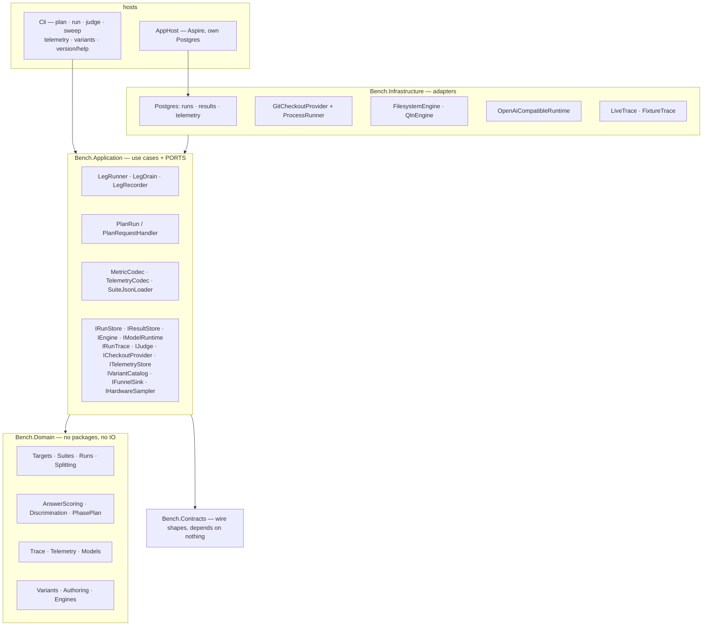
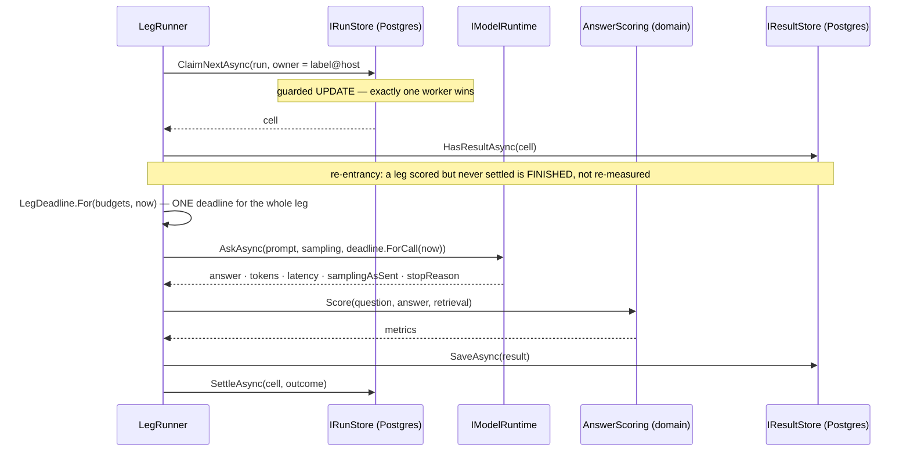

# Architecture — the system as it is

> Status: **current as of 2026-08-16.** Describes what exists and runs, not what is planned; the plan is
> [todo/PLAN_rag_bench_repo.md](../todo/PLAN_rag_bench_repo.md) and the evidence behind the design is
> [MEASURED_LESSONS.md](MEASURED_LESSONS.md). Where the two disagree, this file is wrong and should be
> corrected — a description that has drifted from the code is the failure this convention exists to catch.

## What it is

A benchmark that answers *"is configuration A better than configuration B"* about **any repository, at any
commit, measured by any engine, answered by any model**. Its output is a comparison, not a pass or a fail,
and almost every structure below exists to stop that comparison from being confidently wrong.

## The layers

Ports and adapters, with the domain as a leaf that depends on nothing. `ArchitectureTests` asserts it by
reading assembly references, so a violation is a red build rather than a review comment.



Two projects depend on **nothing**: `Bench.Domain` and `Bench.Contracts`. That is not tidiness — a wire
contract able to reference the domain is a contract that leaks it, and a domain able to reference a package
is a domain whose rules cannot be tested without one.

## The measurement contract

One result row is identified by, and comparable only within, this tuple:

```
target   = (repoUrl, commitSha, exclusions[])     -- pinned, never ambient
engine   = (kind, endpoint, version, indexFingerprint)
suite    = (suiteId, suiteVersion)                -- frozen and hashed, from a file or a bank selection
subject  = (modelId, samplingAsSent)              -- 1..N, each with its OWN endpoint (SubjectRoster)
lane     = (toolSurface, preamble)                -- 1..N
variant  = (name, definitionHash)                 -- 1..N, from the catalog; absent on a run planned without it
repeat   = ordinal                                -- n >= 2 to rank anything
```

`ComparisonScope` is the part that must match before two results may be put beside each other: the target
and the suite. Everything else is an axis you compare *along*.

### The variant catalog

A **variant** is one named retrieval configuration — engine, channels, fusion, corpus recipe, reranker,
result limit — held as a row rather than as code, so a new configuration is a catalog entry and not a
migration. Three properties carry the weight:

- **A definition is never edited.** Results name the variant they ran under, so changing a recipe in place
  would relabel numbers already measured. A variant is added and retired; both states resolve forever
  (`RetrievalVariant`, mirroring `Suite`'s freeze).
- **The recipe is hashed.** Two rows with the same hash are the same configuration under two names — a
  duplicate the catalog can detect rather than a coincidence a report has to explain.
- **An axis this build does not know is refused, never dropped.** The definition is stored as JSON and
  read with unknown members disallowed, so a configuration nobody can honour fails by name instead of
  running as something else. The stored shape is camelCase because that row is published with the results.

`VariantSelection` is what a leg carries: `Selected(id, name)` or `NotApplicable` — a distinct state for a
run planned before the catalog existed, deliberately not an empty id that reads as a variant nobody can
look up. `Leg.Canonical` appends the variant only when there is one, so identities stored before the axis
existed still mean what they said.

**Identity is separate from configuration.** `ModelRef` is an id; `ModelEndpoint` holds the address and the
prices. Every aggregate, every discrimination reading and every saturation label is keyed by the id, so
folding an address into it would make the same model at a different port a different subject.

### The question bank

Questions live in Postgres in named **groups**, with per-**reviewer** marks — both rows rather than enum
members, so a sixth group and a fourth reviewer each cost one insert instead of a migration and a redeploy.
A question carries the suite-facing id every cell and every result quotes, the ordinal an operator selects
by ("group 1, questions 1–10"), what it was authored against, and the **seed** it was derived from with the
date that material entered the world — the memorisation check's only input, and deliberately not the import
date, which would certify every question as clear against every subject's cutoff.

Three properties carry the weight:

- **One way to mint a suite stamp.** A selection from the bank is promoted through the same
  `AuthoringBatch.Promote` + `Suite.Freeze` a file goes through (`BankFreeze`), so a test built either way
  names the same kind of hashed stamp and a result cannot tell which door its questions came through.
  Freezing inherits the refusals already written there: nothing accepted, two questions about the same
  lines, and — added here — one suite-facing id twice.
- **Only what somebody vouched for is selectable.** `BankQuery.Selection` is accepted-only by construction
  rather than by a filter each caller remembers, and admission itself is `QuestionCandidate.Propose`'s rule
  rather than a second one written for the store.
- **Group membership is versioned, and a report does not move.** The current home is a column, the moves
  are rows (`question_group_moves`, refused without a reason), and `run_questions` is the per-test snapshot
  of which group each question was in **when the test was created**. A report reads the snapshot; re-filing
  a question next month cannot move a finished test's numbers into a different column.

`bench questions import|list|groups|review|accept|reject|move` is the surface; `bench run --bank-group`
freezes a selection instead of reading a suite file. A file-selected run writes no snapshot rows, which is
the honest reading rather than a gap: a file has no groups.

### The model registry

Models are configuration, never constants. A row is a key, a runtime, a hosting, and a configuration that
holds **references, never values** — the NAME of the environment variable that holds an endpoint or a key,
resolved on this machine at use. That is the publication rule with teeth: this database is meant to go out
unedited, and a guarantee scoped to result rows while the registry sits in the same schema would be a
redaction pass nobody has scheduled. Sampling and prices stay as values — neither is secret nor
machine-specific, and a run must be able to say what it asked for and what its tokens cost. `ModelConfig`
refuses a url or an absolute path *by name*, and a test re-reads every stored row through that same rule.

A test chooses its **subjects** and its ordered **arbiters** from the enabled rows, and the choice is
stored on the run (`run_subjects`, `run_judges`): the registry can change afterwards without rewriting
what a finished test says it measured. Resolution happens before a single cell exists — a disabled model,
an unknown key, a runtime this build cannot drive, and a reference that is unset on this machine are each
refused by name, rather than discovered three hours into a sweep as a wall of identical transport
failures. A subject may be ADDED to an existing test (that is how a settled test reopens); removing one is
not, because its settled cells would dangle. An arbiter added later continues the order rather than
restarting it.

**One endpoint per SUBJECT, looked up per cell.** `SubjectRoster` closed a defect the registry uncovered:
the matrix has always planned a list of subjects while the runner held a single endpoint, so a two-subject
run would have sent every leg to the first model and labelled the results with the cell's subject — two
models named, one measured, invisible in every report. A cell whose subject this run cannot reach is
settled with that reason, never redirected.

`bench models add|list|disable|enable` is the surface — the listing says which references resolve *here* —
and `bench run --subjects <keys> [--judges <keys>]` composes a test from them. The ad-hoc `--model` pair
still works for pointing the harness at something once; such a run records no roles, because a role names
a registry key and it named none.

## One leg, end to end

`LegRunner` is the assembly. Every piece it uses existed and was tested separately before it; this is where
the seams are actually proved.



**Result first, settle second.** A crash between them leaves the cell claimed rather than settled, so the
sweep hands it back and a retry finishes the interrupted job. Settling first would lose the result
invisibly.

**An answer cut off at a ceiling settles as `CapExceeded`, not `Completed`** — scored as a wrong answer it
would measure the ceiling, and only a recorded cap keeps the leg out of paired deltas.

**One wall budget per LEG, not per call** (`LegDeadline`, `src/Bench.Domain/Runs/LegDeadline.cs`). The
deadline is computed when the leg's model work starts, and every call is handed the REMAINDER through
`ForCall(now)`; a leg that spends it settles `CapExceeded(Wall, …)` and stores no result, while a leg that
failed inside its budget still settles `Crashed`. The distinction is what a per-completion timeout cannot
express: under a 25-turn lane, a 10-minute per-call ceiling is 4 h 10 m of one leg, and a breaker that
fires at twenty consecutive failures needs ~3.5 days to say what the first hang already said. `bench run`
asks for the ceiling with `--leg-wall-seconds` (default 600) and **confirms it with the runtime before any
cell exists** (`BudgetConfirmation`) — a budget the runtime refuses ends the preparation instead of being
believed. When the tool-calling loop arrives it turns inside `LegRunner.AskAsync`, checking
`Exhausted(now)` between turns; nothing else may introduce a second deadline.

## Phases

A leg runs phases, and phases are ours: the adopted evaluation library's unit is a single evaluation with
no notion of one. `TaskKind` picks the plan — `Reading` answers once and is judged; `Fix` runs
**investigate → fix → verify → judge**. A phase cannot start while an earlier one is unfinished, and a
ceiling or a crash stops the **leg**, not just the phase.

## Two vantage points on the same call

| | bench-side trace (`IRunTrace`, `LegRecorder`) | server-side telemetry (`ITelemetryStore`) |
|---|---|---|
| covers | this harness's own legs | **all** traffic, benchmark and real sessions |
| knows the prompt, the answer, the cost | yes | no |
| knows server processing time, the payload returned, the project scope | by inference | exactly |
| shipped by | this repository | `dew_flow_mcp` / `dew_flow_rag_qln`, ingested here from a spool |

The trace port has **two** implementations — live black-box and fixture-replay white-box — because an
interface with one implementation proves nothing about its own shape. The white-box funnel (candidates →
fused → reranker in/out → enriched → sent) is what answers *"recall failure or ranking failure"*, and no
engine emits a real one yet: it lives on a fixture until an engine we control grows retrieval.

Telemetry records carry a **caller-supplied** correlation (leg + phase). The emitter cannot know what a
benchmark leg is, so a real session records as unattributed — and unattributed traffic is excluded from a
leg's totals rather than folded in.

## The one verb that spends money

`bench run` is the only command that reaches a model. It plans the matrix, persists every cell, then drains
the queue leg by leg through `LegRunner` — one claim at a time, so a second process running the same
command is a second worker rather than a duplicate run.

**It reports; it does not judge.** No bar has been agreed, so the exit code answers *did the measurement
happen* — never *was the subject good*. `0` a run that produced legs, `5` a run that produced none, `3` an
unreachable store or a missing checkout, `4` a malformed invocation. A low score exits `0`, and that is the
whole point of the split: an agent that reads "the model answered badly" as "the harness is broken" will
keep reporting the wrong news.

Its first live execution — Polly, three questions, no tools, two repeats — settled 6 legs and passed 0. That
zero is the SUITE's result, not the model's: it is the mechanical memorisation check, and it is recorded in
[MEASURED_LESSONS.md](MEASURED_LESSONS.md) §4c.

### What the drain survives, and what ends it

The loop is `LegDrain` (`src/Bench.Application/LegDrain.cs`), and it is a separate unit because of what a
campaign of ten thousand cells has to live through overnight:

- **One failed leg is recorded and skipped.** Every leg — its scope, its service resolution and its work —
  runs inside its own `try`. A transient `NpgsqlException` on leg 3 001 fails *that* leg and the remaining
  7 000 still run. Until 2026-08-16 it did not, and one blip took the process with every pending cell.
- **A run of failures ends the campaign.** `--max-consecutive-failures` (default 20) stops a run whose
  environment is broken, with a reason naming the last error, and exits `3`. A leg that merely SCORED badly
  resets the run — the harness still reports rather than judges.
- **A stop is planned.** Ctrl+C / SIGTERM cancel a root token: no further cell is claimed, the leg in flight
  keeps its token for a 30-second grace so it can settle, and the verb exits `5` — the run is resumable, not
  finished, and an orchestrator must be able to tell that from a completed one.
- **Recovery runs first.** Every `bench run` sweeps before it drains, so cells a killed host left `Claimed`
  come back. `bench sweep --db … [--stale-after-minutes 30]` is the same recovery as an operator verb, for
  after a `kill -9`. The store had this from its first commit and *nothing called it*, which is the audit
  finding this whole section exists to prevent repeating.
- **And it is ownership-checked, because the sweep is now live.** A claim records the worker's LABEL, HOST
  and PID (`WorkerIdentity`, `cells.owner_host` / `cells.owner_pid`); the sweep loads only the stale
  candidates and hands back the ones whose owner is provably gone. Time alone would be wrong the moment a
  second `bench run` starts — the architecture invites exactly that — because "claimed longer than the
  window" also describes a colleague on a slow leg, and requeuing it puts two workers on one measurement
  and refuses the honest one's settle. The window (30 min against a 10-min leg wall) is a MARGIN, not a
  death certificate. Three rules decide: an owner with no host/pid recorded is gone by definition (it
  predates the columns and nothing can vouch for it); an owner on **another machine is left alone** — that
  host's process table is the only one that can answer, and ending a live leg is worse than leaving a stale
  row for its own host's next sweep; a live pid here is not gone, whatever the clock says. Mirrors
  `dew_flow_rag_qln · src/Rag.Infrastructure/Indexing/IndexPassStore.cs:191` (`SweepOrphansAsync`).

The CLI is a host like any other: `run`, `judge` and `sweep` build a container wired to the same Serilog
sinks as the AppHost — coloured console, one file per run under `logs/{yyyy-MM-dd}/`. `help` and `version`
touch nothing and write nothing.

**`logs/` has a named retention owner: the host, at startup.** Creating the logger also retires day-folders
older than `Serilog:RetentionDays` (default 14), best effort — a folder another host holds open is skipped
rather than fatal, and a folder whose name is not a `yyyy-MM-dd` day is never deleted, because the method
removes directory trees. Zero disables it, which is the shared rule's other option: an operator job owns
the folder instead. A file per run with no reaper is a disk that fills, and on a machine running 24/7 the
"eventually" is a date.

**Nothing in a long run accumulates per leg.** `LiveTrace` retires a leg's recorder in the capture that
hands its trace over (`Close` covers the abandon path), and `GitCheckoutProvider`'s per-repository gates are
reference-counted — created on first use, disposed when the last caller leaves, including when the checkout
failed. Both were `GetOrAdd`-forever maps: harmless while only the CLI drives one leg at a time, and a leak
with a shape the moment a long-running worker wires them in. `bench telemetry ingest` streams its spools and
commits in chunks (`--chunk-size`, default 500) so memory and the store's parameter list are bounded by a
size this process chose rather than by how productive the emitter has been, and the run summary counts its
two integers in SQL instead of hydrating every prompt, answer and metric of the run to fold them here.

## The arbiter, and why it never re-runs a leg

`bench judge` reads a finished run's STORED answers and appends one metric row per leg. It re-scores; it
never re-measures. That is the property the port exists for: the expensive artefact is the subject's output,
so changing the arbiter — or adding a second one that disagrees — costs its own inference and nothing else.

- **Named per arbiter.** The metric is `Judge verdict · {modelId}`, so two arbiters over one run are two
  series that cannot collide, and the same arbiter re-run sees only what it never finished. Work is selected
  by NOT-EXISTS against that name, which makes idempotency and crash-resumability the same query.
- **Asked a binary, at temperature 0.** A judge asked for a score invents a scale and drifts along it
  between runs. YES/NO means the same thing in March and in August.
- **An unreadable verdict is a refusal, never a NO.** Defaulting to NO makes a broken arbiter look exactly
  like a wrong subject, on every leg it touched.
- **No reference answer is a gap in the SUITE**, recorded as *not judgeable* — not a failing leg.
- **Self-judging is marked, not refused.** Measured the day it shipped: the subject model passed 6 of 6 of
  its own answers that an independent arbiter and the mechanical scorer both failed
  ([MEASURED_LESSONS.md](MEASURED_LESSONS.md) §4d).
- **The wrong suite is refused whole.** A verdict issued against a reference from a different suite is the
  one wrong result this system could not detect later, because it would look like a normal one.

The judge sits BESIDE the mechanical score, never instead of it. Two arbiters need a third thing to be
checked against, and the deterministic metrics in the same result are it.

## Guards that shape the API

Each is here because something went wrong that it now prevents; the catalogue is
[MEASURED_LESSONS.md](MEASURED_LESSONS.md).

- **Nothing is captured-or-zero.** `Captured` / `CapturedCount` carry a flag beside every value. Unreported
  tokens make a cost *unknown*, never free.
- **Unset is a refusal.** An empty model id or base url is refused rather than defaulted — an empty
  reranker id once resolved to a paid cloud model inside an arm labelled "$0 local".
- **A budget records the runtime that accepted it**, and a runtime refuses ceilings it cannot enforce. A
  cost ceiling is enforced by the harness not starting the next leg, never by a completion endpoint.
- **Discrimination is a property of a comparison**, not of a question, and nothing is deleted for being
  easy. Difficulty is a measured label per subject tier.
- **A suite version is frozen and hashed**; ground truth is commit-scoped and re-targeting is explicit.
- **Checkouts are read-only** — a bare clone per url, a worktree per commit, never a directory anyone works
  in.
- **A retrieval expectation in a lane with no retrieval is *not applicable*, not a miss.** Scoring it zero
  would make the no-tools baseline look worse than it is, and that baseline exists to be compared fairly.

## What does NOT exist yet

Stated because a description that quietly implies more than is built is the same defect as a stale diagram.

- **No tool-calling loop.** `IEngine` exposes tools and `FilesystemEngine` implements them, but `LegRunner`
  asks the model exactly once. Every lane is therefore currently a no-tools lane, and anchor recall reads
  *not applicable* everywhere. This is what `bench run` measures today, and it is a real measurement rather
  than a placeholder — see *The one verb that spends money* above. The loop's per-leg wall budget already
  exists (`LegDeadline`) and is deliberately in place first: retrofitting it after the first long agentic
  campaign means discovering it from a multi-day gap in a log.
- **No cloud runtime.** Only the OpenAI-compatible local one.
- **No hardware sampler**, no UI, and the API route group is not hosted.
- **`IBenchStore` / `InMemoryBenchStore` are dead** — nothing calls them.
- **Nothing AUTHORS questions.** The bank holds them, reviews them and freezes selections from them, but
  candidates arrive by import: the pipeline that drives CLI agents to write and review them is a later
  plan, and the schema is already the shape it needs so that plan adds verbs rather than tables.
- **A test's ENGINE is still one value per run**, not an axis: variants exist as a catalog and as a column
  on a cell, but `bench run` does not yet plan one leg per variant or wire an engine into a leg — that is
  step 4 of `todo/PLAN_variant_matrix.md`, and it waits on `dew_flow_rag_qln · todo/PLAN_search_variant_axes.md`.
- **Nothing checks the target out.** `ICheckoutProvider` is written and tested and no run path calls it,
  so a run records its commit without verifying it.
