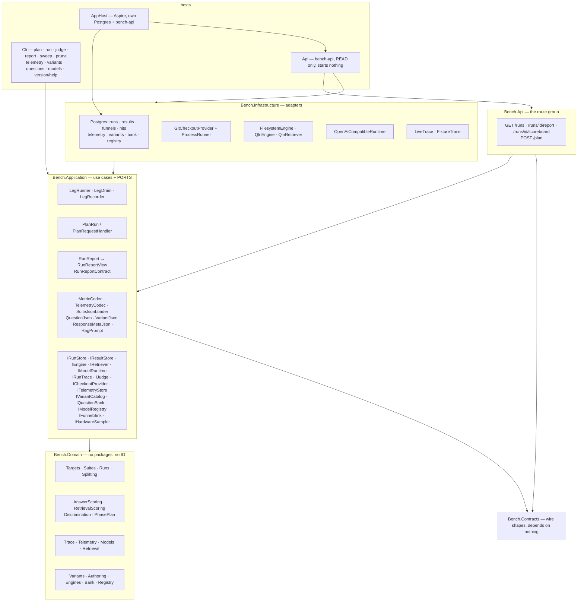
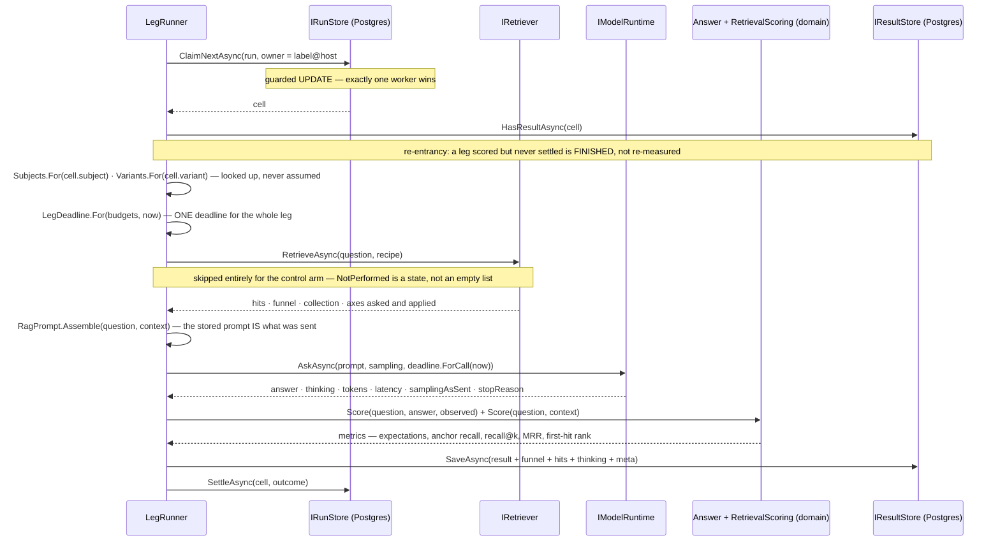

# Architecture — the system as it is

> Status: **current as of 2026-08-19.** Describes what exists and runs, not what is planned; the plan is
> [todo/PLAN_rag_bench_repo.md](../todo/PLAN_rag_bench_repo.md) and the evidence behind the design is
> [MEASURED_LESSONS.md](MEASURED_LESSONS.md). Where the two disagree, this file is wrong and should be
> corrected — a description that has drifted from the code is the failure this convention exists to catch.

## What it is

A benchmark that answers *"is configuration A better than configuration B"* about **any repository, at any
commit, measured by any engine, answered by any model**. Its output is a comparison, not a pass or a fail,
and almost every structure below exists to stop that comparison from being confidently wrong.

## The layers

Ports and adapters, with the domain as a leaf that depends on nothing. `ArchitectureTests` asserts it by
reading assembly references, so a violation is a red build rather than a review comment.



Two projects depend on **nothing**: `Bench.Domain` and `Bench.Contracts`. That is not tidiness — a wire
contract able to reference the domain is a contract that leaks it, and a domain able to reference a package
is a domain whose rules cannot be tested without one.

## The measurement contract

One result row is identified by, and comparable only within, this tuple:

```
target   = (repoUrl, commitSha, exclusions[])     -- pinned, never ambient
engine   = (kind, endpoint, version, indexFingerprint, backend)  -- backend ECHOED, never assumed
suite    = (suiteId, suiteVersion)                -- frozen and hashed, from a file or a bank selection
subject  = (modelId, samplingAsSent)              -- 1..N, each with its OWN endpoint (SubjectRoster)
lane     = (toolSurface, preamble)                -- 1..N
variant  = (name, definitionHash)                 -- 1..N, from the catalog; absent on a run planned without it
arm      = full | investigate-only | implement-only  -- which slice of a fix task the leg runs; Full by default
repeat   = ordinal                                -- n >= 2 to rank anything
```

`ComparisonScope` is the part that must match before two results may be put beside each other: the target
and the suite. Everything else is an axis you compare *along*.

### The variant catalog

A **variant** is one named retrieval configuration — engine, channels, fusion, corpus recipe, reranker,
result limit — held as a row rather than as code, so a new configuration is a catalog entry and not a
migration. Three properties carry the weight:

- **A definition is never edited.** Results name the variant they ran under, so changing a recipe in place
  would relabel numbers already measured. A variant is added and retired; both states resolve forever
  (`RetrievalVariant`, mirroring `Suite`'s freeze).
- **The recipe is hashed.** Two rows with the same hash are the same configuration under two names — a
  duplicate the catalog can detect rather than a coincidence a report has to explain.
- **An axis this build does not know is refused, never dropped.** The definition is stored as JSON and
  read with unknown members disallowed, so a configuration nobody can honour fails by name instead of
  running as something else. The stored shape is camelCase because that row is published with the results.

`VariantSelection` is what a leg carries: `Selected(id, name)` or `NotApplicable` — a distinct state for a
run planned before the catalog existed, deliberately not an empty id that reads as a variant nobody can
look up. `Leg.Canonical` appends the variant only when there is one, so identities stored before the axis
existed still mean what they said.

**Identity is separate from configuration.** `ModelRef` is an id; `ModelEndpoint` holds the address and the
prices. Every aggregate, every discrimination reading and every saturation label is keyed by the id, so
folding an address into it would make the same model at a different port a different subject.

### The lane catalog, and the loop (2026-08-19)

A **lane** is one named TOOL SURFACE — which tools are offered, in which words, under which ordering
instruction, through which shape, for how many turns. It has been an axis of the measurement tuple since
the founding plan, as a bare NAME resolving to nothing; `ToolLane` is what a name finally resolves to, and
it mirrors the variant catalog row for row: never edited, hashed, unknown fields refused.

Two things about it are not copies of the variant catalog, and both are measured:

- **`Presentation` is part of the identity**, because the shape moved a score nine times: the same four
  tools over the MCP wire scored **4 of 63** against **36 of 63** in-process, replicated at sixteen tools as
  4/47 against 11/47. A leaderboard that could not tell those apart would attribute to wording what belongs
  to the shape.
- **The `Doctrine` — the ordering instruction — enters the identity as a hash and is stored beside it as
  TEXT.** Rewriting that one paragraph moved a score **16.5 points of 63** with everything else held, while
  swapping the toolbox from 4 tools to 18 moved **1**. It is the largest single effect measured in this
  system, which is why it is an axis and not a preamble; the text travels in the row so a published
  database explains its own numbers without a second artefact.

`ToolLane.Select()` returns the EXISTING `Lane(Name, Preamble)` axis record with its preamble finally set.
That field was declared on day one, documented, and read by nothing. There is no `cells.LaneId`:
`RunCell.LaneName` already carries the identity, and a catalog changes what a name resolves TO rather than
how a cell stores it — so the axis cost no schema change to `cells`.

**The loop.** `ToolLoopRunner` asks, invokes what the model requested, appends the answers and asks again.
`LegRunner` stays the assembly it was — the loop scores nothing, persists nothing and settles nothing.
Four decisions carry it:

- **The turn budget is confirmed HERE**, which is the component `OpenAiCompatibleRuntime`'s refusal has
  named since the day it was written: *"one completion has no turns — a turn ceiling belongs to an agentic
  loop, not to this runtime"*. A budget nobody confirmed is a budget that does not exist.
- **A leg that spends its ceiling settles as `CapExceeded(Turns)`** — never a crash and never a wrong
  answer, so it stays out of paired deltas. A model still working when the ceiling arrived did not get
  anything wrong, and averaging it in reports the instrument's limit as the subject's score. The ceiling is
  checked AFTER the last permitted turn's calls, because being busy when time ran out is what the cap is
  reporting.
- **Argument JSON is never re-serialized**, on either side of the wire. A local model emits broken JSON
  regularly and "can it form the arguments" is one of the three questions this benchmark exists to answer;
  a parse-and-rewrite would repair the mistake on its way in and make the observation impossible.
- **The transcript is kept**, not discarded after the last turn. The user prompt is on the result, the
  doctrine is in the lane and the advertised tools are in the surface fingerprint — the middle of a loop
  exists nowhere else, and "show me the prompts that were sent" reads exactly that record.

**Scoring.** `ExpectationKind.ToolUsed` / `ToolNotUsed` carry the tool's name in `Expectation.Text`, and
`ToolUsageObservation` mirrors `RetrievalObservation` including its fairness rule: a tool expectation in a
lane with no tools is **not applicable**, never a miss, emitted as text so the numeric aggregate reports a
smaller denominator rather than a diluted mean. Scoring the floor zero for not calling a tool it never had
would make the baseline look worse than it is and flatter every tool lane by exactly that much.
`ToolNotUsed` is the trap half: a description that makes a model reach for a tool where it should not have
is a defect in the DESCRIPTION, and it is invisible unless something asserts the negative.

**One reversal is recorded rather than tidied.** An unknown expectation kind used to fall back to `File`,
deliberately and with its own test — one bad entry should not cost a whole suite, and with four kind names
that look nothing like each other a typo was unlikely. `ToolUsed` and `ToolNotUsed` differ from a
misspelling by one character, and the cost was never "one loose expectation" but a `File` anchor against an
empty path: a retrieval miss the author never wrote, scored forever, silently. It now refuses by name, like
every other unknown value in this system.

### The retrieval lane (single-shot RAG)

A cell whose variant names a retrieval recipe gets retrieval performed **for** it by the harness, and its
prompt is assembled from what came back. This is the single-shot lane; the agentic loop where a subject
decides what to search and when is a separate measurement (see *What does NOT exist yet*).

Two ports, not one, and the separation is measured rather than stylistic:

| port | what it models | who serves it |
|---|---|---|
| `IEngine` | retrieval as a **surface** a subject works — tools, refusals, whatever it decides to call | `FilesystemEngine`, `QlnEngine` |
| `IRetriever` | retrieval as a **call** the harness makes for one question | `QlnRetriever`, `NoRetriever` |

The same four tools behind a different surface shape once scored 4/63 against 37/63 on identical tasks, so
collapsing these into a single `SearchAsync` would make the surface measurement inexpressible — and folding
the single-shot lane into a tool loop would make its funnel unattributable, since a subject that never
searched produces no funnel at all. `QlnEngine` composes `QlnRetriever` for its search tool: one round trip,
one funnel path, whichever lane asked.

**A recipe becomes a request in exactly one place** (`QlnRequest.From`), which is also where the stored
"asked for" axes come from — so what a run records is literally what went out, not a second mapping that
agrees with the first until somebody edits one. An axis the run did not set is **omitted** from the JSON
rather than sent as a C# default: a call that meant to set only a limit would otherwise send
`rerank: false, rerankPool: 0, rrfK: 0`, and the engine would clamp those into a configuration in no catalog
row.

**What the engine can serve, and what it cannot.** As of 2026-08-17 a recipe reaches it whole: the channels,
both weights, the rank constant, the fusion **algorithm** and its normalization, the reranker and its pool,
the result limit, and the corpus **text shape** (which rides beside the axes, since it selects a collection
rather than a knob). Fusion and normalization arrived that morning in the sibling plan's step 1; before it
they were refused here, because the engine would have accepted the request, ignored the field, and served
rank fusion under a record that said `wsum` — the reranker scar exactly.

Still not request axes: **chunk size and embed model**. The engine derives those from its own configured
recipe, so a search cannot select them — two variants differing only in chunk size are two variants it cannot
yet distinguish.

**They are verified instead of selected.** Before a single cell exists, one GET reads what is actually in the
index a search will reach — collection, point count, text shape, window and overlap tokens, embedder,
tokenizer, and the commit of the newest succeeded pass that wrote it — and a recipe that disagrees ends the
run naming both values (`IRetriever.InspectAsync`, `IndexReadiness`). This was missing for exactly one
measurement: on 2026-08-17 a variant declaring 512 embed tokens was recorded against a 256-token index, every
number in it real and the row naming them describing a corpus that would have produced different ones.

Two comparisons in that check are not verbatim, and both directions matter:

- **The embedder name.** An operator types `bge-m3` into a catalog row and the engine reports
  `BAAI/bge-m3 (dense, FP32)`. Vendor prefix and parenthetical detail are dropped before comparing, because
  verbatim equality would refuse every correct recipe — while a CONTAINMENT rule would accept `bge-m3`
  against a `bge-m3-large` index, and a false accept is indistinguishable from a correct measurement
  afterwards.
- **The commit, in three states.** Matched, differing, or **unstamped** — and the third is not the second.
  Every index built before the engine began recording its commit is unstamped, so strict equality would have
  blocked every cell against every index in existence on the day the stamp landed. Unstamped is refused by
  default and passable with `--allow-unstamped-index`, which keeps printing that the tree is UNVERIFIED — the
  same shape as `--no-checkout`. An index built from a DIRTY tree is refused outright: its stamp then names a
  commit the index does not contain, which is worse than no stamp because it reads as evidence.

Two refusals remain, and both happen **before any cell exists**: a recipe naming another engine, and a
corpus shape this one does not have. `IRetriever.CanServe` is the check — a mapping, not a round trip — asked
once per variant while the run is being planned, for the same reason the model registry is resolved there: a
recipe the engine has no field for would otherwise arrive as ten thousand identical leg failures. Its
success value is the axes it WOULD send, so an operator can read what a variant actually becomes.

**Its axes contract refuses members it does not know** (`JsonUnmappedMemberHandling.Disallow`, landed the
same day). So a stray field in this side's request record is now a broken retrieval rather than harmless
noise — which is exactly how one was found, a computed property that had been serialising itself into the
request all along.

**The variant is looked up per cell, exactly as the subject is.** `VariantRoster.For(cell.Variant)` mirrors
`SubjectRoster.For(cell.SubjectModelId)`: a run holds several recipes because the variant is an axis, and a
cell whose recipe is not in the roster is **settled** rather than measured under another one. A cell planned
without a variant resolves to the control arm, which is what every run planned before this lane existed is.

**The prompt is the artefact.** `RagPrompt` assembles it deterministically in rank order — path, span,
signature and the hit's own text — and stores it on the result. It says when a snippet was truncated and when
the engine returned no text for a hit, because the stored prompt has to describe what the model actually
read. There is deliberately **no cap on the number of hits**: that is the variant's `limit` axis, with a name
and a hash, and a second cap here would be an unnamed axis applied to every arm.

**Anchor recall stops reading *not applicable*.** `RetrievalScoring` matches the returned hits against the
question's anchors and feeds `AnswerScoring`'s existing recall metric — one definition of recall in the
system — then adds recall@5, recall@10, MRR and a first-hit rank. Matching is by the readable `Type.Member`
identity or by **line overlap**, never by member name alone: a suffix rule would let `NoRetry` answer for
`Retry`, and a recall figure inflated that way is indistinguishable from a real one. A leg that performed no
retrieval gets **no** rank metrics at all, so the control arm keeps exactly the metric set it had before this
lane existed instead of entering every retrieval aggregate at the bottom.

### What a retrieval leg stores, and who owns its growth

| surface | holds | owner |
|---|---|---|
| `results.Prompt` / `Answer` / `ThinkingText` | the artefact — a published number re-checked against the text that produced it | **kept forever**; its size is a budget line, not a cleanup target |
| `results.ResponseMetaJson` | tokens in/out, latency, stop reason, response bytes, sampling AS SENT | kept forever; unrecoverable after the fact, since a re-run is a different call |
| `funnels` | one row per leg: contract version, stages, total, absent stages, degraded + reason, payload bytes, elapsed, collection, **requested and applied axes** | kept forever — small, fixed-size, and the white-box evidence |
| `retrieved_hits` | rank, path, span, both member identities, signature, score, ordering, channels, per-channel ranks, snippet | **rolled up**: everything a metric computes from is kept forever, the snippet TEXT is released after a window |

`results.ThinkingReason` sits beside the text and is empty exactly when the text was captured — a model that
hides its reasoning and one that reasoned about nothing are different facts, and an empty string alone
merges them. The same three-state discipline covers a hit's snippet: **present**, **never reported by the
engine**, or **released by retention** — a row whose text was dropped must never read as a hit the engine
sent no text for, so the byte count survives the drop.

Retention is `bench prune` and a pass at every `bench run` startup, beside the crash sweep and for the same
reason: a budget that only runs when somebody remembers to run it is not a budget. Default window seven
days, `--hit-retention-days 0` keeps everything. It is an `ExecuteUpdate` filtered on the hit row's **own**
`CreatedAt` — denormalised from the result on write — so the largest table in the system is never joined to
`results` to decide what is old.

### Where questions come from

Two doors, one set of rules. **Import** takes a hand-authored file; **author** drives a CLI coding agent to
write candidates for one group (`bench questions author`, `PLAN_question_authoring.md`). Both land as the
same rows through the same admission rules, and authored ones are `Proposed` until something vouches for them
— which is what keeps "a machine wrote a thousand overnight" from meaning "a thousand are measurable".

Authoring exists because it is the project's one unavoidable bottleneck, in the founding plan's words:
*"Running is cheap and authoring is not."* Every axis built — variants, subjects, lanes, repeats — multiplies
over a question set, and the set is the one factor nothing else compensates for.

- **`ICliAgentRuntime` is not `IModelRuntime`.** One launches a process to do work FOR the harness; the other
  is a completion endpoint measured AS a subject. The same executable will be measured through the second port
  with turn ceilings and telemetry (`todo/PLAN_tool_benchmark.md` step 11), and conflating them would make
  measuring an agent indistinguishable from using one.
- **Over the one launcher**, which grew stdin for this: a prompt runs to kilobytes and an argument list caps
  out around 32 KB, so argv would have failed on the machine with the biggest target repository.
- **The agent is launched inside the target's checkout.** An author that cannot read the repository cannot
  anchor a question in it — asked to write about a commit it had no access to, the agent refused and said so
  rather than inventing line numbers.
- **The answer is `BankQuestionFile`** — the shape `import` already reads, seed and all — so an authored batch
  is literally an importable file and there is one format, not two that agree until somebody edits one.
- **Nothing repairs an answer.** A malformed reply is a rejection carrying the parse error and a SAMPLE of what
  was said, because the next edit to the prompt is made from exactly that text. The array is EXTRACTED from a
  fence or a prose preface — that changes no question — and anything the author said outside it is reported as
  a note rather than dropped. That note is how the environment finding below became visible at all.
- **Prompts are a hashed catalog** (`prompts/author`, `prompts/review`): shared contract plus per-group brief,
  and the hash covers both, so editing the contract changes every group's identity. A prompt in a string
  literal would be an unversioned axis with the largest measured effect in the system — one rewritten ordering
  instruction moved a score 16.5 points of 63 where swapping 4 tools for 18 moved 1.
- **A seed date is never invented.** Unknown reads as *may recall*; a guessed date reads as *safe*, which is
  the lie the whole memorisation check would rest on. `QuestionSeed` normalises to UTC in the domain, because a
  date written `2026-05-14` deserialises to the reading machine's offset and Postgres accepts only UTC.
- **`code-writing` is refused by name.** Its authoring needs three gates — the bug reproduces, the reference
  fix works, the tree is rebuilt to the buggy state — which need a sandbox worktree and a build
  (`todo/PLAN_code_lane.md`).

Measured on the first live batch (2026-08-17, Claude CLI 2.1.216, target `dew_flow_rag_qln` at `64865c68`):
two questions authored and stored, both anchored at members the agent verified in the checked-out tree. Two
environment facts came out of it and are not yet fixed: **git history is not readable inside the worktree** (a
`git worktree` makes `.git` a redirect file, which the agent treats as untrusted and declines), so seed dates
came back `unstated` — which the `pr-diff` group depends on entirely; and a CLI that prints diagnostics beside
its answer is why the runtime reads **stdout alone** rather than the merged output.

**An untrusted checkout costs the whole wall, so the pass pre-trusts it.** Measured on the first real batch
(2026-08-18): two of four groups produced nothing and burned their full 900-second wall each — half an hour —
because the CLI printed *"Ignoring 5 permissions.allow entries: this workspace has not been trusted"* and then
waited on a dialog no headless run can answer. The other two groups succeeded with the same warning printed, so
the warning is not the failure: the blocked tool call behind it is. `WorkspaceTrust` now sets
`hasTrustDialogAccepted` for the tree before any launch — for **both** keys, the worktree and the bare
repository its `.git` pointer names, because the CLI's own message names the bare path while the agent is
launched in the worktree and the lookup is by string. Three properties, because the file is the operator's and
not ours: only paths **under the benchmark's checkout root** may be trusted (trusting an arbitrary path would
hand any repository this benchmark is pointed at the permissions of a trusted workspace), exactly one boolean is
written with every sibling field preserved and a non-object `projects` refused rather than replaced, and the
write goes through a staged file with a backup. It never fails the verb — a tree that could not be pre-trusted
still runs and the printed `trust` line says so; `--no-trust` skips it. Verified against the live config: 51
top-level keys unchanged, one entry added, one boolean flipped in a ten-field entry, and the workspace warning
gone from the next run's output.

**There are SIX groups, and five of them can be authored.** `code-writing` is a real group of this benchmark —
`data/bank-seed.json` seeds it as a row and `BankSeedTests` holds the count at six — and it is the one
`bench questions author` refuses by name, because its three gates need a sandbox worktree and a build. The row
exists so a hand-authored code task has a home and so every report that groups by key counts six; the seed file
is committed because the number was once answered from memory and was wrong by one.

### Vetting: who marks a machine's questions

`bench questions vet` walks a group's `Proposed` questions and asks every **bound** reviewer slot for a verdict,
storing each mark through the same path `bench questions review` uses — so a mark written by an agent and one
typed by a person are indistinguishable afterwards. That is correct rather than sloppy: a review is a
judgement, and its provenance is the slot, which is recorded either way.

- **The mechanical half runs FIRST, and a broken anchor costs no launches.** `AnchorCheck` verifies every
  retrieval expectation against the checked-out tree — the file is present, the line span does not run past the
  end of the file, the member's name occurs inside the span — before a single reviewer is asked. Measured
  2026-08-18: all three live reviewer notes on the first vetted pair *led* with exactly this check, and the
  review contract's first rejection reason is an expectation pointing at nothing, so three agent launches per
  question were buying arithmetic. A question that fails is reported with where the name actually is (the
  difference between a wrong question and a stale line range is what the operator does next) and stays
  `Proposed`: a broken anchor is a defect to fix, not a verdict. What the check does NOT prove is that the
  member is *defined* there — a name in a comment satisfies it — and it says nothing about whether the question
  is any good. Anchor paths are data an agent wrote, so they resolve through `RootedPath` (shared with
  `FilesystemEngine`, which had the only copy of that arithmetic): a path that escapes the tree reads as
  nothing to find.
- **The gate grew two more checks, both taken from what reviewers actually wrote.** `QuestionSanity` reads a
  question against its own reference answer: every required `AnswerContains` term must appear in it, no
  `AnswerExcludes` term may, and no required term may sit in the prompt where any on-topic answer would contain
  it. Comparison is `OrdinalIgnoreCase`, matching `AnswerScoring` — a gate stricter than the scorer would refuse
  questions that score fine. `SeedCheck` compares a `commit` seed's date against what the repository says. Both
  exist because a live panel found exactly these defects and charged three launches each to do it; run over the
  whole bank they flagged **22 of 56 questions**, and the two dominant classes were the contract's fault rather
  than any author's — the rule was never written down. It is now, in `prompts/author/_shared.md`, and the class
  vanished from the next batch's twenty questions.
- **The author is handed the history it cannot read.** A question's seed date is the memorisation check's only
  input, and an agent inside a `git worktree` cannot get one: the `.git` is a redirect file its CLI declines to
  follow. So `GitHistory` gathers first-parent changes — our own git has no objection — and the brief carries
  them. Commits rather than merges, corrected on measurement: the target is trunk-based and has no merge commits
  at all, so the group specified around pull requests would have stayed unauthorable.
- **And the date is DERIVED, not authored** — kept, but for a different reason than the one first written here.
  The justification was *"handed the correct dates and told verbatim to copy them, both Claude and Codex wrote
  the same wrong one"*. **Retracted 2026-08-19: that was our own arithmetic.** A bare `"at": "2026-08-17"`
  deserialises to midnight in the reading machine's offset, and `QuestionSeed.At` normalised the instant to UTC —
  on this UTC+2 machine, one day back. Replayed through the real types, a report reading *"the author dated it
  2026-08-16"* is what an author that wrote **2026-08-17** produces. Both models had copied faithfully; the
  reviewer that rejected three questions for this rejected them over a defect of ours. Fixed at the boundary in
  `QuestionSeed.Written`, which keeps the calendar day rather than converting it to an instant, and the one
  comparison lives in `SeedCheck.Stated` so there is no second spelling to be wrong in.
  The derivation stays on the argument that survives: the author names the CHANGE and the repository dates it,
  the same principle as the harness performing retrieval instead of trusting a model's account of it — and it
  serves the case the contract asks for, where an author honestly omits a date it cannot establish. A
  disagreement still prints as a `fixed` line, and now that line means something.
- **A reviewer slot names its model, as data.** `reviewers.ModelKey` is a registry key, empty for a person. It
  is a column and not a command-line flag because the self-review rule compares a reviewer's model against the
  question's author model, and "who is reviewer-2" has to be answerable from the bank years later. Three slots
  were seeded on 2026-08-17 naming nobody, and this pass could not be written until they did.
- **A model never marks its own writing** — refused before any launch, comparing the resolved **model id**
  rather than the slot or registry key, because two rows bound to two keys that both resolve to
  `claude-sonnet-4-6` are one opinion. `--allow-self-review` takes the mark anyway and **prints what it costs**;
  the run's report carries that sentence, so a batch marked this way cannot be quoted without it.
- **The reviewer is shown the question, not its provenance.** `BankExport.ForReview` omits `authorModel`,
  `state` and the other reviewers' marks: a mark that knows who wrote the question, or how the others voted, is
  partly about the author and partly about agreement. The seed IS shown — the reviewer is asked whether the date
  looks invented.
- **An unreadable verdict is never an approval.** The pass reads its own wire shape rather than the import's
  `ReviewFile`, whose verdict defaults to `Approved` — right for a file a person wrote, and the failure that
  looks like success for an agent whose answer lost a field. A rejection with no note is refused outright: it is
  the only record of what an author gets wrong.
- **Promotion is the strict rule over the ELIGIBLE reviewers.** `Promotion.Decide` accepts only when every
  reviewer eligible for that question has approved — every slot that still serves, except one whose model wrote
  it. It rejects on any single rejection (a defect somebody named outranks any count of approvals), and
  otherwise waits. An empty `reviewers` table promotes nothing — "every configured reviewer approved" is
  vacuously true of none, and would accept a whole machine-written bank on an empty table. A majority rule would
  be a quality claim nobody here has measured.
  Eligibility is what makes the one-third design work: with three authors writing a third of a group each, every
  question's panel is the two models that did not write it, the author is out of its own panel by construction
  rather than by a flag, and a question costs two launches instead of three. Without it the strict rule waits
  forever on a mark the self-review refusal will never allow.
- **A reviewer slot can be RETIRED, and until 2026-08-19 it could not.** `reviewers.Enabled`, with
  `bench questions disable --reviewer <key>`; a retired slot is not launched and not waited for, and the marks it
  already made are kept. It exists because the strict rule turned one broken slot into a frozen bank: three slots
  configured, the third bound to a model that failed on every launch, so every question waited forever on a mark
  that could never arrive — and there was no way out. Unbinding the model does not help, because a slot with no
  model is a *person*: eligible, and equally silent. The model registry had already solved exactly this — disabled,
  never deleted, so history stays readable — and this is that same move, arrived at one design generation late.
- **A decided question is not re-vetted.** Only `Proposed` rows are walked, so a machine cannot overwrite a
  person's mark.

**A mark records the model that made it**, not only the slot (`question_reviews.ModelId`). The slot looked like
provenance until it stopped being one: `reviewer-2` held `claude-sonnet-4-6` for thirty-three marks and
`gpt-5.6-terra` for the next seven, so a per-reviewer statistic needed a timestamp filter to be honest. Marks
older than the column stay empty rather than backfilled — which model held a slot in the past is knowable from a
session's memory, not from the database.

**The panel is three different models** (2026-08-18): `claude-sonnet-4-6`, `gpt-5.6-terra`, `gemini-3.1-flash`,
each verified by `bench models probe` — one trivial question through the same path authoring uses, writing
nothing, because a wrong headless flag does not fail but opens an interactive session that waits on a terminal
nobody watches. **And a second model earned its cost immediately**: on one batch Claude approved 3 and rejected
0 while Codex approved 2 and rejected **7**, against 2 rejections in 57 marks from three slots of one model. Its
reasons were not substring arithmetic — it read the target's git history and checked seed dates against it, a
class of defect the single-model panel never once raised.

**Historically all three slots were bound to one model** (`claude-reviewer` → `claude-sonnet-4-6`, the operator's
decision of 2026-08-18 while one CLI author is verified). That is *one opinion sampled three times, not three
reviewers*, `bench questions reviewers` says so when it sees identical bindings, and every number derived from
such a batch has to be reported that way.

### The question bank

Questions live in Postgres in named **groups**, with per-**reviewer** marks — both rows rather than enum
members, so a sixth group and a fourth reviewer each cost one insert instead of a migration and a redeploy.
A question carries the suite-facing id every cell and every result quotes, the ordinal an operator selects
by ("group 1, questions 1–10"), what it was authored against, and the **seed** it was derived from with the
date that material entered the world — the memorisation check's only input, and deliberately not the import
date, which would certify every question as clear against every subject's cutoff.

Three properties carry the weight:

- **One way to mint a suite stamp.** A selection from the bank is promoted through the same
  `AuthoringBatch.Promote` + `Suite.Freeze` a file goes through (`BankFreeze`), so a test built either way
  names the same kind of hashed stamp and a result cannot tell which door its questions came through.
  Freezing inherits the refusals already written there: nothing accepted, two questions about the same
  lines, and — added here — one suite-facing id twice.
- **Only what somebody vouched for is selectable.** `BankQuery.Selection` is accepted-only by construction
  rather than by a filter each caller remembers, and admission itself is `QuestionCandidate.Propose`'s rule
  rather than a second one written for the store.
- **Group membership is versioned, and a report does not move.** The current home is a column, the moves
  are rows (`question_group_moves`, refused without a reason), and `run_questions` is the per-test snapshot
  of which group each question was in **when the test was created**. A report reads the snapshot; re-filing
  a question next month cannot move a finished test's numbers into a different column.

`bench questions import|author|vet|list|groups|reviewers|bind|review|accept|reject|move` is the surface;
`bench run --bank-group` freezes a selection instead of reading a suite file. A file-selected run writes no snapshot rows, which is
the honest reading rather than a gap: a file has no groups.

### The model registry

Models are configuration, never constants. A row is a key, a runtime, a hosting, and a configuration that
holds **references, never values** — the NAME of the environment variable that holds an endpoint or a key,
resolved on this machine at use. That is the publication rule with teeth: this database is meant to go out
unedited, and a guarantee scoped to result rows while the registry sits in the same schema would be a
redaction pass nobody has scheduled. Sampling and prices stay as values — neither is secret nor
machine-specific, and a run must be able to say what it asked for and what its tokens cost. `ModelConfig`
refuses a url or an absolute path *by name*, and a test re-reads every stored row through that same rule.

A test chooses its **subjects** and its ordered **arbiters** from the enabled rows, and the choice is
stored on the run (`run_subjects`, `run_judges`): the registry can change afterwards without rewriting
what a finished test says it measured. Resolution happens before a single cell exists — a disabled model,
an unknown key, a runtime this build cannot drive, and a reference that is unset on this machine are each
refused by name, rather than discovered three hours into a sweep as a wall of identical transport
failures. A subject may be ADDED to an existing test (that is how a settled test reopens); removing one is
not, because its settled cells would dangle. An arbiter added later continues the order rather than
restarting it.

**One endpoint per SUBJECT, looked up per cell.** `SubjectRoster` closed a defect the registry uncovered:
the matrix has always planned a list of subjects while the runner held a single endpoint, so a two-subject
run would have sent every leg to the first model and labelled the results with the cell's subject — two
models named, one measured, invisible in every report. A cell whose subject this run cannot reach is
settled with that reason, never redirected.

`bench models add|list|disable|enable` is the surface — the listing says which references resolve *here* —
and `bench run --subjects <keys> [--judges <keys>]` composes a test from them. The ad-hoc `--model` pair
still works for pointing the harness at something once; such a run records no roles, because a role names
a registry key and it named none.

## One leg, end to end

`LegRunner` is the assembly. Every piece it uses existed and was tested separately before it; this is where
the seams are actually proved.



**Result first, settle second.** A crash between them leaves the cell claimed rather than settled, so the
sweep hands it back and a retry finishes the interrupted job. Settling first would lose the result
invisibly.

**An answer cut off at a ceiling settles as `CapExceeded`, not `Completed`** — scored as a wrong answer it
would measure the ceiling, and only a recorded cap keeps the leg out of paired deltas.

**One wall budget per LEG, not per call** (`LegDeadline`, `src/Bench.Domain/Runs/LegDeadline.cs`). The
deadline is computed when the leg's model work starts, and every call is handed the REMAINDER through
`ForCall(now)`; a leg that spends it settles `CapExceeded(Wall, …)` and stores no result, while a leg that
failed inside its budget still settles `Crashed`. The distinction is what a per-completion timeout cannot
express: under a 25-turn lane, a 10-minute per-call ceiling is 4 h 10 m of one leg, and a breaker that
fires at twenty consecutive failures needs ~3.5 days to say what the first hang already said. `bench run`
asks for the ceiling with `--leg-wall-seconds` (default 600) and **confirms it with the runtime before any
cell exists** (`BudgetConfirmation`) — a budget the runtime refuses ends the preparation instead of being
believed. When the tool-calling loop arrives it turns inside `LegRunner.AskAsync`, checking
`Exhausted(now)` between turns; nothing else may introduce a second deadline.

## Phases

A leg runs phases, and phases are ours: the adopted evaluation library's unit is a single evaluation with
no notion of one. `TaskKind` picks the plan — `Reading` answers once and is judged; `Fix` runs
**investigate → fix → verify → judge**. A phase cannot start while an earlier one is unfinished, and a
ceiling or a crash stops the **leg**, not just the phase.

## Two vantage points on the same call

| | bench-side trace (`IRunTrace`, `LegRecorder`) | server-side telemetry (`ITelemetryStore`) |
|---|---|---|
| covers | this harness's own legs | **all** traffic, benchmark and real sessions |
| knows the prompt, the answer, the cost | yes | no |
| knows server processing time, the payload returned, the project scope | by inference | exactly |
| shipped by | this repository | `dew_flow_mcp` / `dew_flow_rag_qln`, ingested here from a spool |

The trace port has **two** implementations — live black-box and fixture-replay white-box — because an
interface with one implementation proves nothing about its own shape. The white-box funnel
(collection → embed-query → retrieve → fuse → collapse → rerank → cut) is what answers *"recall failure or
ranking failure"*, and it is no longer a fixture: `dew_flow_rag_qln` emitted its first real one on
2026-08-15 (five of `trace/v0`'s seven drafted stage names were wrong, and the emitter won every
disagreement), and since 2026-08-17 every retrieval leg **persists** it to `funnels` — including a degraded
one, with the reason it could not be read. In the single-shot lane the funnel travels back as part of
`RetrievedContext` rather than through the sink; the sink remains the tool lane's path, where the subject
makes the call and the funnel has no return value to ride on.

Telemetry records carry a **caller-supplied** correlation (leg + phase). The emitter cannot know what a
benchmark leg is, so a real session records as unattributed — and unattributed traffic is excluded from a
leg's totals rather than folded in.

## The one verb that spends money

`bench run` is the only command that reaches a model. It plans the matrix, persists every cell, then drains
the queue leg by leg through `LegRunner` — one claim at a time, so a second process running the same
command is a second worker rather than a duplicate run.

**It checks the target out first.** A bare mirror per url and a worktree per commit, under a cache root
this process owns (`--checkout-root`, default under the user's local application data) — never a directory
anyone works in. A commit that is unpushed, on a fork, or garbage-collected ends the run *there*, by name,
instead of producing a campaign of results labelled with a tree nobody ever saw. The provider had existed,
tested, since the first commits with **no caller**; until it was wired in, every run printed that its
commit was "recorded but unverified" and measured anyway. `--no-checkout` keeps that older behaviour for a
target this machine cannot clone, and keeps the warning, because then it is true.

**It reports; it does not judge.** No bar has been agreed, so the exit code answers *did the measurement
happen* — never *was the subject good*. `0` a run that produced legs, `5` a run that produced none, `3` an
unreachable store or a missing checkout, `4` a malformed invocation. A low score exits `0`, and that is the
whole point of the split: an agent that reads "the model answered badly" as "the harness is broken" will
keep reporting the wrong news.

Its first live execution — Polly, three questions, no tools, two repeats — settled 6 legs and passed 0. That
zero is the SUITE's result, not the model's: it is the mechanical memorisation check, and it is recorded in
[MEASURED_LESSONS.md](MEASURED_LESSONS.md) §4c.

### What the drain survives, and what ends it

The loop is `LegDrain` (`src/Bench.Application/LegDrain.cs`), and it is a separate unit because of what a
campaign of ten thousand cells has to live through overnight:

- **One failed leg is recorded and skipped.** Every leg — its scope, its service resolution and its work —
  runs inside its own `try`. A transient `NpgsqlException` on leg 3 001 fails *that* leg and the remaining
  7 000 still run. Until 2026-08-16 it did not, and one blip took the process with every pending cell.
- **A run of failures ends the campaign.** `--max-consecutive-failures` (default 20) stops a run whose
  environment is broken, with a reason naming the last error, and exits `3`. A leg that merely SCORED badly
  resets the run — the harness still reports rather than judges.
- **A stop is planned.** Ctrl+C / SIGTERM cancel a root token: no further cell is claimed, the leg in flight
  keeps its token for a 30-second grace so it can settle, and the verb exits `5` — the run is resumable, not
  finished, and an orchestrator must be able to tell that from a completed one.
- **Recovery runs first.** Every `bench run` sweeps before it drains, so cells a killed host left `Claimed`
  come back. `bench sweep --db … [--stale-after-minutes 30]` is the same recovery as an operator verb, for
  after a `kill -9`. The store had this from its first commit and *nothing called it*, which is the audit
  finding this whole section exists to prevent repeating.
- **And retention runs beside it**, for the same reason: `bench run` releases hit snippets past the window
  before it drains, and `bench prune --db … [--hit-retention-days 7]` is the same pass as an operator verb.
  A policy that only runs when somebody remembers to run it is the pattern above, one table larger.
- **And it is ownership-checked, because the sweep is now live.** A claim records the worker's LABEL, HOST
  and PID (`WorkerIdentity`, `cells.owner_host` / `cells.owner_pid`); the sweep loads only the stale
  candidates and hands back the ones whose owner is provably gone. Time alone would be wrong the moment a
  second `bench run` starts — the architecture invites exactly that — because "claimed longer than the
  window" also describes a colleague on a slow leg, and requeuing it puts two workers on one measurement
  and refuses the honest one's settle. The window (30 min against a 10-min leg wall) is a MARGIN, not a
  death certificate. Three rules decide: an owner with no host/pid recorded is gone by definition (it
  predates the columns and nothing can vouch for it); an owner on **another machine is left alone** — that
  host's process table is the only one that can answer, and ending a live leg is worse than leaving a stale
  row for its own host's next sweep; a live pid here is not gone, whatever the clock says. Mirrors
  `dew_flow_rag_qln · src/Rag.Infrastructure/Indexing/IndexPassStore.cs:191` (`SweepOrphansAsync`).

The CLI is a host like any other: `run`, `judge` and `sweep` build a container wired to the same Serilog
sinks as the AppHost — coloured console, one file per run under `logs/{yyyy-MM-dd}/`. `help` and `version`
touch nothing and write nothing.

**`logs/` has a named retention owner: the host, at startup.** Creating the logger also retires day-folders
older than `Serilog:RetentionDays` (default 14), best effort — a folder another host holds open is skipped
rather than fatal, and a folder whose name is not a `yyyy-MM-dd` day is never deleted, because the method
removes directory trees. Zero disables it, which is the shared rule's other option: an operator job owns
the folder instead. A file per run with no reaper is a disk that fills, and on a machine running 24/7 the
"eventually" is a date.

**Nothing in a long run accumulates per leg.** `LiveTrace` retires a leg's recorder in the capture that
hands its trace over (`Close` covers the abandon path), and `GitCheckoutProvider`'s per-repository gates are
reference-counted — created on first use, disposed when the last caller leaves, including when the checkout
failed. Both were `GetOrAdd`-forever maps: harmless while only the CLI drives one leg at a time, and a leak
with a shape the moment a long-running worker wires them in. `bench telemetry ingest` streams its spools and
commits in chunks (`--chunk-size`, default 500) so memory and the store's parameter list are bounded by a
size this process chose rather than by how productive the emitter has been, and the run summary counts its
two integers in SQL instead of hydrating every prompt, answer and metric of the run to fold them here.

## The arbiter, and why it never re-runs a leg

`bench judge` reads a finished run's STORED answers and appends one metric row per leg. It re-scores; it
never re-measures. That is the property the port exists for: the expensive artefact is the subject's output,
so changing the arbiter — or adding a second one that disagrees — costs its own inference and nothing else.

- **Named per arbiter.** The metric is `Judge verdict · {modelId}`, so two arbiters over one run are two
  series that cannot collide, and the same arbiter re-run sees only what it never finished. Work is selected
  by NOT-EXISTS against that name, which makes idempotency and crash-resumability the same query.
- **Asked a binary, at temperature 0.** A judge asked for a score invents a scale and drifts along it
  between runs. YES/NO means the same thing in March and in August.
- **An unreadable verdict is a refusal, never a NO.** Defaulting to NO makes a broken arbiter look exactly
  like a wrong subject, on every leg it touched.
- **No reference answer is a gap in the SUITE**, recorded as *not judgeable* — not a failing leg.
- **Self-judging is marked, not refused.** Measured the day it shipped: the subject model passed 6 of 6 of
  its own answers that an independent arbiter and the mechanical scorer both failed
  ([MEASURED_LESSONS.md](MEASURED_LESSONS.md) §4d).
- **The wrong suite is refused whole.** A verdict issued against a reference from a different suite is the
  one wrong result this system could not detect later, because it would look like a normal one.

The judge sits BESIDE the mechanical score, never instead of it. Two arbiters need a third thing to be
checked against, and the deterministic metrics in the same result are it.

### The compute backend, and why two sidecars were one row

An engine's identity carries the arm it computed on — `route/provider/device`, as `wsl/migraphx/R9700`,
`windows/dml/R9700`, or `windows-to-wsl/migraphx/R9700`. Without it two qln engines differing only in which
sidecar they call have the same kind, the same version and, the corpus being unchanged, the same index
fingerprint; they differ in `endpoint`, which is a machine-local address rather than a description of
anything. The operator's own question — on one R9700, is the sidecar faster under WSL/MIGraphX or on
Windows/DirectML — was measured on 2026-08-18 and had nowhere in this schema to live.

**The first segment is a ROUTE, not the sidecar's operating system, and that correction came from the
operator on 2026-08-19.** Three topologies run on this machine, and the two that share a sidecar are the
fastest and the slowest configurations ever measured on it (`dew_flow_rag_qln ·
research/GPU_BACKEND_WSL_VS_WINDOWS.md` §10):

| arm | counting | wall |
|---|---|---|
| `windows/dml/R9700` — Windows host → Windows sidecar | 84.5 s | 18:32 |
| `windows-to-wsl/migraphx/R9700` — Windows host → WSL sidecar | **237.7 s** | 21:30 |
| `wsl/migraphx/R9700` — WSL host → WSL sidecar | **82.7 s** | **17:18** |

The last two are the same binary on the same card with the same provider; 155 s separates them, and all of
it is the per-call crossing repeated 53 083 times. Naming the arm after the sidecar alone would have folded
them into one row — this axis's own defect, one level up, and it survived the first implementation until it
was pointed out.

- **The three parts are one value, because the hardware does not separate them.** MIGraphX exists only under
  Linux/WSL and DirectML only on Windows, so *"WSL against Windows"* and *"MIGraphX against DirectML"* are
  one comparison with two names. The CPU pair is the only one that holds the provider constant, and is
  therefore the only evidence about the operating system itself — an ordinary value here, not a special case.
- **A boundary crossed is part of the arm.** `windows-to-wsl` is a route, not a host, and it is where 155 s
  of one index pass went. A daemon and a sidecar on opposite sides of the VM are a different configuration
  from either of them native, however identical the sidecar.
- **Echoed, never inferred.** The engine reports it on its index-state read; a url is not a description of
  the host, provider or card that answered, and inferring one would reintroduce the confound wearing a
  stored field's authority.
- **Three states, the `IndexCommit` shape**: matched · mismatched · **not declared**. Silence is not
  agreement, and an implementation that let it compare equal would fold an unattributed row into an arm's
  aggregate.
- **A variant may name the arm it measures**, optionally. A recipe that names none hashes exactly as it did
  before this axis existed and stores no field at all — a definition is never edited, so an added axis may
  relabel no number already measured.
- **A disagreement ends the run before a cell exists**, naming both values, beside the corpus and commit
  checks and in that order: corpus, arm, commit, most specific first.
  `--allow-undeclared-backend` measures against an engine that declares nothing and keeps printing that
  which arm the numbers describe is UNVERIFIED — the `--allow-unstamped-index` precedent.
- **Parsing is structural, not an allow-list.** An engine reporting `macos/coreml/M3` has declared something
  real; refusing to represent it would record it as *nothing known*, which is a claim about the engine rather
  than about this build's vocabulary.

**No engine sends the field yet**, so every run reads *not declared* and nothing changed for any of them.
The producer half is `dew_flow_rag_qln`, which already holds the value — `RuntimeInspector` reads
`active_provider` and `compiled_providers` off the sidecar's `/health` — so it is a field on an existing
response rather than a new capability.

## The comparison, and the word a false winner is printed with

`bench report` and `GET /api/runs/{id}/report` read a finished run's stored metrics and assemble the thing
this project exists to produce. `RunReport` decides; both surfaces render — and the CLI's `--json` emits the
same `RunReportDto` the endpoint returns, so an agent reading one and a browser reading the other cannot be
told two different truths about a run.

**It exists because the guard against false winners had never been consulted.** `SeedSplit.Proof`,
`Discrimination.Over` and `MetricByDimension.Legs` were written, tested, and called by nothing: the suite was
split into a selection half and a held-out half, `bench plan` printed the assignment, `bench run` measured
both, and no code ever compared them. That is the third time this shape has appeared here — `SweepAsync` and
`ICheckoutProvider` were both fully built with no caller, and both were found by an audit rather than by use —
and it is the most consequential of the three, because what it left unbuilt was not a guard but the product.

- **Four axes, from columns that already existed.** `AverageByAsync(runId, dimension, metric, scope)` groups by
  engine, lane, subject or variant; `cells` carries each as its own column precisely so this is a group-by
  rather than string parsing. One method rather than six near-copies — the two that existed
  (`AverageByEngineAsync`/`AverageByLaneAsync`) were removed rather than kept as delegations.
- **The verdict is `ProofState`, and `Unproven` is a WORD.** Every arm is read on both halves against the
  baseline: won on both is *Confirmed*, won only where it was chosen is **Unproven**, won only on the held-out
  half is *Suspicious* and is printed rather than hidden. Unproven renders as *"won only where it was chosen"*
  and never as a smaller number, because a false winner reads as a modest success until it is named.
- **A half nobody ran is `unmeasured`, never a loss.** An absent measurement and a defeat are different facts;
  there is no margin over a half that was never run.
- **The baseline is the control arm or an operator's choice — never a nomination.** With neither, the arms are
  reported side by side and none is called a winner, with a warning saying so: picking one by score would
  define the result into existence.
- **The margin is reported and is not a threshold.** A floor nobody has measured would be a quality claim.
- **A thin mean prints and does not rank.** Below `--min-legs` the averages still appear and the ranking is
  withheld naming the counts — `MetricByDimension.Legs` exists for exactly this, and whether to spend more
  repeats is the operator's call rather than a suppressed table.
- **The split is derived, never stored.** `SeedSplit.Assign(Suite.IdOf(stamp), questionId)` — from the suite
  **id** inside the stamp, so freezing a new version cannot reshuffle the halves under a comparison that spans
  versions. A run whose questions all land on one side gets a warning that nothing there can be confirmed.
- **Nothing in a report proposes retiring a question**, and a test asserts it. Discrimination is a property of
  a comparison rather than of a question: pruning what saturates the strongest models deletes the range in
  which cheaper models still differ.
- **`4` against `3`, and `400` against `404`, are the same distinction.** A request that named no metric asked
  wrongly; a run this database does not hold is different news. `--metric` has no default at all — the metric
  that answers a retrieval question means nothing for the control arm.
- **A low score still exits `0`.** The report reports; it does not judge, exactly as `bench run` does not.

**The aggregate stopped reading the campaign to average one number.** It used to `Include` the result, its cell
and its run and materialise full rows — every prompt, answer and `ResponseMetaJson` of a run crossed the wire
to produce one mean. It is a projection now: five short columns per leg. The fold stays in C# rather than
becoming an `AVG` in SQL because *not a number* must be EXCLUDED rather than cast to zero, and a cast would
throw on the row the rule exists to skip.

**`bench-api` serves it and starts nothing.** Read-only routes, no migrations — the CLI owns the schema, and
two processes racing `Migrate()` against one database is a defect rather than a race worth winning. `bench run`
remains the one verb that reaches a model, so nothing an orchestrator restarts can begin spending money; a
start button waits for the console's own worker and the accelerator lease that makes two drains against one
card safe.

## Guards that shape the API

Each is here because something went wrong that it now prevents; the catalogue is
[MEASURED_LESSONS.md](MEASURED_LESSONS.md).

- **Nothing is captured-or-zero.** `Captured` / `CapturedCount` carry a flag beside every value. Unreported
  tokens make a cost *unknown*, never free.
- **Unset is a refusal.** An empty model id or base url is refused rather than defaulted — an empty
  reranker id once resolved to a paid cloud model inside an arm labelled "$0 local".
- **A budget records the runtime that accepted it**, and a runtime refuses ceilings it cannot enforce. A
  cost ceiling is enforced by the harness not starting the next leg, never by a completion endpoint.
- **Discrimination is a property of a comparison**, not of a question, and nothing is deleted for being
  easy. Difficulty is a measured label per subject tier.
- **A suite version is frozen and hashed**; ground truth is commit-scoped and re-targeting is explicit.
- **Checkouts are read-only** — a bare clone per url, a worktree per commit, never a directory anyone works
  in.
- **A retrieval expectation in a lane with no retrieval is *not applicable*, not a miss.** Scoring it zero
  would make the no-tools baseline look worse than it is, and that baseline exists to be compared fairly.

## What does NOT exist yet

Stated because a description that quietly implies more than is built is the same defect as a stale diagram.

- **The investigate arm runs END TO END; the diff-producing arms wait for the sandbox.** `FixArm`
  (full · investigate-only · implement-only, `todo/PLAN_investigate_vs_implement.md`) is a matrix axis,
  a `cells` column defaulting `Full`, a leg-identity suffix (`!investigate-only`) and a report
  dimension. `bench run --task-kind fix [--arm investigate-only]` plans it; the leg's prompt is the
  statement plus the diagnosis CONTRACT (`DiagnosisPrompt` — one fenced JSON block: anchors, mechanism,
  fixIntent), the answer is scored by `DiagnosisScoring` (parses · anchor recall against the question's
  own causal anchors · precision · the symptom trap where authored) beside the ordinary metrics, and
  the leg records PHASES (`leg_phases`: Investigate closed from the settled outcome, Judge left Pending
  for the judge pass, later phases Stopped on a cap or crash). The `full` and `implement-only` arms are
  refused at PLAN time by name — the sandbox executor does not exist and the code lane is
  attended-only (`PLAN_code_lane.md` §4.2), so a cell the runner could only block cannot be created.
  Code tasks land through `bench questions harvest` (a merged fix: derived base/seed/anchors, the two
  gates, `CodeTaskJson`); their reference answers are empty until authored, so `bench judge` reports
  them *not judgeable* — the diagnosis judge prompt is that plan's step 7.
- **The tool loop EXISTS and nothing reaches it.** `ToolLoopRunner` turns, the doctrine reaches the system
  prompt, a spent turn ceiling settles as a cap, and a tool expectation scores (*The lane catalog, and the
  loop*, above) — but `LegPlan.Lanes` is populated by **nobody**, so every cell resolves to the floor and
  the runner takes the single-completion path it always took. Three things stand between here and a first
  agentic leg, in this order:

  1. **No engine advertises a real JSON Schema.** Both `FilesystemEngine` and `QlnEngine` describe their
     arguments in a shorthand — `{"path":"string","startLine":"int?"}` — which is valid JSON and is not a
     schema: no `type`, no `properties`. The runtime parses it and sends it as `parameters`, so a model
     would be handed nonsense and the symptom would read as *"the model cannot use tools"* rather than
     *"we sent it a broken schema"*. This is the one that must be fixed first, because everything measured
     before it would be measuring our own defect.
  2. ~~**Nothing resolves a lane name into a surface.**~~ **DONE.** `bench run --lanes <names>` joins the
     catalog to the plan: each named lane is an ARM of the matrix, resolved before a single cell exists, so
     a retired lane, an unknown name, or a presentation this build cannot serve ends the run there rather
     than three hours in as a wall of identical leg failures. The engine is built in the plan path and
     TRAVELS inside `ToolSurface.Looping` — the prediction that it needed a container registration was
     wrong, and wrong in a way worth keeping: it has to be rooted at the run's pinned checkout, a path
     nobody knows until well after the container is composed, and `LegRunner` already reads its engine off
     the surface. So there is no engine factory and no DI entry, only a constructor call where the tree is
     finally known.
  2b. **And nothing carried the loop's call ledger to the scorer.** `ToolLoopResult.Calls` existed,
     `AnswerScoring` had a rule for a `ToolUsed` expectation, and no code joined them — so every leg scored
     as though no tools existed. **DONE**: `LegRunner` now observes what the subject called and the metric
     reports three readings a passing suite could not previously tell apart. *Called* is a 1; *offered and
     ignored* is a real 0 — one of the more interesting results the wording experiment can produce; and
     *never offered* is the only not-applicable, because scoring the floor zero for a tool it never had
     would flatter every tool lane by exactly that much. The gap was invisible precisely because the missing
     wiring rendered as "not applicable", a sentence that reads like a considered verdict. A **refused** call
     still counts as called: the expectation is about SELECTION, which is what a description is measured on,
     and the outcome survives on the `ToolCall` record for the different question.

  3. **Then the MCP bridge.** `dew_flow_mcp` is not vendored here and `McpBridgeEngine` does not exist —
     which is what the 4/63-against-36/63 comparison needs, since that arm must be measured genuinely
     in-process. It is NOT a prerequisite for the first agentic leg: `FilesystemEngine` already serves four
     real tools and is the native-tools baseline that scored 36/63.

  The loop's per-leg wall budget was designed before any of this (`LegDeadline`), deliberately:
  retrofitting it after the first long agentic campaign means discovering it from a multi-day gap in a log.
  **It was designed and not connected, and that was found by reading rather than by running** — the loop
  computed `ForCall` ONCE, outside the turn loop, so every turn received the wall as it stood before turn
  one. The type's own doc comment describes the mechanism the call site defeated: narrowing the wall to the
  remainder "is what makes twenty-five turns share one ceiling instead of each starting a fresh one". A
  25-turn lane against one hanging endpoint would therefore have spent 25 walls — 4 h 10 m where 10 minutes
  was declared, which is the exact arithmetic `LegDeadline`'s summary uses to argue for itself. The loop now
  takes the deadline and a clock, recomputes the remainder each turn, and stops BETWEEN turns when the wall
  is gone: as a failure, so the existing `UnansweredAsync` settles it as a wall `CapExceeded` rather than a
  crash. No campaign had run long enough to show it, which is the point — a budget nothing enforces reads
  identically to one that works until the day it costs a week.
- **No cloud runtime.** Only the OpenAI-compatible local one.
- **No hardware sampler** and no UI. The API route group IS hosted now — `hosts/Api` (`bench-api`), the
  AppHost's only project resource — but it is READ-only: nothing over HTTP starts a run, and that is a
  boundary rather than a gap (*The comparison*, above).
- **`Discrimination.Usable` still has no caller**, alone among the pieces the report wired in. It returns the
  questions a report may RANK on, and calling it would change what a ranking is — from the mean over a run's
  questions to the mean over the ones that separate these subjects. That is a decision about the measurement
  and not a wiring gap, so it is named here rather than made silently.
- **`Mindex` and `Http` are `EngineKind` members with no adapter.** A run naming one gets `NoRetriever`, which
  refuses by name before any cell exists — honest, but the axis reads as available in the enum and is not.
- **`IBenchStore` / `InMemoryBenchStore` are dead** — nothing calls them.
- **The bank COVERS two of its six groups**, which is the one gap no amount of running compensates for: every
  axis multiplies over the question set, so a comparison drawn from this bank today is a comparison about two
  groups. Open work is `todo/PLAN_question_bank_coverage.md`, and `gemini` has still authored nothing across
  several distinct failures.

  > This bullet used to say the pipeline had *no throughput number*, that **`pr-diff` cannot be authored at
  > all**, and that **all three reviewer slots are one model**. All three had stopped being true — the
  > throughput is measured in `PLAN_question_authoring.md` (17 accepted of 22, ~7 min per accepted question),
  > `GitHistory` hands the author the history it could not read and `pr-diff` questions have since been vetted,
  > and *Vetting*, above, records a panel of three different models. The gap list had drifted from the body of
  > its own file, which is exactly the defect this file's status line warns about; corrected 2026-08-19.
- **Two variant axes cannot be honoured yet, and they are the corpus ones.** `bench run --variants` plans one
  leg per variant and the engine serves everything a recipe names except **chunk size** and **embed model**,
  which it derives from its own configured recipe rather than from a request. So two variants differing only
  in chunk size are two variants it cannot distinguish, and what a run records instead is the collection that
  answered. They land with the index preparations below and with `dew_flow_rag_qln ·
  todo/PLAN_search_variant_axes.md` steps 3–4.
- **A pass cannot be TRIGGERED from here.** The echoed axes are now asserted and a mismatched cell is blocked
  (`EngineAxes.AssertAppliedIn` → `LegRunner.BlockAsync`), and `index_preparations` holds a preparation's owner,
  heartbeat and stranding sweep — but nothing starts an index pass over HTTP, so a corpus the engine has not
  built is a refusal the operator satisfies by hand. That is the tail of step 5 in
  `todo/PLAN_variant_matrix.md`.
- **The checked-out tree is verified but not yet READ.** `bench run` mirrors and checks out the target before
  it measures, which is what makes a commit real rather than recorded — but no lane reads the worktree yet:
  the retrieval lane reads the engine's index, and there is no tool loop to read files.
