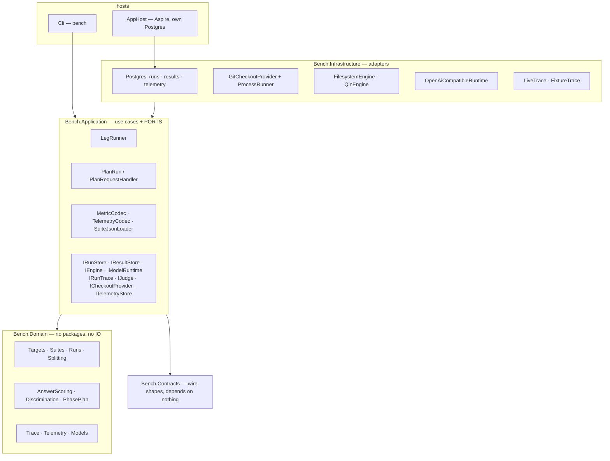
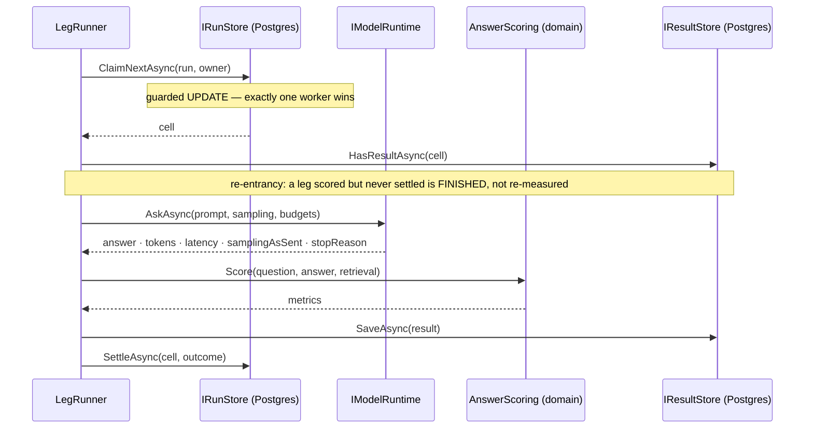

# Architecture — the system as it is

> Status: **current as of 2026-08-15.** Describes what exists and runs, not what is planned; the plan is
> [todo/PLAN_rag_bench_repo.md](../todo/PLAN_rag_bench_repo.md) and the evidence behind the design is
> [MEASURED_LESSONS.md](MEASURED_LESSONS.md). Where the two disagree, this file is wrong and should be
> corrected — a description that has drifted from the code is the failure this convention exists to catch.

## What it is

A benchmark that answers *"is configuration A better than configuration B"* about **any repository, at any
commit, measured by any engine, answered by any model**. Its output is a comparison, not a pass or a fail,
and almost every structure below exists to stop that comparison from being confidently wrong.

## The layers

Ports and adapters, with the domain as a leaf that depends on nothing. `ArchitectureTests` asserts it by
reading assembly references, so a violation is a red build rather than a review comment.



Two projects depend on **nothing**: `Bench.Domain` and `Bench.Contracts`. That is not tidiness — a wire
contract able to reference the domain is a contract that leaks it, and a domain able to reference a package
is a domain whose rules cannot be tested without one.

## The measurement contract

One result row is identified by, and comparable only within, this tuple:

```
target   = (repoUrl, commitSha, exclusions[])     -- pinned, never ambient
engine   = (kind, endpoint, version, indexFingerprint)
suite    = (suiteId, suiteVersion)                -- frozen and hashed
subject  = (modelId, samplingAsSent)              -- 1..N
lane     = (toolSurface, preamble)                -- 1..N
repeat   = ordinal                                -- n >= 2 to rank anything
```

`ComparisonScope` is the part that must match before two results may be put beside each other: the target
and the suite. Everything else is an axis you compare *along*.

**Identity is separate from configuration.** `ModelRef` is an id; `ModelEndpoint` holds the address and the
prices. Every aggregate, every discrimination reading and every saturation label is keyed by the id, so
folding an address into it would make the same model at a different port a different subject.

## One leg, end to end

`LegRunner` is the assembly. Every piece it uses existed and was tested separately before it; this is where
the seams are actually proved.



**Result first, settle second.** A crash between them leaves the cell claimed rather than settled, so the
sweep hands it back and a retry finishes the interrupted job. Settling first would lose the result
invisibly.

**An answer cut off at a ceiling settles as `CapExceeded`, not `Completed`** — scored as a wrong answer it
would measure the ceiling, and only a recorded cap keeps the leg out of paired deltas.

## Phases

A leg runs phases, and phases are ours: the adopted evaluation library's unit is a single evaluation with
no notion of one. `TaskKind` picks the plan — `Reading` answers once and is judged; `Fix` runs
**investigate → fix → verify → judge**. A phase cannot start while an earlier one is unfinished, and a
ceiling or a crash stops the **leg**, not just the phase.

## Two vantage points on the same call

| | bench-side trace (`IRunTrace`, `LegRecorder`) | server-side telemetry (`ITelemetryStore`) |
|---|---|---|
| covers | this harness's own legs | **all** traffic, benchmark and real sessions |
| knows the prompt, the answer, the cost | yes | no |
| knows server processing time, the payload returned, the project scope | by inference | exactly |
| shipped by | this repository | `dew_flow_mcp` / `dew_flow_rag_qln`, ingested here from a spool |

The trace port has **two** implementations — live black-box and fixture-replay white-box — because an
interface with one implementation proves nothing about its own shape. The white-box funnel (candidates →
fused → reranker in/out → enriched → sent) is what answers *"recall failure or ranking failure"*, and no
engine emits a real one yet: it lives on a fixture until an engine we control grows retrieval.

Telemetry records carry a **caller-supplied** correlation (leg + phase). The emitter cannot know what a
benchmark leg is, so a real session records as unattributed — and unattributed traffic is excluded from a
leg's totals rather than folded in.

## Guards that shape the API

Each is here because something went wrong that it now prevents; the catalogue is
[MEASURED_LESSONS.md](MEASURED_LESSONS.md).

- **Nothing is captured-or-zero.** `Captured` / `CapturedCount` carry a flag beside every value. Unreported
  tokens make a cost *unknown*, never free.
- **Unset is a refusal.** An empty model id or base url is refused rather than defaulted — an empty
  reranker id once resolved to a paid cloud model inside an arm labelled "$0 local".
- **A budget records the runtime that accepted it**, and a runtime refuses ceilings it cannot enforce. A
  cost ceiling is enforced by the harness not starting the next leg, never by a completion endpoint.
- **Discrimination is a property of a comparison**, not of a question, and nothing is deleted for being
  easy. Difficulty is a measured label per subject tier.
- **A suite version is frozen and hashed**; ground truth is commit-scoped and re-targeting is explicit.
- **Checkouts are read-only** — a bare clone per url, a worktree per commit, never a directory anyone works
  in.
- **A retrieval expectation in a lane with no retrieval is *not applicable*, not a miss.** Scoring it zero
  would make the no-tools baseline look worse than it is, and that baseline exists to be compared fairly.

## What does NOT exist yet

Stated because a description that quietly implies more than is built is the same defect as a stale diagram.

- **No tool-calling loop.** `IEngine` exposes tools and `FilesystemEngine` implements them, but `LegRunner`
  asks the model exactly once. Every lane is therefore currently a no-tools lane, and anchor recall reads
  *not applicable* everywhere.
- **No judge.** `IJudge` is declared; nothing implements it. Scoring is entirely mechanical, deliberately —
  the first measurement must not depend on a second model.
- **No cloud runtime.** Only the OpenAI-compatible local one.
- **No hardware sampler**, no UI, and the API route group is not hosted.
- **`IBenchStore` / `InMemoryBenchStore` are dead** — nothing calls them.
