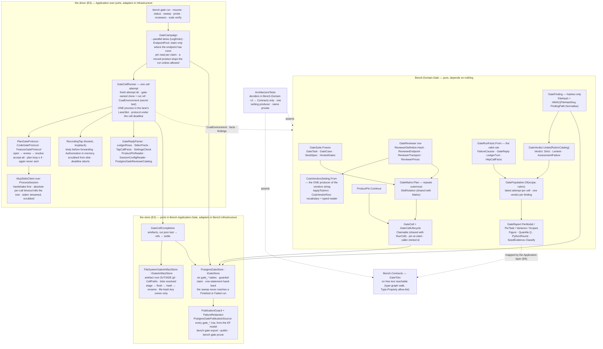

# Module — Gate: the coai gate-model benchmark

> Status: **the domain and the contracts (E1), the store and the privacy guard (E2) and the driver (E3) exist,
> 2026-09-28: `bench gate run` drives the product over MCP stdio, cell by cell, and stores every session.** The
> assessment (E4), the import (E5), the report surfaces and the page (E6) and the first campaign (E7) are open in
> [todo/PLAN_coai_gate_model_benchmark.md](../todo/PLAN_coai_gate_model_benchmark.md).
> This file describes what is built; a sentence here about something that does not run is a bug in the file.

## Purpose

Which reviewer MODEL, on each of the product's three review gates (plan · code/diff · feature), finds the
planted defects — at what cost, how repeatably. The product is `coai-mcp` (ConnectOtherAIs), driven the way a
person's editor drives it, never a side harness. The measurement model is the retrieval benchmark's, applied
to a different leg: the subject is a **reviewer plus its calibrated transport**, the task is a **frozen seeded
case** that serves all three gates, a run produces findings, a blinded strict assessment says which were
supported and which seeds were hit, and every number is a comparison inside one scope.

Three things this module exists to make impossible, each already paid for elsewhere in this repository:

- **a mean over two populations** — two products, two settings hashes, two rubric kinds in one column;
- **a gap rendered as a fact** — an unassessed finding as `0 %`, an unmetered reviewer as free, two repeats as a
  variance;
- **private text on a public page** — the suite, the checkouts, every prompt and answer and every finding's
  text stay outside git and outside the database; the database holds ids, hashes, enum names and numbers.

## The measurement tuple

```
gate      = plan | code | feature                          GateKind
task      = (taskId, language, hostedGates, calibration,   GateTask → TaskSummary is what the store holds
             seeds[] as (id, crossEpic))
suite     = GateSuite.Stamp = id#hash12                    hash of the tasks' LENGTH-PREFIXED canonical forms;
                                                           the clone location and the private names are NOT
                                                           inputs
reviewer  = (reviewerId, ReviewerDefinition.Hash)          runtime WORD (api · codex · gemini · claude ·
                                                           antigravity · local · remote) · model · endpoint ·
                                                           key NAME · transport (dialect, effort, maxTokens,
                                                           timeout, followUps, cap, thinking) · prices · gates
product   = ProductPin (binarySha256, versionText,         stored per CELL at claim time; a moved product
             gitSha, dirtyFiles as CapturedCount,          is refused naming both shas
             checkedTree)
settings  = settingsHash                                   every COAI_* as sent, minus secrets (E3)
repeat    = 1..n, repeats OUTERMOST                        GateMatrix.Plan
```

`GateScope = (suiteStamp, gate, product.versionText, product.binarySha256, settingsHash)` is what must match
before two runs may be put beside each other; everything else is an axis compared along. `GateReport.Scopes`
partitions a run set by it — two pins in one campaign are two partitions, and so are two builds that print
the same `--version` text from different bytes (a dirty rebuild at one HEAD), never a mean.

Inside a scope, `GatePopulation` decides WHICH runs and verdicts every figure is over, once: one run per cell
(campaign, task, reviewer, repeat) — its latest attempt; two campaigns in one scope are two runs of a repeat,
and an imported run carries its import's campaign id — with every attempt counted in the attempts columns; the
verdicts of ONE rubric (id, kind and hash), one per finding, a real reading preferred over an
`AssessmentFailure` and an independent assessor over one of the reviewer's own family; and a valid run that
found nothing counted as assessed with zero hits.

## Diagram



## Core entities, and the rule each one carries

| entity | file | the rule |
|---|---|---|
| `GateSuite` | `src/Bench.Domain/Gate/GateSuite.cs` | frozen over SNAPSHOTS (the task list is copied, every task holds its own copy of its seeds — a caller editing its lists afterwards changes nothing), hashed; the stamp is `id#hash12` over the tasks' canonical forms. A **moved clone keeps its stamp** (`CloneLocation` is not an input); private names are a guard input, not a hash input. `Task(id, gate)` refuses a task that cannot host the gate; `SeedsOf` refuses a task with no seeds — no zero-of-zero recall |
| `GateTask` · `GateCase` · `SeedSpec` | `GateTask.cs`, `SeedSpec.cs`, `CanonicalFields.cs` | the trial's shape field for field; a seed without trigger, mechanism AND consequence is refused, because the strict rubric judges all three. Every canonical form is **length-prefixed** (`CanonicalFields`, `length:value` per field, the seed count a field of its own) — a separator inside free text used to forge a boundary: two different cases, and one seed spelling two, stamped alike. The plan path is **repository-relative** (`RepositoryRelative`): rooted (`/x`, `\x`, `C:\x`, `C:x`), a url, or a whole `..` segment is refused. `TaskSummary` / `SeedRef` are what the database holds — no text, no path |
| `GateReviewer` · `ReviewerDefinition` | `GateReviewer.cs`, `ReviewerDefinition.cs` | the variant-catalog row, mirrored: added and retired, never edited, hashed; two rows with one hash are reported as one configuration (`GateReviewerCatalog.SameConfiguration`). The **transport is part of the subject**, so `effort` changes the hash. The definition's and the transport's canonical forms are length-prefixed (`CanonicalFields`) — a `|`-joined form let a model and a url trade text and keep one hash. Key names and refs are NAMES (`ModelConfig.IsReference`) |
| `ReviewerEndpoint` · `ReviewerRuntime` | `ReviewerEndpoint.cs` | a public vendor url is a VALUE; a loopback, private-range, link-local, `localhost`, `.local` or bare-name address is refused as a value and stored as a REFERENCE — `ModelConfig`'s rule, inverted for addresses. An IPv4-mapped IPv6 address (`[::ffff:10.0.0.7]`) is normalised to the IPv4 it carries before the range checks. The runtime is one member per product WORD — `Api`, `Codex`, `Gemini`, `Claude`, `Antigravity`, `Local`, `Remote`; there is no `cli`, because the product runs a word it does not know on Codex |
| `CoaiVendorsSetting` · `CoaiVendorRow` | `CoaiVendorsSetting.cs`, `CoaiVendorRow.cs` | `CoaiVendorsSetting.From` is the one producer of the vendors string and lives INSIDE the type: private constructor, private variable name, `ApplyTo(env)` the only way into an environment (it removes any inherited spelling of the variable). An architecture test reflects over every production assembly for any other member that returns a setting and any constant holding the name, each with a planted negative. **Only the gate under measurement is ticked**; the runtime is the product's word; an effort of `none` (the module default) is not written. `CoaiVendorRow` is the vocabulary — `KnownFields`, each with the JSON type the product reads — and the reader: an unknown field, or a known one of the wrong type (`"plan":"false"`), is refused by name; absent or `null` is the product's default |
| `ProductPin` | `ProductPin.cs` | `Continue(campaign, current)` refuses a moved product naming both shas; an imported pin (no binary hashed) never matches; a binary outside a checkout has an empty git sha and a dirty count that is *not captured*, never zero |
| `Claimable` (shared) | `src/Bench.Domain/Runs/Claimable.cs` | the four claim fields and the claim/settle/reclaim/stale transitions, composed by `RunCell` and `GateCell`; `MaxAttempts = 3` lives here once |
| `GateCell` · `GateCellLifecycle` | `GateCell.cs` | `Pending(id, runId, cell)` — the CALLER mints the id, the factory reads no clock; claimed UNDER a pin, refused without one; abandonment is `Claimable`'s rule |
| `SlotRotation` (shared) | `src/Bench.Domain/Runs/SlotRotation.cs` | the global slot rotation, called by `Matrix.Plan` and `GateMatrix.Plan` |
| `GateMatrix` | `GateMatrix.cs` | task × reviewer × repeat, **repeats outermost** (the three repeats of one task are never adjacent), reviewers rotated, repeats numbered from one |
| `GateRunFacts` · `FailureCauses` | `GateRunFacts.cs` | a port of the other harness's `summarise` / `failure_cause`: **valid** = verdict ∈ {proceed, revise} ∧ ≥ 1 ledger turn ∧ every turn `ok` ∧ a findings LIST. Tokens sum what was captured or are *not captured*; cost is `CapturedUsd` — unknown, never free; review and per-turn seconds round through `PythonRound`, as `summarise` does. The failure's first reason is its `FailureKind`; every reason is in the text |
| `GateFinding` · `FileHashKey` · `FindingPath` | `GateFinding.cs`, `FileHashKey.cs` | ordinal, severity, category, gating, line, `TextHash`, `FileHash` — the only text the type graph can carry is the two hashes (a walk test); the one constructor for a NEW finding takes the text and keeps the hash (`Stored` only reads back a row, refusing any hash that is not 64 lower-case hex). `FileHash` is **HMAC-SHA256** under a `FileHashKey` (at least 32 bytes, never printed) of the path in its one normal form (`\` → `/`, empty and `.` segments dropped) — a plain SHA-256 of a guessable path is confirmed by hashing candidates. The key lives ONLY in the artefact root, never in git or the database; the domain takes it as a value; the artefact root creates, reads and refuses it (`GateFileHashKeys`, E2) |
| `Rubric` · `RubricCatalog` · `Verdict` · `GateVerdict` | `Rubric.cs`, `Verdict.cs` | a verdict is issued under a rubric the catalog holds, of that rubric's kind; `AssessmentFailure(cause)` is a verdict case that never counts in a rate; the cluster key travels as a hash |
| `GatePopulation` | `GatePopulation.cs` | which runs and verdicts a figure is over: the latest attempt per cell (campaign, task, reviewer, repeat), every attempt kept beside; one rubric (id + kind + hash); one verdict per (run, finding) — real reading over `AssessmentFailure`, independent assessor over family-matched, then assessor and batch id; `IsAssessed` = has verdicts, or valid with zero findings |
| `GateReport` | `GateReport.cs`, `GateReportRows.cs`, `ReviewerAggregate.cs`, `Figure.cs`, `PythonRound.cs` | `PerModel(scope, rubric, input)` — the operator's columns, the `Rubric` required; **calibration tasks in `ModelTable.Calibration`, never in `Rows`**; `Runs` one per cell plus `Attempts` / `AttemptsFailed`; `AssessorFamilyMatched` counted apart; variance as two spreads over the cells, each with a state — seeds need 3 ASSESSED readings, findings 3 cells; `Unassessed` (`—`) where nobody looked; `Unknown` where nothing was metered; a failed run in every denominator; `AssessmentFailed` its own column; `TaskRowOf` / `VarianceOf` take their ids from the caller, so an empty group is an empty state; `Quantile.Q` = `report.py: q`; every rounding the Python report does (`q`, `pct`, the means, the costs) goes through `PythonRound` (the exact binary value, half to even), each pinned on vectors printed by the Python |
| `SeedEvidence` | `SeedEvidence.cs` | where a seed's evidence sat — pack / pack by file / on request / withheld / unknown — off the product's turn-1 prompt |
| `Gate*Dto` | `src/Bench.Contracts/GateContracts.cs` | figures travel as `GateFigureDto(known, value, state)`; `GateContractsGuardTests` walks every `Gate*Dto` into the nested types and collection elements it reaches and holds every text-bearing property — `string`, collections and dictionaries of strings, `object`, `JsonElement`, `JsonNode` — to an allow-list keyed by `Type.Property`, with `GateRunSummaryDto.FailureText` the one named exception; planted negatives (a `FailureText` elsewhere, a nested `FindingNote(string Title)`, `List<string>`) prove it bites |
| `GateRun` · `GateRunStatus` · `DataDirMode` · `GateSettlement` | `GateRun.cs` | a `bench gate run` invocation — the CAMPAIGN its cells belong to and the id every artefact path starts with. Forward-only status (Planned → Running → Finished or Failed); a terminal run's cells are never swept and never claimed; the data-directory mode is stored on the run so a resume cannot flip it. A product SESSION is one cell's settled attempt (only one attempt of a cell ever settles), so `GateRunRecord.RunId` is the cell's id. `GateSettlement` is `Completed(facts, findings, settingsHash, promptHash)` or `Failed(cause)`; `GateRunFacts.NotProduced(cause)` gives a failed session invalid facts with nothing captured — it stays in every denominator |
| `CellPaths` · `ArtifactPath` · `ArtifactScope` | `CellPaths.cs` | the ONE path function. `ArtifactPath` is relative to the artefact root: `/`-separated segments of `[A-Za-z0-9._-]`, never empty, `.` or `..`; rooted, drive, url and backslash forms are refused at parse time. `DataDirFor(run, cell, attempt)` is `runs/<run>/cells/<cell>/attempt-<n>/data` (isolated) or `runs/<run>/data-shared` (shared). `Allows(scope, path)` decides by SEGMENT (so `attempt-10` is not under `attempt-1`): an isolated cell cannot reach `data-shared`, a shared run cannot reach a cell's private `data`, no cell reaches another cell or another attempt |
| `ArtifactRef` · `ArtifactClass` · `ArtifactFootprint` | `ArtifactRef.cs` | what the database knows of a file: relative path, attempt, class, SHA-256, length — never the bytes. `Of` refuses a path outside the writing attempt; `Stored` re-parses a row's path, so a hand-edited `..` is refused on read. A footprint that could not be measured is `unknown`, never zero |
| `PublicationGuard` · `PrivateNames` · `FailureRedaction` | `PublicationGuard.cs` | the string guard: refuses `://`, a drive path, `/home/`, `\Users\` (and `/Users/`) and any private name (case-insensitive), a HOST name (this machine's name as a whole word, `DESKTOP-…`/`LAPTOP-…`/`WIN-…`, `*.local`/`*.lan`/`*.internal`/`*.corp`/`*.home`), naming table, column, row id and the RULE — never the text, and the row id itself is redacted, because a reviewer id can be the private name. The one column checked by a stricter rule than `://` is `gate_reviewers.EndpointUrl`: any non-empty value there passes only when `ReviewerEndpoint.Parse` reads a public vendor url — a schemeless `llm.corp.internal:8000` is refused as well (it spells no `://`). `FailureRedaction` replaces urls, machine paths and private names in the failure sentence before it is stored |
| `HashText` | `HashText.cs` | the one twelve-character short form of a hash every stamp uses — never a `[..12]` that throws on a shorter value |
| `CoaiEnvironment` · `SecretValue` · `ChildEnvironment` · `GateRunSettings` | `CoaiEnvironment.cs` | one cell ATTEMPT's environment, a port of the calibration's `child_env`: the parent's `COAI_*` dropped (and the variable the reviewer names as holding the creds key), the run's pinned knobs (`COAI_FEATURE_MIN_EPICS=1` — the product's default 3 SKIPS a small plan —, consult off, `COAI_ON_EXHAUSTED=good_enough`, the product's concurrency caps, Debug logs) plus the operator's `--set` extras, the reviewer's transport, the vendors string through `ApplyTo`, `COAI_CALLER_SESSION=bench-gate-<run8>-<reviewer>-<task>-r<n>-a<k>`, `COAI_DATA_DIR` from `CellPaths.DataDirFor`. `Snapshot` = every `COAI_*` sent minus secrets by name; `SettingsHash` (the SCOPE's) = the snapshot minus `AxisVariables` (the cell's identity and the reviewer's own configuration, each with its reason). The secret joins only at `WithSecret`, LAST, into a `ChildEnvironment` that renders as names and `Scrub`s the key out of stderr; `SecretValue` prints `[redacted]`. An operator extra that is not `COAI_*`, is harness-owned or looks like a secret is refused |
| `GateRunResume` · `RequestedDataDir` | `GateRun.cs` | a resume never flips the data-directory mode, and a finished run is a record — both refused by name |
| `GateReplyParser` · `ParsedFinding` · `LedgerRows` · `StderrFacts` · `TapCallFacts` | `GateReplies.cs` | the reply (not JSON → `NotJson`; `{error}` → `Refused`; findings a LIST or *not captured*; the product's severity and category words), accept-all decisions, `Passed` = proceed · good_enough · continue_anyway; the ledger's REVIEW rows of the gate's own stage word (`PlanReview` · `CodeReview` · `FeatureReview`, the product's `Stage` enum — a code cell's plan loop and a consultation are not the code reviewer's spend), an absent field *not captured*; served/refused and the shim's prompt files off stderr; a tap call without a facts file is status 0 |
| `SettingsCheck` · `SettingsApplied` | `SettingsCheck.cs` | what was ASKED against THIS run's session file: mismatches, checked, and unchecked (a knob the disk cannot show — never passing); `good_enough` and `GoodEnough` are one decision |
| `EndpointRoutes` · `ResolvedReferences.Hash` | `CoaiVendorsSetting.cs` | the tap's loopback address routed into the vendors string by the one producer; the hash of what a row's references RESOLVED to, stored per cell (`ReferencesHash`) — the row hashes the names, so a re-pointed endpoint would otherwise be one population, and a resume where it changed is refused |
| `GateSessionNotes` | `GateRun.cs` | on a settlement: the handshake's `serverInfo.version`, the references hash, the settings check as counts |

## Entry points

- `bench gate export --public --db <conn> --suite-file <suite.json> --out <file.json>` — every `gate_*` row (read
  through the EF model, so a new column is exported and guarded without anyone listing it) EXCEPT the claim owner
  (`Owner`, `OwnerHost`, `OwnerPid` — sweep state that names a machine and a process; a row still carrying one is
  refused whatever its value) through
  `PublicationGuard`, written as one JSON document (`kind: bench-gate-public-export`). **Built from database rows
  ONLY; it never opens the artefact root**, so nothing inside a request, a reply, a prompt, an answer or a findings
  file can reach it. Without `--public` → 4; without the suite's private names (`--suite-file` or
  `BENCH_GATE_SUITE`) → 4, because an export that does not know which names are private cannot prove it carries
  none; one violation → 5 and nothing written. The file is staged, flushed and renamed over the target; a target that cannot be written → 3, with the partial file removed.
- `bench gate prune --artifact-root <dir> [--tap-retention-days 30] [--dry-run] [--json]` — releases tap
  request/response bodies past the window from attempts that committed a `run.json`; lists unfinished and
  interrupted attempts without touching them, and never follows a link planted at an attempt's `tap/` (a prune
  deletes); prints every run's footprint (`unknown (why)` when it could not be
  measured). A root inside a git checkout → 4.
- The ports, for the driver (E3): `IGateStore` (plan · claim under a pin · settle with facts and findings · sweep
  · advance · cells · facts · artefact refs) and `IGateArtifactStore` (begin an attempt · write · read-and-verify ·
  attempts on disk · footprint · the file-hash key · prune), plus `GateCellCompletion`, the commit protocol.
  `GateFileHashKeys.ResolveAsync` is the one place the key is read, created or refused.
- `bench gate run --gate plan|code|feature --suite-file <suite.json> --reviewers <id,…> --coai-exe <coai-mcp>
  --artifact-root <dir> --db <conn> [--repeats 3] [--parallel 4] [--per-endpoint 2] [--shared-data-dir] [--no-tap]
  [--prediction "<text>"] [--allow-product-change] [--set "COAI_X=1,…"] [--cell-timeout-minutes 300]
  [--checkout-root <dir>] [--creds-key-from-coai-settings]` — loads and refuses in the order a person fixes things
  (flags 4 · missing files 3 · suite 4 · database 3 · reviewers 4 · pin and file-hash key 3), refuses a product that
  moved since an earlier native run of this gate and suite measured any of these reviewers (4, both shas named) unless
  allowed, plans the matrix (repeats outermost), writes the prediction to `runs/<id>/prediction.txt` (its hash on the
  run) and the run settings to `runs/<id>/run-settings.json`, drives the campaign, prints the pins seen and the
  footprint. Exit 0 cells produced · 3 pin unreadable / too many failures · 4 product moved · 5 nothing produced
  (resumable). A shared data directory runs one lane (`--parallel` above 1 is refused, saying why).
- `bench gate resume --run <id> [--dry-run] [--shared-data-dir|--isolated-data-dir]` — the same inputs; refused when
  the suite stamp differs, the product moved (unless the run allows it), the mode would flip, or a reviewer's
  references now resolve to something else than its settled cells were measured under. `--dry-run` is `status`.
- `bench gate status --run <id>` — pending, claimed (owner, age), abandoned (cause), settled (failed), the pins seen,
  the data-dir mode. Claims nothing. `bench gate sweep` — hands back claims whose owner is provably gone and removes
  the gate clones of runs that ended.
- `bench gate probe --coai-exe … --reviewers <id>` — the product started with that reviewer's environment in a throwaway
  data directory: `tools/list`, `providers` (an allow-list of fields), no model called.
- `bench gate reviewers add --id … --runtime api|codex|gemini|claude|antigravity|local|remote --model … [--endpoint
  <public https url | VARIABLE_NAME>] [--key-name …] [--creds-key-ref VARIABLE] [--executable-ref VARIABLE]
  [--dialect …] [--effort …] [--max-tokens …] [--timeout-minutes …] [--follow-ups …] [--review-minutes …] [--thinking]
  [--price-in/--price-cached/--price-out …] --gates plan,code,feature` · `list [--all]` · `retire --id …` — added and
  retired, never edited; a row read back whose stored hash no longer matches its definition is refused.
- `bench gate suite verify --suite-file … [--checkout-root …]` — every task's checkout at its variant head with its
  plan committed there; 3 when any is not.
- `bench gate assess` (E4), `bench gate import` (E5), `bench gate report` + `/api/bench/gate/*` + the Gate tab (E6)
  are open in the plan.

## The driver — one cell attempt, end to end

The calibration harness's `one_run`, in C#, over ports (`GateCellRunner`, Application):

1. **A fresh attempt directory** (`BeginAttemptAsync`): earlier attempts of the cell are marked `interrupted.json`,
   kept whole, never continued. The attempt number IS the claim's.
2. **The checkout**: a GATE-OWNED clone per run and task, `<checkout-root>/gate/<runId>/<task>`, made with `git clone
   --shared --no-checkout` from the read-only worktree `ICheckoutProvider` keeps and detached at the variant head; the
   run's ref `bench/gate/<run8>/<reviewer>/<task>-r<n>-a<k>` is made THERE (plan and code). The shared read-only
   checkout is never written.
3. **References and the key**: the reviewer's references resolved through `ISecretSource` (`GateSecrets`), the vault's
   access key for an `api` row from the variable its `credsKeyRef` names, or — opt-in — from the machine's coai
   `settings.json` (`CoaiSettingsSecrets`), held as a `SecretValue`.
4. **The tap** for an `api` row whose endpoint is known (`RecordingTap`, a loopback Kestrel per cell): the vendors
   string routes the row's base url through it (`EndpointRoutes`). Deadline = the review cap + 5 minutes.
5. **The environment** (`CoaiEnvironment`), the secret last.
6. **ONE process** in the lane's `LaneSlot` (opening a second throws — one process per cell), over `McpStdioClient`:
   `initialize` → `notifications/initialized` before any call; every call's timeout is what is left of the CELL's
   absolute deadline (`--cell-timeout-minutes`), and a call that runs out kills the process tree.
7. **The protocol**: plan — `open → review_plan → resolve` (ONE round is the measurement); code — `open → plan loop
   (≤ 4, accept-all, until a passing verdict) → review_code → resolve`, a loop that never passes recorded as a
   completed, INVALID run (`VerdictNotPassing`, review_code never called); feature — `review_feature` with the suite's
   inputs, no open, no resolve (the calibration's shape). `again` is never sent. Each resolve's refusal is kept on its
   stage.
8. **The process gone, the tap closed** — calls still open are aborted and marked `closed_at_cell_end`.
9. **Evidence read back** (`IGateAttemptFiles`): the reply, the ledger (the slice appended during THIS session — a
   shared directory's `usage.jsonl` is one file), stderr (served/refused, the shim's prompt files → the turn-1 prompt
   hash), the tap's calls, this session's config → the settings check.
10. **Facts, findings, settlement**: `GateRunFacts.From`, findings hashed under the root's key (text to
    `findings.jsonl`), the failure redacted with the suite's private names and this host; a session that BROKE (no
    measurement: the product exited, the deadline ran out) settles `Failed` (`ProcessDied` / `Interrupted`).
11. **Commit** (`GateCellCompletion`): live files ADOPTED where they lie (`stderr.txt`, `tap/call-NN.*` — flushed and
    hashed, never copied), then `settings.json`, `request.json`, `stage-<name>.reply.json` / `.resolve.json`,
    `reply.json`, `findings.jsonl`, `ledger.jsonl`, `settings-check.json`, `answers/NN-*`, and `run.json` LAST; refs in
    one transaction; then the settle.

**The campaign** (`GateCampaign`): `--parallel` lanes, each its own database context, store, runner and slot, each a
`LegDrain`. A lane pins the product (`ProductPinReader`) before EVERY claim; a moved product stops every lane
(`ProductMoved`, exit 4) unless the run allows a change, in which case the next claim is under the new pin and the pins
seen are listed. The per-endpoint cap is enforced AT THE CLAIM (`EndpointPool`): under one lock, a lane claims only
among reviewers whose endpoint has a free slot (`IGateStore.ClaimNextAmongAsync`), and waits for a release only when
every pending cell's endpoint is full — so no lane holds a claimed cell at the head of the line while another endpoint
idles. The endpoint key is the url value, the reference name, or a CLI row's runtime word.

**Measured against the real product** (`GateDriverLiveTests`, 2026-09-28, the installed coai-mcp 0.39.0, a `local`
reviewer at a loopback stand-in vendor): `providers` answered, one plan cell completed — verdict proceed, valid, one
ledger turn, one vendor call — and its session was stored with `serverInfo.version`.

**The pin** (`ProductPinReader`): SHA-256 of the deployment set — every `.dll`, `.exe`, `.json` under the binary's
folder, when a sibling `<name>.dll` shows a framework-dependent build (an apphost barely changes between builds) — or
the file alone; `--version`'s first line; and under a checkout the short sha and `git status --porcelain
--untracked-files=no -- <the nearest *.csproj directory>`, naming the tree.

## The store — six tables, two migrations (`GateTables`, E3's `GateDriver`), no existing table touched

| table | one row per | what it holds |
|---|---|---|
| `gate_runs` | `bench gate run` invocation | gate, suite stamp, data-dir mode, status, source (`native` or the harness an import came from); since E3 the prediction's HASH (its text is in the artefact root) and whether a product change is allowed |
| `gate_cells` | task × reviewer × repeat | the claim (state, attempts, owner label/host/pid, claimed-at), the pin taken at claim, and once settled the session's facts — every count beside a *captured* flag, the vendor's finish WORDS, the verdict word, the failure KIND and the ONE free-text column, `FailureText` (redacted); since E3 the handshake's `ServerVersion`, the `ReferencesHash`, and the settings check as `SettingsChecked` / `SettingsMismatches` |
| `gate_findings` | finding of a settled session | ordinal, severity, category, gating, line, `TextHash`, `FileHash`; `(cell, attempt, ordinal)` unique |
| `gate_verdicts` | verdict on a finding under a rubric | rubric id/kind/hash, the verdict case, the strict fields as enum names, cluster hash, seed id, assessor id, batch id, prompt hash, family match (written by E4) |
| `gate_reviewers` | reviewer catalog row | the definition flattened: runtime, model, the endpoint as a public url OR a reference name, key/creds/executable NAMES, the transport, prices, the gates ticked, added/retired (written by E3's `reviewers add`) |
| `gate_artifacts` | committed file | run, cell, attempt, class, RELATIVE path (unique), SHA-256, length |

**The claim** takes the next pending cell in the MATRIX's order — slot, then position (it was position first until
E3's consultation found it reversing the nesting: planned A1 B1 B2 A2, claimed A1 B2 B1 A2) — optionally only among
named reviewers (`ClaimNextAmongAsync`, the lanes' capacity-aware claim), with one UPDATE guarded on
`State == Pending` that sets the owner, the claim time, the pin and
`Attempts + 1` in the same statement — so the attempt number a cell is claimed at is its attempt directory — and a
run that ended is never claimed from. **The hand-back is ONE statement per stranded cell**, guarded on every fact
the sweep decided on — still claimed, the same owner (label, host, pid), the same claim time, the same attempt
count, a run that has not ended — and choosing requeue or abandonment (`Claimable.MaxAttempts`,
`FailureKind.Interrupted`) inside it. A hand-back never moves the count; the next claim moves it once. Candidates
are chosen the run store's way (stale in SQL, `WorkerIdentity.IsProvablyGoneOn` in memory). Measured by revert:
with the claim's `State` guard removed, 5 of 16 simultaneous claimers won one cell; with the hand-back's guard
reduced to the id, 6–8 simultaneous sweepers each counted the same cell. **The settle** is the guarded state change
plus the facts and the findings, in one transaction.

## The artefact root — layout and the commit protocol

```
<artifact-root>/                        refused if it is inside ANY git checkout (a .git folder or file above it)
  file-hash.key                         32 random bytes; created once (CreateNew), owner-only from creation
  runs/<runId>/
    prediction.txt                      the prediction written before the run (E3); its SHA-256 is on gate_runs
    run-settings.json                   the run's pinned knobs and --set extras, re-applied by a resume (E3)
    data-shared/                        COAI_DATA_DIR of a SHARED run
    cells/<cellId>/attempt-<n>/         one cell attempt — created once, never reused
      data/                             COAI_DATA_DIR of an ISOLATED run
      stderr.txt                        the product's stderr, streamed live with the key scrubbed, adopted at the end
      settings.json, request.json       the COAI_* snapshot (no secret); every tool call's arguments
      stage-<name>.reply/resolve.json   every review and resolve reply; reply.json is the measured one
      findings.jsonl, ledger.jsonl      the findings' TEXT; this session's slice of the product's usage ledger
      settings-check.json, answers/     the settings check; the api shim's prompt and answer files
      tap/call-NN.request.json          tap bodies (released by prune)
      tap/call-NN.response.json
      tap/call-NN.json                  tap facts (kept forever)
      tap/pruned.jsonl                  what prune released: file, SHA-256, length, when
      run.json                          the LAST artefact an attempt commits
      interrupted.json                  written into an earlier attempt when a later one begins
```

**Containment** is decided twice. By segment, in the domain (`CellPaths.Allows`). On the real filesystem, by
`ArtifactContainment`: `Path.GetFullPath`, then every EXISTING component asked whether it is a symbolic link or a
junction (dangling ones included) and replaced by its resolved target, then a separator-aware starts-with
(case-insensitive on Windows) against the root AND against the attempt's own writable roots — and a writable root
that is itself reached through a link does not count as one, so `cells/<a>` made a link to `cells/<b>` cannot
carry cell a's writes into cell b's folder. The residual race — a link created between the check and the write —
needs a hostile process already running as the operator.

**The commit**: stage (`<name>.staging-<guid>`, `CreateNew`, write-through) → flush to disk → SHA-256 and length →
rename into place (refusing an existing target) → the `ArtifactRef`. `GateCellCompletion` then persists every ref
in one transaction and only then settles the cell — after first checking, before a byte is written, that the owner holds the cell and the scope's attempt IS the claim's attempt. Killed at each step in the tests: before the rename nothing
exists under the real name (the staging file does, and nothing reads it); after it the file is whole; after the
refs the cell is still claimed. In every case the sweep hands the cell back, the next claim is attempt 2, the next
`BeginAttemptAsync` creates `attempt-2` and marks `attempt-1` interrupted (kept, never continued), and the cell
settles — measured by revert: settling before the refs left a cell SETTLED over refs that were never written.
Directory entries are not flushed after a rename (.NET has no portable directory fsync); a power loss can lose a
rename, which the next attempt treats like any other interrupted one.

**The file-hash key** is `file-hash.key`, 32 bytes from the OS generator — never derived from a path, never in
the database, never printed (`FileHashKey.ToString` is redacted). Owner-only FROM creation: `UnixCreateMode` 0600
on POSIX, and on Windows a PROTECTED access list (inheritance cut) with one rule, the current user. Every READ re-checks that: a key whose permissions were loosened after creation is `Unusable`. A root that
has lost its key while `gate_findings` holds rows is REFUSED rather than re-keyed (`GateFileHashKeys`); two
workers on a fresh root race on `CreateNew`, and the loser reads the winner's key.

## The publication guard

Structural first: `GateEntitiesGuardTests` walks every entity the EF model maps to a `gate_*` table (from the
model, so a seventh table is walked the moment it is mapped) with the same `TextSurface` walk as the DTO guard,
and holds every text-bearing property to an allow-list keyed by `Type.Property`; `GateCellRow.FailureText` is the
one free-text exception. Then the string guard over REAL rows: `GatePublicationTests` re-reads every row of every
`gate_*` table — `gate_artifacts.RelativePath` included — on a database of its own, with the sample suite's private
names (`samples/gate-suite.sample.json`, always) and the operator's (`BENCH_GATE_SUITE`, when set), and a fixture
with one dirty row per rule, each named by table, column and row id. `bench gate export --public` calls the same
`GatePublication.Check`. The export never includes an artefact's contents: a private name planted inside a
findings file on disk is tested not to reach it.

## External dependencies

None. Everything in `Bench.Domain.Gate` is pure; `System.Text.Json.Nodes` (runtime) builds and reads the
vendor row, `System.Net.IPAddress` (runtime) classifies an endpoint's host, `System.Security.Cryptography`
(runtime) keys the file hash and `System.Numerics.BigInteger` (runtime) does `PythonRound`'s exact arithmetic.
The product's runtime words are pinned by a COPIED fixture, `tests/Bench.Tests/Fixtures/coai-runtime-names.json`
(`coai · src_mcp/runners/Reviewers/ReviewerRuntime.cs`, `RuntimeNames`, commit `9cb01a2b`), replaced from the
product's source when it grows.

The store (E2) adds no package: `Bench.Infrastructure` already carries EF Core and Npgsql; the key file's Windows
access list uses `System.Security.AccessControl` and `System.Security.Principal` (runtime, Windows-only calls
behind `OperatingSystem.IsWindows`).

The driver (E3) adds no package either. `Bench.Infrastructure` gains a FRAMEWORK reference to
`Microsoft.AspNetCore.App` for the tap's Kestrel listener — it ships with the runtime — and drops three package
references that framework now carries (logging abstractions, `Microsoft.Extensions.Http`, `FileSystemGlobbing`;
NU1510 refuses a reference the framework already has). The product's finding words are pinned by a second copied
fixture, `tests/Bench.Tests/Fixtures/coai-finding-words.json` (`coai · src_mcp/core/Findings/Finding.cs`, commit
`9cb01a2b`). The fake product is `tests/FakeCoai`, a console the test project builds and launches from its own output
folder, never referencing it as an assembly; the real product is exercised by `GateDriverLiveTests` when
`BENCH_GATE_COAI_EXE` names a binary.

## Growth surfaces

The tables and the artefact root exist since E2; the sizes are still the plan's projection (§4) until E7's first
campaign measures them.

| surface | projected at one full campaign (3 gates × 8 tasks × 4 reviewers × 3 repeats = 288 runs) | retires it | interrupted |
|---|---|---|---|
| `gate_runs`, `gate_cells` | one `gate_runs` row per campaign; 288 `gate_cells` rows, < 1 MB | kept forever (the measurement) | a cell `Claimed` by a dead worker is handed back at the next sweep by ONE guarded statement, ownership-checked (`WorkerIdentity.IsProvablyGoneOn`); three hand-backs → `Abandoned`; a cell of a Finished or Failed run is never swept |
| `gate_findings`, `gate_verdicts` | ~5 findings/run → ~1 500 rows; verdicts ≤ findings × assessors | kept forever | findings land in the settle's transaction or not at all; an assessment batch that dies leaves its ids unassessed (E4) |
| `gate_artifacts` | ~10 refs per attempt → ~3 000 rows | kept forever, beside the files they describe | refs are persisted in one transaction after every file is committed and before the settle — a crash between leaves files without refs, under an attempt the next attempt marks interrupted |
| the artefact root, `runs/<id>/` | measured 2026-09-27: 160 MB for 71 feature runs ≈ 2.3 MB/run → ~650 MB per campaign, mostly tap bodies | `bench gate prune` releases tap bodies past 30 days (`--tap-retention-days`), each call's facts made durable and its release logged to `tap/pruned.jsonl` before a body goes; request / reply / stderr / ledger / answers are kept forever | an attempt without `run.json` never finished — prune lists it and touches nothing; an interrupted attempt is kept whole; a prune killed half-way leaves the facts and some bodies, never neither, and the next prune finishes |
| staging files (`*.staging-<guid>`) | none in a healthy run; one per crash mid-write | nothing yet — counted in the footprint, read by nothing | a crash before the rename leaves one, never a half file under the real name |
| `file-hash.key` | 32 bytes, once per root | never — losing it refuses the root while findings exist | — |
| checkouts at the variant heads | 8 worktrees + bare mirrors, the size of the repositories | the checkout root's existing owner; `bench gate suite verify --prune` is not built (open) | — |
| gate clones (E3) | one working tree per run × task under `<checkout-root>/gate/<runId>/`, objects borrowed from the mirror | `bench gate sweep` once the run is `Finished` or `Failed` | a clone of a run still open is reused by its resume |
| per attempt (E3) | `settings.json`, `request.json`, the stage replies, `reply.json`, `stderr.txt`, `findings.jsonl`, `ledger.jsonl`, `settings-check.json`, `answers/`, `run.json`, the product's own data dir (`usage.jsonl`, `sessions/`, `coai.db`, logs) and for `api` rows the tap — ≈ 2.3 MB per feature run as the calibration measured, most of it tap bodies | `bench gate prune` for tap bodies; the rest kept with the run | an interrupted attempt is kept whole and marked; ≤ 2 per cell by the abandon rule |
| `gate_reviewers` | tens of rows | never deleted, retired | — |

## Operator decisions assumed on 2026-09-27, pending the operator

Recorded in the plan's §9 and applied here where a type already carries them: an isolated data directory
by default (D4); a checkout build is "the product", pinned by sha (`ProductPin`); codex as the primary
assessor and the Claude CLI for an agreement figure (E4); the lenient 09-05/09-06 verdicts in their own
labelled column (`RubricKind.LenientWorth` is a separate population everywhere); the seeded 8-defect plan and
coai's own plans may go in `samples/`; the suite file lives in the local artefact root outside git; CLI
reviewers show *cost unknown*, never zero (`CapturedUsd`, `ReviewerPrices.Unknown`, `Figure.Unknown`); the
coordinator bumps the qln pin after E6.

## What does NOT exist yet

The reviewer catalog's imports (`reviewers add --from-coai-settings` / `--from-calib-models`, E7) and `suite verify
--prune`; the blinded export
and the assessor launch that write `gate_verdicts` (E4); the import of the 71 Python runs and the coai-bench
records (E5); the report verb, the API routes, the Gate tab and the mapping from `ModelTable` to
`GateModelTableDto` (E6). The per-model TABLES in the public export wait for E6's report; today the export is the
guarded rows.
