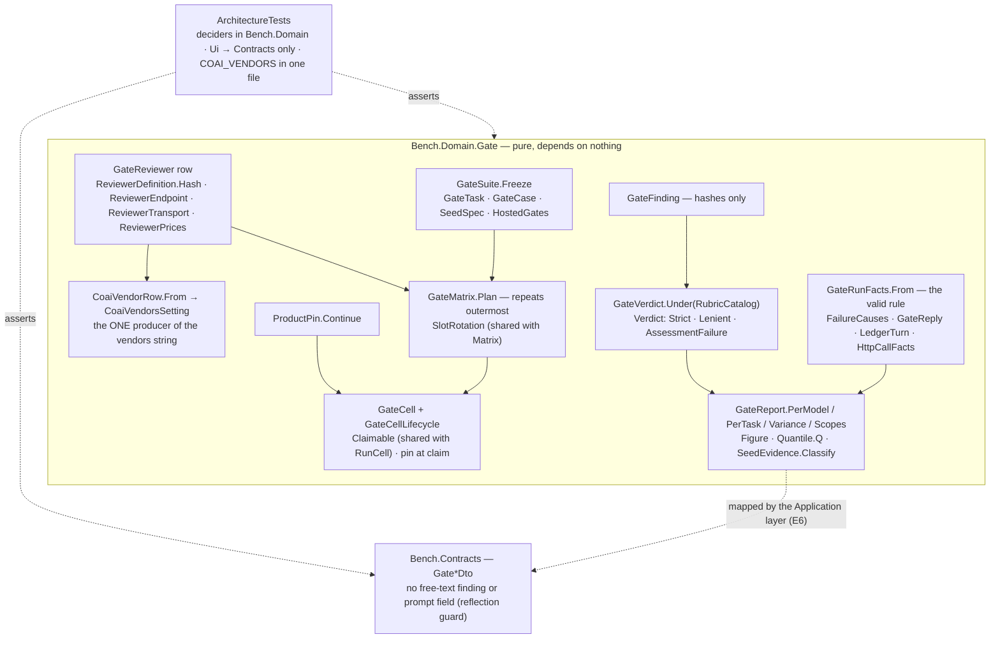

# Module — Gate: the coai gate-model benchmark

> Status: **the domain and the contracts exist (E1, 2026-09-27); nothing runs yet.** The store (E2), the
> driver (E3), the assessment (E4), the import (E5), the report surfaces and the page (E6) and the first
> campaign (E7) are open in [todo/PLAN_coai_gate_model_benchmark.md](../todo/PLAN_coai_gate_model_benchmark.md).
> This file describes what is built; a sentence here about something that does not run is a bug in the file.

## Purpose

Which reviewer MODEL, on each of the product's three review gates (plan · code/diff · feature), finds the
planted defects — at what cost, how repeatably. The product is `coai-mcp` (ConnectOtherAIs), driven the way a
person's editor drives it, never a side harness. The measurement model is the retrieval benchmark's, applied
to a different leg: the subject is a **reviewer plus its calibrated transport**, the task is a **frozen seeded
case** that serves all three gates, a run produces findings, a blinded strict assessment says which were
supported and which seeds were hit, and every number is a comparison inside one scope.

Three things this module exists to make impossible, each already paid for elsewhere in this repository:

- **a mean over two populations** — two products, two settings hashes, two rubric kinds in one column;
- **a gap rendered as a fact** — an unassessed finding as `0 %`, an unmetered reviewer as free, two repeats as a
  variance;
- **private text on a public page** — the suite, the checkouts, every prompt and answer and every finding's
  text stay outside git and outside the database; the database holds ids, hashes, enum names and numbers.

## The measurement tuple

```
gate      = plan | code | feature                          GateKind
task      = (taskId, language, hostedGates, calibration,   GateTask → TaskSummary is what the store holds
             seeds[] as (id, crossEpic))
suite     = GateSuite.Stamp = id#hash12                    hash of the tasks' canonical forms; the clone
                                                           location and the private names are NOT inputs
reviewer  = (reviewerId, ReviewerDefinition.Hash)          runtime · model · endpoint · key NAME · transport
                                                           (dialect, effort, maxTokens, timeout, followUps,
                                                           cap, thinking) · prices · gates ticked
product   = ProductPin (binarySha256, versionText,         stored per CELL at claim time; a moved product
             gitSha, dirtyFiles as CapturedCount,          is refused naming both shas
             checkedTree)
settings  = settingsHash                                   every COAI_* as sent, minus secrets (E3)
repeat    = 1..n, repeats OUTERMOST                        GateMatrix.Plan
```

`GateScope = (suiteStamp, gate, product.versionText, settingsHash)` is what must match before two runs may
be put beside each other; everything else is an axis compared along. `GateReport.Scopes` partitions a run
set by it — two pins in one campaign are two partitions, never a mean.

## Diagram



## Core entities, and the rule each one carries

| entity | file | the rule |
|---|---|---|
| `GateSuite` | `src/Bench.Domain/Gate/GateSuite.cs` | frozen, hashed; the stamp is `id#hash12` over the tasks' canonical forms. A **moved clone keeps its stamp** (`CloneLocation` is not an input); private names are a guard input, not a hash input. `Task(id, gate)` refuses a task that cannot host the gate; `SeedsOf` refuses a task with no seeds — no zero-of-zero recall |
| `GateTask` · `GateCase` · `SeedSpec` | `GateTask.cs`, `SeedSpec.cs` | the trial's shape field for field; a seed without trigger, mechanism AND consequence is refused, because the strict rubric judges all three. `TaskSummary` / `SeedRef` are what the database holds — no text, no path |
| `GateReviewer` · `ReviewerDefinition` | `GateReviewer.cs`, `ReviewerDefinition.cs` | the variant-catalog row, mirrored: added and retired, never edited, hashed; two rows with one hash are reported as one configuration (`GateReviewerCatalog.SameConfiguration`). The **transport is part of the subject**, so `effort` changes the hash. Key names and refs are NAMES (`ModelConfig.IsReference`) |
| `ReviewerEndpoint` | `ReviewerEndpoint.cs` | a public vendor url is a VALUE; a loopback, private-range, link-local, `localhost`, `.local` or bare-name address is refused as a value and stored as a REFERENCE — `ModelConfig`'s rule, inverted for addresses |
| `CoaiVendorRow` · `CoaiVendorsSetting` | `CoaiVendorRow.cs` | the one producer of the vendors string; the setting has no public constructor and a reflection test finds exactly one factory. **Only the gate under measurement is ticked.** `KnownFields` is the product's vendor vocabulary; the reader refuses an unknown field by name |
| `ProductPin` | `ProductPin.cs` | `Continue(campaign, current)` refuses a moved product naming both shas; an imported pin (no binary hashed) never matches; a binary outside a checkout has an empty git sha and a dirty count that is *not captured*, never zero |
| `Claimable` (shared) | `src/Bench.Domain/Runs/Claimable.cs` | the four claim fields and the claim/settle/reclaim/stale transitions, composed by `RunCell` and `GateCell`; `MaxAttempts = 3` lives here once |
| `GateCell` · `GateCellLifecycle` | `GateCell.cs` | claimed UNDER a pin, refused without one; abandonment is `Claimable`'s rule |
| `SlotRotation` (shared) | `src/Bench.Domain/Runs/SlotRotation.cs` | the global slot rotation, called by `Matrix.Plan` and `GateMatrix.Plan` |
| `GateMatrix` | `GateMatrix.cs` | task × reviewer × repeat, **repeats outermost** (the three repeats of one task are never adjacent), reviewers rotated, repeats numbered from one |
| `GateRunFacts` · `FailureCauses` | `GateRunFacts.cs` | a port of the other harness's `summarise` / `failure_cause`: **valid** = verdict ∈ {proceed, revise} ∧ ≥ 1 ledger turn ∧ every turn `ok` ∧ a findings LIST. Tokens sum what was captured or are *not captured*; cost is `CapturedUsd` — unknown, never free. The failure's first reason is its `FailureKind`; every reason is in the text |
| `GateFinding` | `GateFinding.cs` | ordinal, severity, category, gating, line, `TextHash`, `FileHash` — the only string properties are the two hashes, asserted by reflection; the one constructor takes the text and keeps the hash |
| `Rubric` · `RubricCatalog` · `Verdict` · `GateVerdict` | `Rubric.cs`, `Verdict.cs` | a verdict is issued under a rubric the catalog holds, of that rubric's kind; `AssessmentFailure(cause)` is a verdict case that never counts in a rate; the cluster key travels as a hash |
| `GateReport` | `GateReport.cs`, `ReviewerAggregate.cs`, `Figure.cs` | `PerModel(scope, rubric, input)` — the operator's columns; `RubricKind` required; `Withheld` below 3 repeats; `Unassessed` (`—`) where nobody looked; `Unknown` where nothing was metered; a failed run in every denominator; `AssessmentFailed` its own column; `Quantile.Q` = `report.py: q`, pinned on vectors run through the Python |
| `SeedEvidence` | `SeedEvidence.cs` | where a seed's evidence sat — pack / pack by file / on request / withheld / unknown — off the product's turn-1 prompt |
| `Gate*Dto` | `src/Bench.Contracts/GateContracts.cs` | figures travel as `GateFigureDto(known, value, state)`; every string property is on an allow-list (`GateContractsGuardTests`) and `FailureText` is the one named exception |

## Entry points

None yet. `bench gate run | resume | status | sweep | probe | reviewers | suite verify` (E3),
`bench gate assess` (E4), `bench gate import` (E5), `bench gate report` + `/api/bench/gate/*` + the Gate tab
(E6) are open in the plan. The architecture guard is the only thing that executes this module today.

## External dependencies

None. Everything in `Bench.Domain.Gate` is pure; `System.Text.Json.Nodes` (runtime) builds and reads the
vendor row, `System.Net.IPAddress` (runtime) classifies an endpoint's host.

## Growth surfaces (from the plan's §4 — projected, none of it exists yet)

| surface | projected at one full campaign (3 gates × 8 tasks × 4 reviewers × 3 repeats = 288 runs) | retires it | interrupted |
|---|---|---|---|
| `gate_runs`, `gate_cells` | 288 rows each, < 1 MB | kept forever (the measurement) | a cell `Claimed` by a dead worker is swept at the next `bench gate run\|resume\|sweep`, ownership-checked (`WorkerIdentity.IsProvablyGoneOn`); three hand-backs → `Abandoned` (`Claimable.MaxAttempts`) |
| `gate_findings`, `gate_verdicts` | ~5 findings/run → ~1 500 rows; verdicts ≤ findings × assessors | kept forever | an assessment batch that dies leaves its ids unassessed; the next `bench gate assess` re-asks them |
| the artefact root, `runs/<id>/` | measured 2026-09-27: 160 MB for 71 feature runs ≈ 2.3 MB/run → ~650 MB per campaign, mostly tap bodies | `bench gate prune` releases tap bodies past 30 days; request / reply / stderr / ledger / answers are kept forever | a run directory without a `run.json` never finished; the importer and the report ignore it and `bench gate sweep` names it |
| checkouts at the variant heads | 8 worktrees + bare mirrors, the size of the repositories | the checkout root's existing owner; `bench gate suite verify --prune` | — |
| `gate_reviewers` | tens of rows | never deleted, retired | — |

## Operator decisions assumed on 2026-09-27, pending the operator

Recorded in the plan's §9 and applied here where a type already carries them: an isolated data directory
by default (D4); a checkout build is "the product", pinned by sha (`ProductPin`); codex as the primary
assessor and the Claude CLI for an agreement figure (E4); the lenient 09-05/09-06 verdicts in their own
labelled column (`RubricKind.LenientWorth` is a separate population everywhere); the seeded 8-defect plan and
coai's own plans may go in `samples/`; the suite file lives in the local artefact root outside git; CLI
reviewers show *cost unknown*, never zero (`CapturedUsd`, `ReviewerPrices.Unknown`, `Figure.Unknown`); the
coordinator bumps the qln pin after E6.

## What does NOT exist yet

Everything that touches a process, a file or a database: the `gate_*` tables and the artefact store (E2),
`ProcessSession` / `McpStdioClient` / `CoaiEnvironment` / the tap / `ProductPin.Read` (E3), the blinded
export and the assessor launch (E4), the import of the 71 Python runs and the coai-bench records (E5), the
CLI verbs, the API routes, the Gate tab and the mapping from `ModelTable` to `GateModelTableDto` (E6). The
`FailureText` redaction the contracts name as their one exception is E2's publication guard.
