# Module — Gate: the coai gate-model benchmark

> Status: **the domain and the contracts (E1), the store and the privacy guard (E2), the driver (E3), the blinded
> strict assessment (E4), the import (E5) and the report, the API and the page (E6) exist, 2026-09-28: `bench gate run`
> drives the product over MCP stdio, cell by cell, and stores every session; `bench gate assess` reads each finding blind
> and records a verdict per batch; `bench gate hand-check` records the person's check that gates every strict %; `bench
> gate import` brings the calibration's Python runs, the coai-bench records and the published summary tables in,
> read-only and idempotent; `bench gate report`, `/api/bench/gate/*` and the console's Gate tab answer ONE object per
> scope and rubric.** The first campaign (E7) is open in
> [todo/PLAN_coai_gate_model_benchmark.md](../todo/PLAN_coai_gate_model_benchmark.md).
> This file describes what is built; a sentence here about something that does not run is a bug in the file.

## Purpose

Which reviewer MODEL, on each of the product's three review gates (plan · code/diff · feature), finds the
planted defects — at what cost, how repeatably. The product is `coai-mcp` (ConnectOtherAIs), driven the way a
person's editor drives it, never a side harness. The measurement model is the retrieval benchmark's, applied
to a different leg: the subject is a **reviewer plus its calibrated transport**, the task is a **frozen seeded
case** that serves all three gates, a run produces findings, a blinded strict assessment says which were
supported and which seeds were hit, and every number is a comparison inside one scope.

Three things this module exists to make impossible, each already paid for elsewhere in this repository:

- **a mean over two populations** — two products, two settings hashes, two rubric kinds in one column;
- **a gap rendered as a fact** — an unassessed finding as `0 %`, an unmetered reviewer as free, two repeats as a
  variance;
- **private text on a public page** — the suite, the checkouts, every prompt and answer and every finding's
  text stay outside git and outside the database; the database holds ids, hashes, enum names and numbers.

## The measurement tuple

```
gate      = plan | code | feature                          GateKind
task      = (taskId, language, hostedGates, calibration,   GateTask → TaskSummary is what the store holds
             seeds[] as (id, crossEpic))
suite     = GateSuite.Stamp = id#hash12                    hash of the tasks' LENGTH-PREFIXED canonical forms;
                                                           the clone location and the private names are NOT
                                                           inputs
reviewer  = (reviewerId, ReviewerDefinition.Hash)          runtime WORD (api · codex · gemini · claude ·
                                                           antigravity · local · remote) · model · endpoint ·
                                                           key NAME · transport (dialect, effort, maxTokens,
                                                           timeout, followUps, cap, thinking) · prices · gates
product   = ProductPin (binarySha256, versionText,         stored per CELL at claim time; a moved product
             gitSha, dirtyFiles as CapturedCount,          is refused naming both shas
             checkedTree)
settings  = settingsHash                                   every COAI_* as sent, minus secrets (E3)
repeat    = 1..n, repeats OUTERMOST                        GateMatrix.Plan
```

`GateScope = (suiteStamp, gate, product.versionText, product.binarySha256, settingsHash)` is what must match
before two runs may be put beside each other; everything else is an axis compared along. `GateReport.Scopes`
partitions a run set by it — two pins in one campaign are two partitions, and so are two builds that print
the same `--version` text from different bytes (a dirty rebuild at one HEAD), never a mean.

Inside a scope, `GatePopulation` decides WHICH runs and verdicts every figure is over, once: one run per cell
(campaign, task, reviewer, repeat) — its latest attempt; two campaigns in one scope are two runs of a repeat,
and an imported run carries its import's campaign id — with every attempt counted in the attempts columns; the
verdicts of ONE rubric (id, kind and hash), one per finding, a real reading preferred over an
`AssessmentFailure` and an independent assessor over one of the reviewer's own family; and a valid run that
found nothing counted as assessed with zero hits.

## Diagram

```mermaid
flowchart TB
    subgraph dom["Bench.Domain.Gate — pure, depends on nothing"]
        suite["GateSuite.Freeze<br/>GateTask · GateCase · SeedSpec · HostedGates"]
        reviewer["GateReviewer row<br/>ReviewerDefinition.Hash · ReviewerEndpoint · ReviewerTransport · ReviewerPrices"]
        vendor["CoaiVendorsSetting.From — the ONE producer of the vendors string<br/>ApplyTo(env) · CoaiVendorRow: vocabulary + typed reader"]
        pin["ProductPin.Continue"]
        matrix["GateMatrix.Plan — repeats outermost<br/>SlotRotation (shared with Matrix)"]
        cell["GateCell + GateCellLifecycle<br/>Claimable (shared with RunCell) · pin at claim · caller-minted id"]
        facts["GateRunFacts.From — the valid rule<br/>FailureCauses · GateReply · LedgerTurn · HttpCallFacts"]
        finding["GateFinding — hashes only<br/>FileHash = HMAC(FileHashKey, FindingPath.Normalise)"]
        verdict["GateVerdict.Under(RubricCatalog)<br/>Verdict: Strict · Lenient · AssessmentFailure"]
        population["GatePopulation.Of(scope, rubric)<br/>latest attempt per cell · one verdict per finding"]
        report["GateReport.PerModel / PerTask / Variance / Scopes<br/>Figure · Quantile.Q · PythonRound · SeedEvidence.Classify"]
    end
    subgraph store["the store (E2) — ports in Bench.Application.Gate, adapters in Bench.Infrastructure"]
        pgstore["PostgresGateStore : IGateStore<br/>six gate_* tables · guarded claim · one-statement hand-back<br/>the sweep never reaches a Finished or Failed run"]
        artstore["FileSystemGateArtifactStore : IGateArtifactStore<br/>artefact root OUTSIDE git · CellPaths · links resolved<br/>stage → flush → hash → rename · file-hash.key owner-only"]
        completion["GateCellCompletion<br/>artefacts, run.json last → refs → settle"]
        pub["PublicationGuard + FailureRedaction<br/>PostgresGatePublicationSource: every gate_* row, from the EF model<br/>bench gate export --public · bench gate prune"]
    end
    subgraph driver["the driver (E3) — Application over ports, adapters in Infrastructure"]
        campaign["GateCampaign<br/>--parallel lanes (LegDrain) · EndpointPool: claim only where the endpoint has room<br/>pin read per claim · a moved product stops the run unless allowed"]
        runner["GateCellRunner — one cell attempt<br/>fresh attempt dir · gate-owned clone + run ref · CoaiEnvironment (secret last)<br/>ONE process in the lane's LaneSlot · protocol under the cell deadline"]
        protocols["PlanGateProtocol · CodeGateProtocol · FeatureGateProtocol<br/>open → review → resolve accept-all · plan loop ≤ 4 · again never sent"]
        mcp["McpStdioClient over ProcessSession<br/>handshake first · absolute per-call timeout kills the tree · stderr streamed, scrubbed"]
        tap["RecordingTap (Kestrel, loopback)<br/>body before forwarding · Authorization in memory, scrubbed from disk · deadline aborts"]
        readers["GateReplyParser · LedgerRows · StderrFacts · TapCallFacts · SettingsCheck<br/>ProductPinReader · SessionConfigReader · PostgresGateReviewerCatalog"]
        cli["bench gate run · resume · status · sweep · probe · reviewers · suite verify"]
    end
    subgraph assess["the assessment (E4) — pure deciders in Domain, the pass in Application, adapters in Infrastructure"]
        blind["BlindExport · BlindedId · BlindKeyEntry · AssessmentRow<br/>fresh ids, the key only in the artefact root, no identity field on a row"]
        output["AssessorOutput.Read → BatchReading<br/>Answered(rows, missing) · Failed(Unparseable · Truncated · UnknownIds · NoAnswer)<br/>a seed_hit must be the row's own task's"]
        pending["AssessmentPending · BatchSize ≤ 24 · VendorFamily<br/>HandCheck · HandCheckGate · HandCheckAnswers"]
        pass["GateAssessmentPass — export → pending → batches<br/>retry a failed batch once, re-ask missing once · log then database per batch"]
        assessor["FindingAssessor over ICliAgentRuntime<br/>codex -s read-only --output-schema · claude plan mode, Edit/Write/NotebookEdit denied, --max-turns 1"]
        verdictstore["PostgresGateVerdictStore : IGateVerdictStore<br/>a stored finding or the batch refused · replay-safe · hand-checks"]
        assessfiles["FileSystemGateAssessmentFiles : IGateAssessmentFiles<br/>assess/key.json (locked, atomic) · verdicts/per assessor · batches/ · hand-check/"]
        acli["bench gate assess · hand-check sample | record"]
    end
    subgraph imp["the import (E5) — pure mappings in Domain, the passes in Application, adapters in Infrastructure"]
        readers5["CalibRecords · CalibFacts · CalibReviewers · CalibVerdicts<br/>CoaiBenchRecords · CoaiBenchFacts · SummaryTables · ImportIds"]
        preflight["CalibPreflight — every record, reply, key entry and verdict read and checked<br/>before the first byte is written"]
        writer["GateImportWriter — files first (written, or adopted when a killed import left them)<br/>then ONE transaction · unchanged = no-op · changed = refused"]
        passes["CalibImport · CalibVerdictImport · CoaiBenchImport"]
        importstore["PostgresGateImportStore : IGateImportStore<br/>settled cells of FINISHED campaigns · gate_summaries"]
        source["DirectoryImportSource : IImportSource (read-only)<br/>GitCommitResolver : ICommitResolver"]
        icli["bench gate import calib · coai-bench · summary"]
    end
    subgraph read["the report (E6) — the query in Application, the read adapter in Infrastructure, the page in Bench.Ui"]
        query["GateReportQuery over IGateReads<br/>scopes · one scope under ONE rubric · run list · one run<br/>400 asked wrongly · 404 not here · 409 tasks not recorded"]
        mapping["GateReportContract — ModelTable → GateModelTableDto<br/>every Figure a state, never a zero"]
        reads["PostgresGateReads : IGateReads (read only)<br/>GateRecordReader.ReadAllAsync · rubrics from the rows · gate_suite_tasks"]
        tasks["PostgresGateSuiteTasks : IGateSuiteTasks<br/>a suite's tasks in ONE transaction · same set = no-op · other = refused"]
        rcli["bench gate report --json · bench gate suite record"]
        api["GateApi — /api/bench/gate/*<br/>port resolved per request · 503 when a host never registered it"]
        page["Gate tab — GateFeature · GatePlan · GateCode<br/>GateScopeView → GateModelTable · GatePerTaskTable · GateRunList<br/>GateFigureWords: — · unknown · withheld · n/a · not hand-checked"]
    end
    contracts["Bench.Contracts — Gate*Dto<br/>no free text reachable (type-graph walk, Type.Property allow-list)"]
    guard["ArchitectureTests<br/>deciders in Bench.Domain · Ui → Contracts only · one setting producer · name private"]

    suite --> matrix
    reviewer --> vendor
    reviewer --> matrix
    matrix --> cell
    pin --> cell
    facts --> population
    finding --> verdict
    verdict --> population
    population --> report
    report --> query
    query --> mapping
    mapping --> contracts
    query --> reads
    reads --> pgstore
    tasks --> pgstore
    rcli --> query
    rcli --> tasks
    cli -- "records the suite's tasks" --> tasks
    icli -- "records the suite's tasks" --> tasks
    api --> query
    page -- "HTTP, Contracts only" --> api
    cell --> pgstore
    finding --> pgstore
    completion --> artstore
    completion --> pgstore
    pgstore --> pub
    guard -. asserts .-> dom
    guard -. asserts .-> contracts
    cli --> campaign
    campaign --> runner
    runner --> protocols
    protocols --> mcp
    runner --> tap
    runner --> readers
    runner --> completion
    campaign --> pgstore
    runner -. "CoaiEnvironment · facts · findings" .-> dom
    acli --> pass
    pass --> blind
    pass --> pending
    pass --> assessor
    assessor --> output
    pass --> verdictstore
    pass --> assessfiles
    pass -- "findings.jsonl, hash-verified" --> artstore
    verdictstore --> pgstore
    verdict --> verdictstore
    pending -. "the hand-check gate" .-> report
    icli --> passes
    passes --> preflight
    preflight --> source
    preflight --> readers5
    passes --> writer
    writer --> artstore
    writer --> importstore
    passes -- "verdicts, the E4 contract" --> verdictstore
    importstore --> pgstore
    readers5 -. "facts · findings · pins" .-> dom
```



## Core entities, and the rule each one carries

| entity | file | the rule |
|---|---|---|
| `GateSuite` | `src/Bench.Domain/Gate/GateSuite.cs` | frozen over SNAPSHOTS (the task list is copied, every task holds its own copy of its seeds — a caller editing its lists afterwards changes nothing), hashed; the stamp is `id#hash12` over the tasks' canonical forms. A **moved clone keeps its stamp** (`CloneLocation` is not an input); private names are a guard input, not a hash input. `Task(id, gate)` refuses a task that cannot host the gate; `SeedsOf` refuses a task with no seeds — no zero-of-zero recall |
| `GateTask` · `GateCase` · `SeedSpec` | `GateTask.cs`, `SeedSpec.cs`, `CanonicalFields.cs` | the trial's shape field for field; a seed without trigger, mechanism AND consequence is refused, because the strict rubric judges all three. Every canonical form is **length-prefixed** (`CanonicalFields`, `length:value` per field, the seed count a field of its own) — a separator inside free text used to forge a boundary: two different cases, and one seed spelling two, stamped alike. The plan path is **repository-relative** (`RepositoryRelative`): rooted (`/x`, `\x`, `C:\x`, `C:x`), a url, or a whole `..` segment is refused. `TaskSummary` / `SeedRef` are what the database holds — no text, no path |
| `GateReviewer` · `ReviewerDefinition` | `GateReviewer.cs`, `ReviewerDefinition.cs` | the variant-catalog row, mirrored: added and retired, never edited, hashed; two rows with one hash are reported as one configuration (`GateReviewerCatalog.SameConfiguration`). The **transport is part of the subject**, so `effort` changes the hash. The definition's and the transport's canonical forms are length-prefixed (`CanonicalFields`) — a `|`-joined form let a model and a url trade text and keep one hash. Key names and refs are NAMES (`ModelConfig.IsReference`) |
| `ReviewerEndpoint` · `ReviewerRuntime` | `ReviewerEndpoint.cs` | a public vendor url is a VALUE; a loopback, private-range, link-local, `localhost`, `.local` or bare-name address is refused as a value and stored as a REFERENCE — `ModelConfig`'s rule, inverted for addresses. An IPv4-mapped IPv6 address (`[::ffff:10.0.0.7]`) is normalised to the IPv4 it carries before the range checks. The runtime is one member per product WORD — `Api`, `Codex`, `Gemini`, `Claude`, `Antigravity`, `Local`, `Remote`; there is no `cli`, because the product runs a word it does not know on Codex |
| `CoaiVendorsSetting` · `CoaiVendorRow` | `CoaiVendorsSetting.cs`, `CoaiVendorRow.cs` | `CoaiVendorsSetting.From` is the one producer of the vendors string and lives INSIDE the type: private constructor, private variable name, `ApplyTo(env)` the only way into an environment (it removes any inherited spelling of the variable). An architecture test reflects over every production assembly for any other member that returns a setting and any constant holding the name, each with a planted negative. **Only the gate under measurement is ticked**; the runtime is the product's word; an effort of `none` (the module default) is not written. `CoaiVendorRow` is the vocabulary — `KnownFields`, each with the JSON type the product reads — and the reader: an unknown field, or a known one of the wrong type (`"plan":"false"`), is refused by name; absent or `null` is the product's default |
| `ProductPin` | `ProductPin.cs` | `Continue(campaign, current)` refuses a moved product naming both shas; an imported pin (no binary hashed) never matches; a binary outside a checkout has an empty git sha and a dirty count that is *not captured*, never zero. **An imported pin's version text is the POPULATION the other harness compared within** — `imported from calib-py phase 2 — binary not hashed` — and its commit (when the harness recorded one) stays on `GitSha`, per cell (E5): a scope per commit would have split the calibration's phase 2 into ten scopes, none comparable with its published table. `ImportedStored` reads the population back out of the stored text |
| `Claimable` (shared) | `src/Bench.Domain/Runs/Claimable.cs` | the four claim fields and the claim/settle/reclaim/stale transitions, composed by `RunCell` and `GateCell`; `MaxAttempts = 3` lives here once |
| `GateCell` · `GateCellLifecycle` | `GateCell.cs` | `Pending(id, runId, cell)` — the CALLER mints the id, the factory reads no clock; claimed UNDER a pin, refused without one; abandonment is `Claimable`'s rule |
| `SlotRotation` (shared) | `src/Bench.Domain/Runs/SlotRotation.cs` | the global slot rotation, called by `Matrix.Plan` and `GateMatrix.Plan` |
| `GateMatrix` | `GateMatrix.cs` | task × reviewer × repeat, **repeats outermost** (the three repeats of one task are never adjacent), reviewers rotated, repeats numbered from one |
| `GateRunFacts` · `FailureCauses` | `GateRunFacts.cs` | a port of the other harness's `summarise` / `failure_cause`: **valid** = verdict ∈ {proceed, revise} ∧ ≥ 1 ledger turn ∧ every turn `ok` ∧ a findings LIST. Tokens sum what was captured or are *not captured*; cost is `CapturedUsd` — unknown, never free; review and per-turn seconds round through `PythonRound`, as `summarise` does. The failure's first reason is its `FailureKind`; every reason is in the text. `TurnFactsCaptured` (E5, default true) is false only for an import from a harness that kept no ledger: turns, HTTP calls, served and refused are then *not captured*, and the report reads those columns over the runs that recorded them (`ReviewerAggregate.TurnLevel`) |
| `GateFinding` · `FileHashKey` · `FindingPath` | `GateFinding.cs`, `FileHashKey.cs` | ordinal, severity, category, gating, line, `TextHash`, `FileHash` — the only text the type graph can carry is the two hashes (a walk test); the one constructor for a NEW finding takes the text and keeps the hash (`Stored` only reads back a row, refusing any hash that is not 64 lower-case hex). `FileHash` is **HMAC-SHA256** under a `FileHashKey` (at least 32 bytes, never printed) of the path in its one normal form (`\` → `/`, empty and `.` segments dropped) — a plain SHA-256 of a guessable path is confirmed by hashing candidates. The key lives ONLY in the artefact root, never in git or the database; the domain takes it as a value; the artefact root creates, reads and refuses it (`GateFileHashKeys`, E2) |
| `Rubric` · `RubricCatalog` · `Verdict` · `GateVerdict` | `Rubric.cs`, `Verdict.cs` | a verdict is issued under a rubric the catalog holds, of that rubric's kind; `AssessmentFailure(cause)` is a verdict case that never counts in a rate; the cluster key travels as a hash |
| `GatePopulation` | `GatePopulation.cs` | which runs and verdicts a figure is over: the latest attempt per cell (campaign, task, reviewer, repeat), every attempt kept beside; one rubric (id + kind + hash); one verdict per (run, finding) — real reading over `AssessmentFailure`, independent assessor over family-matched, then assessor and batch id; `IsAssessed` = has verdicts, or valid with zero findings |
| `GateReport` | `GateReport.cs`, `GateReportRows.cs`, `ReviewerAggregate.cs`, `Figure.cs`, `PythonRound.cs` | `PerModel(scope, rubric, input)` — the operator's columns, the `Rubric` required; **calibration tasks in `ModelTable.Calibration`, never in `Rows`**; `ModelTable.AllTasks` (E5) is every task, calibration included — the population the other harness's `per_model` reads, so an import is held against its published table like with like; it is never the default reading; the turn-level columns (turns mean, runs with extra calls and extra calls — `Figure`s since E5 —, served, refused, and the per-task turns) are read over the runs that RECORDED turn facts and are *unknown* when none did; `Runs` one per cell plus `Attempts` / `AttemptsFailed`; `AssessorFamilyMatched` counted apart; variance as two spreads over the cells, each with a state — seeds need 3 ASSESSED readings, findings 3 cells; `Unassessed` (`—`) where nobody looked; `Unknown` where nothing was metered; a failed run in every denominator; `AssessmentFailed` its own column; `TaskRowOf` / `VarianceOf` take their ids from the caller, so an empty group is an empty state; `Quantile.Q` = `report.py: q`; every rounding the Python report does (`q`, `pct`, the means, the costs) goes through `PythonRound` (the exact binary value, half to even), each pinned on vectors printed by the Python |
| `SeedEvidence` | `SeedEvidence.cs` | where a seed's evidence sat — pack / pack by file / on request / withheld / unknown — off the product's turn-1 prompt; `GateSeedEvidence` (Application, E4) reads that prompt off disk: the first `Prompt`-class artefact of the task's earliest settled cell, hash-verified; none recorded reads `Unknown` |
| `BlindedId` · `BlindKeyEntry` · `AssessmentRow` · `BlindExport` | `BlindExport.cs` | E4. A blinded id is eight lower-case hex, minted fresh and never one the key holds. The KEY (blinded id → campaign, cell, ordinal, task, reviewer) lives ONLY in the artefact root. `AssessmentRow` — what the assessor reads — has no model, run, cell, campaign, reviewer or ordinal field (reflection-tested), and its JSON uses the other harness's keys (`repo_path`, `base`, `head`, `seed_spec`) so the strict rubric is sent verbatim. `Plan` skips a finding already in the key and shuffles each task's new entries |
| `AssessorOutput` · `AssessedRow` · `BatchReading` | `AssessorOutput.cs` | E4. An answer read against its batch: nothing → `NoAnswer`; a JSON document valid so far and cut → `Truncated`; prose, the wrong shape, a word outside the rubric, an id twice → `Unparseable`; an id the batch did not carry → `UnknownIds`; otherwise `Answered(rows, missing, refusals)`. A row naming another task, or a `seed_hit` that is not a seed of ITS task, is refused and counts as missing. `AssessedRow` keeps the note and the cluster TEXT (artefact store); `ToVerdict` gives the database a cluster hash HMAC'd under the artefact root's key |
| `AssessmentPending` · `BatchSize` | `AssessmentPending.cs` | E4. Pending = no verdict of THIS assessor under THIS rubric, or only `AssessmentFailure` rows (so a later pass re-asks exactly the failed findings). Batches never span a task and hold at most 24 — a larger size is refused at the flag |
| `VendorFamily` | `VendorFamily.cs` | E4. A row's family from its model id (lower-cased, a `vendor/` route prefix dropped), then its CLI word, then the model id itself; `AssessorFamilyMatches` on every verdict |
| `HandCheck` · `HandCheckGate` · `HandCheckAnswers` | `HandCheck.cs` | E4, the DoD. A hand-check is (campaigns, rubric, assessor, read ≥ 20, agreed, the answered file's hash). Under a strict rubric a row's `SupportedPct` / `SupportedOrPartialPct` are `Figure.NotHandChecked` unless every (campaign, assessor) its counted verdicts come from is covered; a lenient rubric is not gated; nothing judged stays `Unassessed`. Answers count only when every answered row was DRAWN, still shows the stored verdict (same batch, same reading) and is answered once |
| `FindingAssessor` · `GateAssessmentPass` · `GateRubrics` · `GateFindingTexts` · `GateHandChecks` | `src/Bench.Application/Gate/` | E4, over the ports. The rubrics are `prompts/gate-assess/strict.md` (the calibration's instructions verbatim) and `lenient-worth-v1.md` (the coai-bench judge's question, a label only), hashed through `PromptCatalog.GateRubric` with line endings normalised; only `strict-v1` is asked. The prompt is the rubric, `PRIOR CLUSTER KEYS`, `INPUT ROWS` — the other harness's framing. A claude answer is taken out of its prose by `AgentJson`; a claude run that stopped at its turn ceiling is `NoAnswer` |
| `GateScope.Id` · `GateWord` · `GateRunList` · `TaskSummary.Canonical` | `GateScope.cs`, `GateKind.cs`, `GateRunList.cs`, `GateTask.cs` | E6. A scope's KEY is twelve hex of `StableHash` over its five fields, length-prefixed (a documented formula, pinned on a vector; each field moves it) — what `--scope`, `?scope=` and the page control carry. `GateWord.Parse` is the one reading of a gate word: `plan`, `code`, `feature` in any case and nothing else (`Enum.TryParse` alone took `"7"`). `GateRunList.Superseded` marks an earlier attempt of a cell (campaign, task, reviewer, repeat) whose later attempt is the run — the population's rule, shown rather than hidden. `TaskSummary.Canonical` (seeds in id order) is what a recorded task set is compared by |
| `IGateReads` · `IGateSuiteTasks` · `GateReportQuery` · `GateSnapshot` · `GateRubricChoice` · `GateReportContract` · `TaskOrNot` | `src/Bench.Application/Gate/GateReport*.cs`, `GateSnapshot.cs` | E6. The READ port carries no write (an architecture test). One snapshot per request — every record, the rubric catalog built from the ROWS, every verdict, the recorded stamps. Refusals are `GateAnswer<T>.Refused(kind, reason)`: `BadRequest` (a word that is no gate, no scope, no rubric, a rubric id naming two wordings), `NotFound` (a scope the gate does not hold — the refusal lists the ones it does —, a rubric the scope's verdicts do not carry, nothing assessed, an unknown run), `Conflict` (the suite's tasks not recorded). `ResolveScope` takes a scope id or a suite stamp that spans exactly one scope; a stamp spanning several is refused listing each. `GateReportContract` is the one flattening both surfaces answer with; `TaskOrNot` reads a task the database does not hold as NOT RECORDED, never as a measured task with no language |
| `PostgresGateReads` · `PostgresGateSuiteTasks` · `GateSuiteTaskRow` | `src/Bench.Infrastructure/Persistence/PostgresGateReads.cs`, `GateEntities.cs` | E6. Reads compose the verdict store's own mapping and `GateRecordReader.ReadAllAsync` (three queries whatever the number of campaigns). A suite's tasks are written in ONE `SaveChanges`; a held row that reads differently from the suite — or a held task the suite lacks — refuses the whole record naming the task; a unique-index race is an Outcome, never an exception |
| `GateApi` | `src/Bench.Api/GateApi.cs` | E6. `/api/bench/gate/scopes[?gate=]`, `/{gate}/models?scope=&rubric=`, `/{gate}/runs?scope=`, `/runs/{id}` — mapped from `MapBenchApi`, the port resolved from the REQUEST's services: in a host that never registered it the route answers 503 naming the registration, where a handler parameter would have been inferred as a body and failed every route of that host at startup (measured by revert) |
| Gate pages · `GateScopeView` · `GateModelTable` · `GatePerTaskTable` · `GateRunList` · `GateViews` · `GateFigureWords` | `src/Bench.Ui/Pages/Gate*.razor(.cs)`, `src/Bench.Ui/Components/Gate*.razor(.cs)`, `src/Bench.Contracts/GateContracts.cs` | E6. The scope control offers only the scopes `/gate/scopes` echoed; the rubric control only the rubrics the chosen scope's verdicts carry, and the table re-reads when either changes; one option is chosen for the reader, two wait (no default), and `?scope=` / `?rubric=` in the address choose when on offer. The verdict columns are headed in the rubric's own words WITH its id (*supported % (strict-v1)* against *worth having % (lenient-worth-v1)*), and the strict-only columns are not drawn under a lenient rubric. A scope whose tasks are not recorded asks for no table and names the verb; a scope with no verdicts hides the rubric control. `GateFigureWords` is the ONE rendering of a figure the CLI's text and the page share |
| `Gate*Dto` | `src/Bench.Contracts/GateContracts.cs` | figures travel as `GateFigureDto(known, value, state)`; `GateContractsGuardTests` walks every `Gate*Dto` into the nested types and collection elements it reaches and holds every text-bearing property — `string`, collections and dictionaries of strings, `object`, `JsonElement`, `JsonNode` — to an allow-list keyed by `Type.Property`, with `GateRunSummaryDto.FailureText` the one named exception; planted negatives (a `FailureText` elsewhere, a nested `FindingNote(string Title)`, `List<string>`) prove it bites |
| `GateRun` · `GateRunStatus` · `DataDirMode` · `GateSettlement` | `GateRun.cs` | a `bench gate run` invocation — the CAMPAIGN its cells belong to and the id every artefact path starts with. Forward-only status (Planned → Running → Finished or Failed); a terminal run's cells are never swept and never claimed; the data-directory mode is stored on the run so a resume cannot flip it. A product SESSION is one cell's settled attempt (only one attempt of a cell ever settles), so `GateRunRecord.RunId` is the cell's id. `GateSettlement` is `Completed(facts, findings, settingsHash, promptHash)` or `Failed(cause)`; `GateRunFacts.NotProduced(cause)` gives a failed session invalid facts with nothing captured — it stays in every denominator |
| `CellPaths` · `ArtifactPath` · `ArtifactScope` | `CellPaths.cs` | the ONE path function. `ArtifactPath` is relative to the artefact root: `/`-separated segments of `[A-Za-z0-9._-]`, never empty, `.` or `..`; rooted, drive, url and backslash forms are refused at parse time. `DataDirFor(run, cell, attempt)` is `runs/<run>/cells/<cell>/attempt-<n>/data` (isolated) or `runs/<run>/data-shared` (shared). `Allows(scope, path)` decides by SEGMENT (so `attempt-10` is not under `attempt-1`): an isolated cell cannot reach `data-shared`, a shared run cannot reach a cell's private `data`, no cell reaches another cell or another attempt |
| `ArtifactRef` · `ArtifactClass` · `ArtifactFootprint` | `ArtifactRef.cs` | what the database knows of a file: relative path, attempt, class, SHA-256, length — never the bytes. `Of` refuses a path outside the writing attempt; `Stored` re-parses a row's path, so a hand-edited `..` is refused on read. A footprint that could not be measured is `unknown`, never zero |
| `PublicationGuard` · `PrivateNames` · `FailureRedaction` | `PublicationGuard.cs` | the string guard: refuses `://`, a drive path, `/home/`, `\Users\` (and `/Users/`) and any private name (case-insensitive), a HOST name (this machine's name as a whole word, `DESKTOP-…`/`LAPTOP-…`/`WIN-…`, `*.local`/`*.lan`/`*.internal`/`*.corp`/`*.home`), naming table, column, row id and the RULE — never the text, and the row id itself is redacted, because a reviewer id can be the private name. The one column checked by a stricter rule than `://` is `gate_reviewers.EndpointUrl`: any non-empty value there passes only when `ReviewerEndpoint.Parse` reads a public vendor url — a schemeless `llm.corp.internal:8000` is refused as well (it spells no `://`). `FailureRedaction` replaces urls, machine paths and private names in the failure sentence before it is stored |
| `HashText` | `HashText.cs` | the one twelve-character short form of a hash every stamp uses — never a `[..12]` that throws on a shorter value |
| `CoaiEnvironment` · `SecretValue` · `ChildEnvironment` · `GateRunSettings` | `CoaiEnvironment.cs` | one cell ATTEMPT's environment, a port of the calibration's `child_env`: the parent's `COAI_*` dropped (and the variable the reviewer names as holding the creds key), the run's pinned knobs (`COAI_FEATURE_MIN_EPICS=1` — the product's default 3 SKIPS a small plan —, consult off, `COAI_ON_EXHAUSTED=good_enough`, the product's concurrency caps, Debug logs) plus the operator's `--set` extras, the reviewer's transport, the vendors string through `ApplyTo`, `COAI_CALLER_SESSION=bench-gate-<run8>-<reviewer>-<task>-r<n>-a<k>`, `COAI_DATA_DIR` from `CellPaths.DataDirFor`. `Snapshot` = every `COAI_*` sent minus secrets by name; `SettingsHash` (the SCOPE's) = the snapshot minus `AxisVariables` (the cell's identity and the reviewer's own configuration, each with its reason). The secret joins only at `WithSecret`, LAST, into a `ChildEnvironment` that renders as names and `Scrub`s the key out of stderr; `SecretValue` prints `[redacted]`. An operator extra that is not `COAI_*`, is harness-owned or looks like a secret is refused |
| `GateRunResume` · `RequestedDataDir` | `GateRun.cs` | a resume never flips the data-directory mode, and a finished run is a record — both refused by name |
| `GateReplyParser` · `ParsedFinding` · `LedgerRows` · `StderrFacts` · `TapCallFacts` | `GateReplies.cs` | the reply (not JSON → `NotJson`; `{error}` → `Refused`; findings a LIST or *not captured*; the product's severity and category words), accept-all decisions, `Passed` = proceed · good_enough · continue_anyway; the ledger's REVIEW rows of the gate's own stage word (`PlanReview` · `CodeReview` · `FeatureReview`, the product's `Stage` enum — a code cell's plan loop and a consultation are not the code reviewer's spend), an absent field *not captured*; served/refused and the shim's prompt files off stderr; a tap call without a facts file is status 0 |
| `SettingsCheck` · `SettingsApplied` | `SettingsCheck.cs` | what was ASKED against THIS run's session file: mismatches, checked, and unchecked (a knob the disk cannot show — never passing); `good_enough` and `GoodEnough` are one decision |
| `EndpointRoutes` · `ResolvedReferences.Hash` | `CoaiVendorsSetting.cs` | the tap's loopback address routed into the vendors string by the one producer; the hash of what a row's references RESOLVED to, stored per cell (`ReferencesHash`) — the row hashes the names, so a re-pointed endpoint would otherwise be one population, and a resume where it changed is refused |
| `GateSessionNotes` | `GateRun.cs` | on a settlement: the handshake's `serverInfo.version`, the references hash, the settings check as counts |
| `ImportIds` · `ImportSlug` | `Import/ImportIds.cs` | E5. An imported campaign's or cell's id is DERIVED — a version-8 name-based UUID over (harness, source key) — so importing one source twice finds one set of ids; a slug of a name somebody else chose (a model id, a table's first column) is `[a-z0-9-]` only |
| `CalibRecord` · `CalibRecords` · `CalibFacts` · `CalibPreset` | `Import/CalibRecord.cs`, `Import/CalibFacts.cs` | E5. One `runs.jsonl` line: its id (the source key — it carries the attempt, `…-a2`), phase, model, task, repeat (the ITERATION in phase 1), attempt, preset (`capMin` absent = the 20 the harness's `child_env` sent), product sha, dirty count, start, facts and the line as read. `Latest` is the other harness's `latest_by_id`. The facts field for field, every "nobody counted" a state: the ledger sums over NO ledger turn are *not captured* (Python's `sum([])` is 0), every `null` is *not captured*, served/refused follow the other REPORT (`served_count or note.count("served ")`), the failure is redacted and its kind read off its first reason. A line that does not parse is a refusal naming its number, never a skipped record |
| `CalibModels` · `CalibReviewers` | `Import/CalibReviewers.cs` | E5. `models.py`'s `MODELS` as JSON — endpoint, vault key NAME, prices, what a line does not record — plus the line's preset make a `ReviewerDefinition` (api, feature ticked); a row is MATCHED by definition hash to one already in the catalog under any name, else added as `<model>-<hash8>` |
| `CalibVerdicts` · `CalibKeyEntry` · `CalibVerdictLine` | `Import/CalibVerdicts.cs` | E5. The calibration's key (blinded id → run, index, task) and verdict lines, read against the suite: a word outside the strict rubric, or a `seed_hit` that is not a seed of the row's own task, refuses the line; `Latest` is `latest_by_id` |
| `CoaiBenchRecords` · `CoaiBenchStage` · `CoaiBenchFacts` · `WorthWord` | `Import/CoaiBenchRecord.cs` | E5. A coai-bench `RunRecord` → a stage per `plan-N` (plan) and `code` (code), any other stage refused by name; the key is the RECORD's (arm, case, repeat, startedUtc, stage), so a byte copy of a file is the same cells. Findings go through the one reply parser with the judge's `useful` and `verdict` removed (the text is the reviewer's); `RunJson`, the stage without the judge's fields, is what a re-import compares, so a judge pass after the first import adds verdicts rather than reading as a changed run. Facts: no ledger → `TurnFactsCaptured` false, cached and reasoning *not captured*, a 0 token count *not captured*; valid is the gate's one rule (proceed or revise, and no error) — a `good_enough` round is not valid, as for a native cell. The reviewer is `coai-bench-<arm>`: a vendor SET with no model recorded gets no catalog row |
| `SummaryTables` · `SummaryTable` · `SummaryFigure` | `Import/SummaryTable.cs` | E5. The first markdown table under a named heading → rows of (label slug, metric slug, number or *not captured*): `k`/`M`, `$`, `%`, emphasis and thousands separators understood, `a / b` split into `-part1` / `-part2`, a short sha is not a number; two columns that slug alike refuse the table |
| `CalibImport` · `CalibPreflight` · `CalibVerdictImport` · `CoaiBenchImport` · `GateImportWriter` · `ImportedFiles` | `src/Bench.Application/Gate/` | E5, over the ports. `CalibPreflight` reads and checks everything first (a line, a file that cannot be READ — never taken for an empty one —, a reply whose findings disagree with its line, a product sha that is not one, a key entry naming a record or a finding the workspace lacks, two records on one cell attempt), and `CalibVerdictImport.CheckAsync` refuses a verdict line that does not name the `--assessor` row and an id that clashes with this root's key — all before the first byte. `GateImportWriter` commits a cell's files (the run directory copied under `source/` — a file that cannot be read refuses the cell; only a name no artefact path can carry is skipped and counted —, `findings.jsonl`, `import-source.json`, `run.json` LAST) and then ONE transaction; on re-import an unchanged `import-source.json` is a no-op and a changed one a refusal; an attempt directory a killed import left is RESUMED — each file written or adopted, the same bytes reused, other bytes refused naming the path. `CalibVerdictImport` holds the assessor's lock, enters the ids into this root's key (a clash refuses), appends the log lines (with their text) that are not already there, then records each batch through `IGateVerdictStore`; the prompt hash is empty (the other harness archived no batch prompt). `ImportedSettings.Hash(harness)` is the settings hash of an imported cell — one value per harness, because none kept a `COAI_*` snapshot |

## Entry points

- `bench gate export --public --db <conn> --suite-file <suite.json> --out <file.json>` — every `gate_*` row (read
  through the EF model, so a new column is exported and guarded without anyone listing it) EXCEPT the claim owner
  (`Owner`, `OwnerHost`, `OwnerPid` — sweep state that names a machine and a process; a row still carrying one is
  refused whatever its value) through
  `PublicationGuard`, written as one JSON document (`kind: bench-gate-public-export`). **Built from database rows
  ONLY; it never opens the artefact root**, so nothing inside a request, a reply, a prompt, an answer or a findings
  file can reach it. Without `--public` → 4; without the suite's private names (`--suite-file` or
  `BENCH_GATE_SUITE`) → 4, because an export that does not know which names are private cannot prove it carries
  none; one violation → 5 and nothing written. The file is staged, flushed and renamed over the target; a target that cannot be written → 3, with the partial file removed.
- `bench gate prune --artifact-root <dir> [--tap-retention-days 30] [--dry-run] [--json]` — releases tap
  request/response bodies past the window from attempts that committed a `run.json`; lists unfinished and
  interrupted attempts without touching them, and never follows a link planted at an attempt's `tap/` (a prune
  deletes); prints every run's footprint (`unknown (why)` when it could not be
  measured). A root inside a git checkout → 4.
- The ports, for the driver (E3): `IGateStore` (plan · claim under a pin · settle with facts and findings · sweep
  · advance · cells · facts · artefact refs) and `IGateArtifactStore` (begin an attempt · write · read-and-verify ·
  attempts on disk · footprint · the file-hash key · prune), plus `GateCellCompletion`, the commit protocol.
  `GateFileHashKeys.ResolveAsync` is the one place the key is read, created or refused.
- `bench gate run --gate plan|code|feature --suite-file <suite.json> --reviewers <id,…> --coai-exe <coai-mcp>
  --artifact-root <dir> --db <conn> [--repeats 3] [--parallel 4] [--per-endpoint 2] [--shared-data-dir] [--no-tap]
  [--prediction "<text>"] [--allow-product-change] [--set "COAI_X=1,…"] [--cell-timeout-minutes 300]
  [--checkout-root <dir>] [--creds-key-from-coai-settings]` — loads and refuses in the order a person fixes things
  (flags 4 · missing files 3 · suite 4 · database 3 · reviewers 4 · pin and file-hash key 3), refuses a product that
  moved since an earlier native run of this gate and suite measured any of these reviewers (4, both shas named) unless
  allowed, plans the matrix (repeats outermost), writes the prediction to `runs/<id>/prediction.txt` (its hash on the
  run) and the run settings to `runs/<id>/run-settings.json`, drives the campaign — one line per cell as it ends
  (`settled … — Completed` / `refused … — <why>`) —, prints the pins seen and the footprint. Exit 0 cells produced ·
  3 pin unreadable / too many failures · 4 product moved · 5 nothing produced (resumable). A shared data directory
  runs one lane (`--parallel` above 1 is refused, saying why). A `--set` name given twice, a pair without `=`, and a
  suite gate word that is not plan, code or feature are each refused by name.
- `bench gate resume --run <id> [--dry-run] [--shared-data-dir|--isolated-data-dir]` — the same inputs; refused when
  the suite stamp differs, the product moved (unless the run allows it), the mode would flip, or a reviewer's
  references now resolve to something else than its settled cells were measured under. `--dry-run` is `status`.
- `bench gate status --run <id>` — pending, claimed (owner, age), abandoned (cause), settled (failed), the pins seen,
  the data-dir mode. Claims nothing. `bench gate sweep` — hands back claims whose owner is provably gone and removes
  the gate clones of runs that ended.
- `bench gate probe --coai-exe … --reviewers <id>` — the product started with that reviewer's environment in a throwaway
  data directory: `tools/list`, `providers` (an allow-list of fields), no model called.
- `bench gate reviewers add --id … --runtime api|codex|gemini|claude|antigravity|local|remote --model … [--endpoint
  <public https url | VARIABLE_NAME>] [--key-name …] [--creds-key-ref VARIABLE] [--executable-ref VARIABLE]
  [--dialect …] [--effort …] [--max-tokens …] [--timeout-minutes …] [--follow-ups …] [--review-minutes …] [--thinking]
  [--price-in/--price-cached/--price-out …] --gates plan,code,feature` · `list [--all]` · `retire --id …` — added and
  retired, never edited; a row read back whose stored hash no longer matches its definition is refused.
- `bench gate suite verify --suite-file … [--checkout-root …]` — every task's checkout at its variant head with its
  plan committed there; 3 when any is not.
- `bench gate assess --run <id>[,<id>…] | --scope <suite stamp> --assessor <reviewer id> [--rubric strict-v1]
  --suite-file … --artifact-root … --db … [--checkout-root …] [--batch-size 24] [--wall-minutes 90] [--prompts prompts]`
  (E4) — refused in the order a person fixes things: flags 4 (a `--batch-size` outside 1–24, `--run` and `--scope`
  together, neither) · the suite file 3 · the suite, the artefact root 4 · the rubric files 3 · the database 3 · a run of
  another suite or a scope that is not the suite file's stamp 4 · the assessor not in the catalog, or not a codex/claude
  row 4 · its executable reference unset 3 · the file-hash key 3. `--scope` takes every run of the stamp from the database (`IGateStore.RunsOfSuiteAsync`). Prints a line when each batch
  is SENT and one when it settles, the seed-evidence line per
  task (`cs2-S1* pack, cs2-S2 on request` — `*` is cross-epic), and the summary (assessed · assessment failed · left
  unassessed · newly blinded · read by the reviewer's own family). Exit 0 every finding has a reading · 5 some are left
  unassessed (resumable) · 3 the assessor never answered at all, or another pass of the same assessor holds the root.
  `lenient-worth-v1` is refused: it labels imported verdicts and is never asked.
- `bench gate hand-check sample --run … | --scope … --assessor … [--count 20]` writes
  `assess/hand-check/<sample>.jsonl` — a header and twenty random verdicts, each WITH the finding's text, the verdict,
  the seed hit, the cluster and the note, and `"agree": null` — plus `<sample>.drawn.json`. `bench gate hand-check
  record --file <sample> --run … | --scope … --assessor …` refuses a file outside that folder, a header of another
  rubric or assessor, campaigns outside the ones named, a row not drawn, a row that no longer shows what was drawn (the
  draw hashes everything a row shows but the person's `agree` and `comment`) or whose verdict changed since, and fewer
  than twenty answered rows; then stores the counts and the file's SHA-256. The check covers the campaigns that HAD
  verdicts to draw — never every campaign named, so a campaign assessed afterwards stays `not hand-checked`.
- `bench gate import calib --calib <workspace> --suite-file <suite.json> --calib-models <models.json> --artifact-root … --db …
  [--assessor <catalog id>]` (E5) — the calibration's `runs.jsonl`, its run directories and its blinded assessment. One
  campaign per PHASE (Finished, source `calib-py`), a cell per record (a second attempt is a second cell, so the report's
  latest-attempt rule reads the re-run and counts the first in the attempts columns — the other harness's
  `final_attempts`), the run directory copied under `source/`. `--assessor` is REQUIRED when the workspace has an
  assessment and must be a catalog row whose runtime word (or id) is what each verdict line names. Prints every cell as
  `imported` or `unchanged` and a summary; exit 0 when all were imported or already there; 4 for a source record that does
  not read or changed since it was imported; 3 for a missing source, file-hash key or database.
- `bench gate import coai-bench --runs <runs.json>[,…] --repo <the product's checkout> --artifact-root … --db …` (E5) — a
  campaign per (the file's FOLDER, gate) and a cell per RECORD; neither id carries the suite stamp (code round: a stamp
  over every file of one invocation re-keyed every record whenever another file or case came along), so a grown file adds
  its new records to its campaign, and a byte copy elsewhere or a file that also carries another case adds nothing for the
  records already there. Each location's cases are its suite (full shas resolved in `--repo`; an empty sha is refused, not
  resolved to HEAD), written to `<artifact-root>/imports/coai-bench-cases-<hash12>.suite.json`. Two records on one cell of a
  campaign (arm, case, repeat, different starts) are refused. Judged findings become `lenient-worth-v1` verdicts by the
  record's `judgedBy` (`coai-bench-unrecorded` when it named none); `unjudged` has no row; a finding the judge answered
  DIFFERENTLY since the first import is refused, never kept as it was.
- `bench gate import summary --document <RESULTS_*.md> --section "<heading>" --gate plan|code|feature --db … [--source
  coai-results]` (E5) — one published table as summary-only numbers in `gate_summaries`, cited by the document's file
  name, the section slug and the document's SHA-256; a re-import is a no-op, an edited document a new citation, and the same
  table imported again under another `--gate` or `--source` is refused (4) rather than kept under the first. A database that
  fails mid-import is 3 for every import verb — each cell is its own transaction, so the next import resumes.
- `bench gate report --gate plan|code|feature --scope <scope id | suite stamp> --rubric <id or stamp> --db … [--json]` (E6)
  — `--json` prints the object `/api/bench/gate/{gate}/models` answers, byte for byte; text otherwise: the scope, its
  product and source, the rubric, the measured tasks, the calibration tasks apart, all tasks beside them (only when there
  are calibration tasks), the variance sentence — every figure through `GateFigureWords`. No `--scope` → 4 listing the
  gate's scopes; a stamp spanning several → 4 listing each; no `--rubric` → 4 listing the rubrics the scope carries; a
  word that is no gate → 4; the suite's tasks not recorded → 3 naming the verb; an unreachable database → 3. Migrates, as
  every CLI verb does.
- `bench gate suite record --suite-file <file>[,<file>…] --db …` (E6) — records each suite's task summaries (the backfill
  for anything imported before `gate_suite_tasks`); prints `suite <stamp> — n task(s) recorded`, or `0 … (already
  there)`; a conflicting row → 4. `bench gate run` / `resume` and `bench gate import calib | coai-bench` record the suite
  they load the same way.
- `GET /api/bench/gate/scopes[?gate=]` · `/gate/{gate}/models?scope=&rubric=` · `/gate/{gate}/runs?scope=` ·
  `/gate/runs/{id}` (E6) — 400 · 404 · 409 · 503 as the entity row says; `http/gate/gate.http` is the contract suite.
- The console's **Gate** tab (E6) — `/benchmarking/gate` (= `/feature`), `/benchmarking/gate/plan`,
  `/benchmarking/gate/code`, each taking `?scope=<id>&rubric=<id or stamp>`.

## The driver — one cell attempt, end to end

The calibration harness's `one_run`, in C#, over ports (`GateCellRunner`, Application):

1. **A fresh attempt directory** (`BeginAttemptAsync`): earlier attempts of the cell are marked `interrupted.json`,
   kept whole, never continued. The attempt number IS the claim's.
2. **The checkout**: a GATE-OWNED clone per run and task, `<checkout-root>/gate/<runId>/<task>`, made with `git clone
   --shared --no-checkout` from the read-only worktree `ICheckoutProvider` keeps and detached at the variant head; the
   run's ref `bench/gate/<run8>/<reviewer>/<task>-r<n>-a<k>` is made THERE (plan and code). The shared read-only
   checkout is never written. A clone found NOT at the variant head (interrupted between its clone and its checkout) is
   checked out again, or made anew — never reused as it lies.
3. **References and the key**: the reviewer's references resolved through `ISecretSource` (`GateSecrets`), the vault's
   access key for an `api` row from the variable its `credsKeyRef` names, or — opt-in — from the machine's coai
   `settings.json` (`CoaiSettingsSecrets`), held as a `SecretValue`. `run` and `resume` resolve both for EVERY reviewer
   before anything is planned (a dead environment is exit 3 naming the reviewer).
4. **The tap** for an `api` row whose endpoint is known (`RecordingTap`, a loopback Kestrel per cell): the vendors
   string routes the row's base url through it (`EndpointRoutes`). Deadline = the review cap + 5 minutes. It follows
   no redirect, reads no body past its cap (a larger one is cut and marked `too_large`), and scrubs the value of EVERY
   credential header (`Authorization`, `Proxy-Authorization`, `x-api-key`, `api-key`, `x-goog-api-key`, `Cookie`)
   from every body and kept response header it writes.
5. **The environment** (`CoaiEnvironment`), the secret last. Every text the product sends back — replies, resolves, an
   RPC error the session broke on, the ledger slice — is scrubbed of the vault key AND of every secret-named value the
   harness's own shell passed through (raw and JSON-escaped) before anything reads or writes it.

**Refused before launch is not an attempt** (the coordinator's decision, 2026-09-28). Everything that can refuse
before the product starts — the product binary not there, a reference or the key unset, the checkout, the ref, the
plan — is decided BEFORE the attempt directory is begun. Such a cell was never measured: it is handed back AT ONCE
(`IGateStore.HandBackUnmeasuredAsync`, one guarded UPDATE — still claimed, by this owner, at this attempt, in a run that
has not ended), its attempt given back (never a step toward Abandoned, whatever the number of resumes), the redacted
cause recorded on the cell (`refused before launch: …`, shown by `status`), and the leg refused so the drain's breaker
still ends a dead environment (exit 3). A product that STARTED and then failed is a measured attempt: it settles
`Failed` and counts. `run` and `resume` also resolve every reviewer's references and key before anything is planned.

**The child's environment is inherited, the artefacts are scrubbed** (the coordinator's decision, 2026-09-28): the
product runs with the harness's environment minus `COAI_*` and the creds-ref variable, as the editor launches it — a
CLI reviewer may sign in through a variable — and every text the harness WRITES is scrubbed of the vault key and of
every secret-named value that environment carries.
6. **ONE process** in the lane's `LaneSlot` (opening a second throws — one process per cell), over `McpStdioClient`:
   `initialize` → `notifications/initialized` before any call; every call's timeout is what is left of the CELL's
   absolute deadline (`--cell-timeout-minutes`), and a call that runs out kills the process tree.
7. **The protocol** — and the DEFINITION of what each gate measures (confirmed by the coordinator, 2026-09-28): **a code
   cell measures the code stage only; the plan stage is measured on its own**, by plan cells. Plan — `open → review_plan →
   resolve` (ONE round is the measurement); code — `open → plan loop
   (≤ 4, accept-all, until a passing verdict) → review_code → resolve`, a loop that never passes recorded as a
   completed, INVALID run (`VerdictNotPassing`, review_code never called); feature — `review_feature` with the suite's
   inputs, no open, no resolve (the calibration's shape). `again` is never sent. Each resolve's refusal is kept on its
   stage — and a resolve that FAILED keeps the review it followed as the measurement. Right before the measured call
   the protocol marks where the stderr and the tap stand (`MeasuredMark`), so served/refused, the turn-1 prompt and the
   HTTP calls are the measured stage's, never a code cell's plan loop's.
8. **The process gone, the tap closed** — calls still open are aborted and marked `closed_at_cell_end`.
9. **Evidence read back** (`IGateAttemptFiles`): the reply, the ledger (the slice appended during THIS session — a
   shared directory's `usage.jsonl` is one file), stderr (served/refused, the shim's prompt files → the turn-1 prompt
   hash), the tap's calls, this session's config → the settings check.
10. **Facts, findings, settlement**: `GateRunFacts.From`, findings hashed under the root's key (text to
    `findings.jsonl`), the failure redacted with the suite's private names and this host; a session that BROKE (no
    measurement: the product exited, the deadline ran out) settles `Failed` (`ProcessDied` / `Interrupted`).
11. **Commit** (`GateCellCompletion`): live files ADOPTED where they lie (`stderr.txt`, `tap/call-NN.*` — flushed and
    hashed, never copied), then `settings.json`, `request.json`, `stage-<name>.reply.json` / `.resolve.json`,
    `reply.json`, `findings.jsonl`, `ledger.jsonl`, `settings-check.json`, `answers/NN-*`, and `run.json` LAST; refs in
    one transaction; then the settle.

**The campaign** (`GateCampaign`): `--parallel` lanes, each its own database context, store, runner and slot, each a
`LegDrain`. A lane pins the product (`ProductPinReader`) at EVERY claim — under the pool's lock, right before the store
takes the cell, so a lane that waited an hour for its endpoint sees the product as it is then; a moved product stops every lane
(`ProductMoved`, exit 4) unless the run allows a change, in which case the next claim is under the new pin and the pins
seen are listed. The per-endpoint cap is enforced AT THE CLAIM (`EndpointPool`): under one lock, a lane claims only
among reviewers whose endpoint has a free slot (`IGateStore.ClaimNextAmongAsync`), and waits for a release only when
every pending cell's endpoint is full — so no lane holds a claimed cell at the head of the line while another endpoint
idles. The endpoint key is the url value, the reference name, or a CLI row's runtime word.

**Measured against the real product** (`GateDriverLiveTests`, 2026-09-28, the installed coai-mcp 0.39.0, a `local`
reviewer at a loopback stand-in vendor): `providers` answered, one plan cell completed — verdict proceed, valid, one
ledger turn, one vendor call — and its session was stored with `serverInfo.version`.

**The pin** (`ProductPinReader`): SHA-256 of the deployment set — every `.dll`, `.exe`, `.json` under the binary's
folder, when a sibling `<name>.dll` shows a framework-dependent build (an apphost barely changes between builds) — or
the file alone; `--version`'s first line; and under a checkout the short sha and `git status --porcelain
--untracked-files=no -- <the nearest *.csproj directory>`, naming the tree.

## The store — nine tables, five migrations (`GateTables`, E3's `GateDriver`, E4's `GateAssessment`, E5's `GateImport`, E6's `GateReportReads`), no existing table touched

| table | one row per | what it holds |
|---|---|---|
| `gate_runs` | `bench gate run` invocation | gate, suite stamp, data-dir mode, status, source (`native` or the harness an import came from); since E3 the prediction's HASH (its text is in the artefact root) and whether a product change is allowed |
| `gate_cells` | task × reviewer × repeat | the claim (state, attempts, owner label/host/pid, claimed-at), the pin taken at claim, and once settled the session's facts — every count beside a *captured* flag, the vendor's finish WORDS, the verdict word, the failure KIND and the ONE free-text column, `FailureText` (redacted); since E3 the handshake's `ServerVersion`, the `ReferencesHash`, and the settings check as `SettingsChecked` / `SettingsMismatches`; since E5 `TurnFactsCaptured` (true for every earlier row). An IMPORTED cell is written settled with `Attempts` = the source's attempt number — a source cell with two attempts is two cells on one (campaign, task, reviewer, repeat) |
| `gate_findings` | finding of a settled session | ordinal, severity, category, gating, line, `TextHash`, `FileHash`; `(cell, attempt, ordinal)` unique |
| `gate_verdicts` | verdict on a finding under a rubric | rubric id/kind/hash, the verdict case, the strict fields as enum names, cluster hash (HMAC under the artefact root's key), seed id, assessor id, batch id, prompt hash, family match — written by E4 through `PostgresGateVerdictStore`: a batch naming a finding no settled attempt stored is refused whole, and `(cell, ordinal, rubric hash, assessor, batch)` is unique, so a replay changes nothing. Never a note, never a cluster's text, never a blinded id |
| `gate_hand_checks` | recorded hand-check (E4) | the campaigns covered (uuid[]), rubric id/kind/hash, assessor id, verdicts read, agreed, the answered sample file's SHA-256, recorded at |
| `gate_reviewers` | reviewer catalog row | the definition flattened: runtime, model, the endpoint as a public url OR a reference name, key/creds/executable NAMES, the transport, prices, the gates ticked, added/retired (written by E3's `reviewers add`) |
| `gate_artifacts` | committed file | run, cell, attempt, class, RELATIVE path (unique), SHA-256, length |
| `gate_suite_tasks` | task of a recorded suite (E6) | suite stamp, task id, language, calibration flag, hosted gates (`plan,code,feature`), seed ids and their cross-epic flags (parallel lists, id order), recorded at; unique per (stamp, task). What a report puts the calibration tasks apart by; the suite file itself stays outside |
| `gate_summaries` | number of a published table whose raw data is gone (E5) | gate, source label, document FILE NAME, section slug, document SHA-256, row ordinal, row label slug, metric slug, captured, value; unique per (document sha, section, row, metric). Read by no report — shown, never averaged with runs |

**The claim** takes the next pending cell in the MATRIX's order — slot, then position (it was position first until
E3's consultation found it reversing the nesting: planned A1 B1 B2 A2, claimed A1 B2 B1 A2) — optionally only among
named reviewers (`ClaimNextAmongAsync`, the lanes' capacity-aware claim), with one UPDATE guarded on
`State == Pending` that sets the owner, the claim time, the pin and
`Attempts + 1` in the same statement — so the attempt number a cell is claimed at is its attempt directory — and a
run that ended is never claimed from. **The hand-back is ONE statement per stranded cell**, guarded on every fact
the sweep decided on — still claimed, the same owner (label, host, pid), the same claim time, the same attempt
count, a run that has not ended — and choosing requeue or abandonment (`Claimable.MaxAttempts`,
`FailureKind.Interrupted`) inside it. A hand-back never moves the count; the next claim moves it once. Candidates
are chosen the run store's way (stale in SQL, `WorkerIdentity.IsProvablyGoneOn` in memory). Measured by revert:
with the claim's `State` guard removed, 5 of 16 simultaneous claimers won one cell; with the hand-back's guard
reduced to the id, 6–8 simultaneous sweepers each counted the same cell. **The settle** is the guarded state change
plus the facts and the findings, in one transaction.

## The artefact root — layout and the commit protocol

```
<artifact-root>/                        refused if it is inside ANY git checkout (a .git folder or file above it)
  file-hash.key                         32 random bytes; created once (CreateNew), owner-only from creation
  runs/<runId>/
    prediction.txt                      the prediction written before the run (E3); its SHA-256 is on gate_runs
    run-settings.json                   the run's pinned knobs and --set extras, re-applied by a resume (E3)
    data-shared/                        COAI_DATA_DIR of a SHARED run
    cells/<cellId>/attempt-<n>/         one cell attempt — created once, never reused
      data/                             COAI_DATA_DIR of an ISOLATED run
      stderr.txt                        the product's stderr, streamed live with the key scrubbed, adopted at the end
      settings.json, request.json       the COAI_* snapshot (no secret); every tool call's arguments
      stage-<name>.reply/resolve.json   every review and resolve reply; reply.json is the measured one
      findings.jsonl, ledger.jsonl      the findings' TEXT; this session's slice of the product's usage ledger
      settings-check.json, answers/     the settings check; the api shim's prompt and answer files
      tap/call-NN.request.json          tap bodies (released by prune)
      tap/call-NN.response.json
      tap/call-NN.json                  tap facts (kept forever)
      tap/pruned.jsonl                  what prune released: file, SHA-256, length, when
      run.json                          the LAST artefact an attempt commits
      interrupted.json                  written into an earlier attempt when a later one begins
  assess/                               the blinded assessment (E4) — FileSystemGateAssessmentFiles
    key.json                            the blinding key; extended under key.lock, replaced staged → flushed → renamed
    key.lock                            held exclusively while the key is read, extended and replaced
    locks/<assessor>.lock               held for one assessor's pass; a second pass of that assessor is refused
    seeds/<task>.json                   the task's seeds, as the assessor's seed_spec names them
    batches/<task>-<8hex>-a<n>/         prompt.txt (as sent — its hash is on every verdict), verdict-schema.json,
                                        answer.json — ARCHIVED here after the batch; the assessor never works here
    verdicts/<assessor>.jsonl           every reading WITH its text (cluster, note) and every failure, one writer per file
    hand-check/<sample>.jsonl           a sample for a person to answer; <sample>.drawn.json is what was drawn
  imports/coai-bench-cases-<h>.suite.json   the suite E5 built from coai-bench's cases (it names the product's checkout)
```

An IMPORTED attempt (E5) has the same root, `runs/<campaign>/cells/<cell>/attempt-<n>/`, and holds `source/…` (the other
harness's run directory, file by file — its tap bodies under `source/tap/`, which `bench gate prune` does not release),
`findings.jsonl`, `import-source.json` (the source record as read — what a re-import compares) and `run.json` LAST.

**What the assessor is handed lives OUTSIDE the artefact root.** Its working folder, the schema, its answer file and the
seed list it reads are in a workspace of their own under the system temp folder (`bench-assess-<random>`, removed when
the pass ends), and archived into `assess/` afterwards. A read-only sandbox confines writes, not reads: a folder inside
`assess/` would have put the key, the other assessor's log and every run's `findings.jsonl` one `ls ..` away (our own
review, E4). The rubric's hard rules also forbid opening anything but the row's repository and seed list.

**Each finding's text is CHECKED before it is shown.** Line *n* of a cell's `findings.jsonl` is ordinal *n* by raw
position, and its text (read by the one reply parser) must hash to the `TextHash` the database stored for that ordinal,
or the pass is refused — a reordered or edited file would have judged one finding under another's identity.

**The assessment's commit point is the database.** Per batch the verdict log is appended and flushed, then the
verdicts are written in one transaction. A crash between the two leaves log lines whose batch never reached the
database — orphans, never read as verdicts (the hand-check joins a stored verdict to its line by blinded id AND batch);
the next pass asks those findings again under a new batch id. A batch the database REFUSES is reported as not assessed
(its findings stay unassessed, exit 5), never as read. Prior cluster keys are THIS assessor's committed ones only — an
orphan line is not a reading, and another assessor's keys would steer the second opinion. An append after a torn last
line starts on a new line, so only the fragment is lost. Two assessors may run side by side (the key is extended under an
exclusive lock, each writes its own log, a log is read with the writer's sharing); two passes of ONE assessor may not.

**Containment** is decided twice. By segment, in the domain (`CellPaths.Allows`). On the real filesystem, by
`ArtifactContainment`: `Path.GetFullPath`, then every EXISTING component asked whether it is a symbolic link or a
junction (dangling ones included) and replaced by its resolved target, then a separator-aware starts-with
(case-insensitive on Windows) against the root AND against the attempt's own writable roots — and a writable root
that is itself reached through a link does not count as one, so `cells/<a>` made a link to `cells/<b>` cannot
carry cell a's writes into cell b's folder. The residual race — a link created between the check and the write —
needs a hostile process already running as the operator.

**The commit**: stage (`<name>.staging-<guid>`, `CreateNew`, write-through) → flush to disk → SHA-256 and length →
rename into place (refusing an existing target) → the `ArtifactRef`. `GateCellCompletion` then persists every ref
in one transaction and only then settles the cell — after first checking, before a byte is written, that the owner holds the cell and the scope's attempt IS the claim's attempt. Killed at each step in the tests: before the rename nothing
exists under the real name (the staging file does, and nothing reads it); after it the file is whole; after the
refs the cell is still claimed. In every case the sweep hands the cell back, the next claim is attempt 2, the next
`BeginAttemptAsync` creates `attempt-2` and marks `attempt-1` interrupted (kept, never continued), and the cell
settles — measured by revert: settling before the refs left a cell SETTLED over refs that were never written.
Directory entries are not flushed after a rename (.NET has no portable directory fsync); a power loss can lose a
rename, which the next attempt treats like any other interrupted one.

**The file-hash key** is `file-hash.key`, 32 bytes from the OS generator — never derived from a path, never in
the database, never printed (`FileHashKey.ToString` is redacted). Owner-only FROM creation: `UnixCreateMode` 0600
on POSIX, and on Windows a PROTECTED access list (inheritance cut) with one rule, the current user. Every READ re-checks that: a key whose permissions were loosened after creation is `Unusable`. A root that
has lost its key while `gate_findings` holds rows is REFUSED rather than re-keyed (`GateFileHashKeys`); two
workers on a fresh root race on `CreateNew`, and the loser reads the winner's key.

## The publication guard

Structural first: `GateEntitiesGuardTests` walks every entity the EF model maps to a `gate_*` table (from the
model, so a seventh table is walked the moment it is mapped) with the same `TextSurface` walk as the DTO guard,
and holds every text-bearing property to an allow-list keyed by `Type.Property`; `GateCellRow.FailureText` is the
one free-text exception. Then the string guard over REAL rows: `GatePublicationTests` re-reads every row of every
`gate_*` table — `gate_artifacts.RelativePath` included — on a database of its own, with the sample suite's private
names (`samples/gate-suite.sample.json`, always) and the operator's (`BENCH_GATE_SUITE`, when set), and a fixture
with one dirty row per rule, each named by table, column and row id. `bench gate export --public` calls the same
`GatePublication.Check`. The export never includes an artefact's contents: a private name planted inside a
findings file on disk is tested not to reach it.

## External dependencies

None. Everything in `Bench.Domain.Gate` is pure; `System.Text.Json.Nodes` (runtime) builds and reads the
vendor row, `System.Net.IPAddress` (runtime) classifies an endpoint's host, `System.Security.Cryptography`
(runtime) keys the file hash and `System.Numerics.BigInteger` (runtime) does `PythonRound`'s exact arithmetic.
The product's runtime words are pinned by a COPIED fixture, `tests/Bench.Tests/Fixtures/coai-runtime-names.json`
(`coai · src_mcp/runners/Reviewers/ReviewerRuntime.cs`, `RuntimeNames`, commit `9cb01a2b`), replaced from the
product's source when it grows.

The store (E2) adds no package: `Bench.Infrastructure` already carries EF Core and Npgsql; the key file's Windows
access list uses `System.Security.AccessControl` and `System.Security.Principal` (runtime, Windows-only calls
behind `OperatingSystem.IsWindows`).

The driver (E3) adds no package either. `Bench.Infrastructure` gains a FRAMEWORK reference to
`Microsoft.AspNetCore.App` for the tap's Kestrel listener — it ships with the runtime — and drops three package
references that framework now carries (logging abstractions, `Microsoft.Extensions.Http`, `FileSystemGlobbing`;
NU1510 refuses a reference the framework already has). The product's finding words are pinned by a second copied
fixture, `tests/Bench.Tests/Fixtures/coai-finding-words.json` (`coai · src_mcp/core/Findings/Finding.cs`, commit
`9cb01a2b`). The fake product is `tests/FakeCoai`, a console the test project builds and launches from its own output
folder, never referencing it as an assembly; the real product is exercised by `GateDriverLiveTests` when
`BENCH_GATE_COAI_EXE` names a binary.

## Growth surfaces

The tables and the artefact root exist since E2; the sizes are still the plan's projection (§4) until E7's first
campaign measures them.

| surface | projected at one full campaign (3 gates × 8 tasks × 4 reviewers × 3 repeats = 288 runs) | retires it | interrupted |
|---|---|---|---|
| `gate_runs`, `gate_cells` | one `gate_runs` row per campaign; 288 `gate_cells` rows, < 1 MB | kept forever (the measurement) | a cell `Claimed` by a dead worker is handed back at the next sweep by ONE guarded statement, ownership-checked (`WorkerIdentity.IsProvablyGoneOn`); three hand-backs → `Abandoned`; a cell of a Finished or Failed run is never swept |
| `gate_findings`, `gate_verdicts` | ~5 findings/run → ~1 500 rows; verdicts ≤ findings × assessors | kept forever | findings land in the settle's transaction or not at all; an assessment batch that dies leaves its ids unassessed (E4) |
| `gate_artifacts` | ~10 refs per attempt → ~3 000 rows | kept forever, beside the files they describe | refs are persisted in one transaction after every file is committed and before the settle — a crash between leaves files without refs, under an attempt the next attempt marks interrupted |
| the artefact root, `runs/<id>/` | measured 2026-09-27: 160 MB for 71 feature runs ≈ 2.3 MB/run → ~650 MB per campaign, mostly tap bodies | `bench gate prune` releases tap bodies past 30 days (`--tap-retention-days`), each call's facts made durable and its release logged to `tap/pruned.jsonl` before a body goes; request / reply / stderr / ledger / answers are kept forever | an attempt without `run.json` never finished — prune lists it and touches nothing; an interrupted attempt is kept whole; a prune killed half-way leaves the facts and some bodies, never neither, and the next prune finishes |
| staging files (`*.staging-<guid>`) | none in a healthy run; one per crash mid-write | nothing yet — counted in the footprint, read by nothing | a crash before the rename leaves one, never a half file under the real name |
| `file-hash.key` | 32 bytes, once per root | never — losing it refuses the root while findings exist | — |
| checkouts at the variant heads | 8 worktrees + bare mirrors, the size of the repositories | the checkout root's existing owner; `bench gate suite verify --prune` is not built (open) | — |
| gate clones (E3) | one working tree per run × task under `<checkout-root>/gate/<runId>/`, objects borrowed from the mirror | `bench gate sweep` once the run is `Finished` or `Failed` | a clone of a run still open is reused by its resume |
| per attempt (E3) | `settings.json`, `request.json`, the stage replies, `reply.json`, `stderr.txt`, `findings.jsonl`, `ledger.jsonl`, `settings-check.json`, `answers/`, `run.json`, the product's own data dir (`usage.jsonl`, `sessions/`, `coai.db`, logs) and for `api` rows the tap — ≈ 2.3 MB per feature run as the calibration measured, most of it tap bodies | `bench gate prune` for tap bodies; the rest kept with the run | an interrupted attempt is kept whole and marked; ≤ 2 per cell by the abandon rule |
| `gate_reviewers` | tens of rows | never deleted, retired | — |
| `gate_verdicts` (E4) | ≤ findings × assessors real readings (~1 500 × 2 per campaign), plus the failure rows a re-ask superseded (kept: the history of what failed) | kept forever | a batch lands in one transaction or not at all; a replay is a no-op |
| `gate_hand_checks` (E4) | one row per recorded sample — a handful per campaign | kept forever | one insert |
| imported attempts (E5) | **measured 2026-09-28: 111 calibration cells → 271 MB** (the source's 269 MB copied, plus findings, source record, run record); 160 coai-bench cells → a few KB each | kept forever — the evidence an imported number is re-checked against; imported tap bodies are NOT released by prune (they sit under `source/`) | a killed import leaves an attempt directory with no row; the next import resumes it (the same bytes adopted, other bytes refused) |
| `gate_summaries` (E5) | ~10 numbers per table row → 220 rows for the three 2026-09-01/02 tables | kept forever; an edited document is a new citation beside the old | one insert per table, all or none |
| `gate_suite_tasks` (E6) | bounded by tasks per suite version: 7 for the seeded suite, one or two per coai-bench location → tens of rows | kept forever — a verdict's report needs its suite's tasks for as long as the verdict exists; a new suite version is new rows beside the old | one transaction per suite: all of a stamp or none |
| a report read (E6) | every settled record, verdict and recorded stamp per request (three record queries, one verdict query) — 243 cells and 1 032 verdicts on the local database | nothing to retire: nothing is cached or written | — |
| `assess/key.json` (E4) | one entry per finding ever blinded, ~200 B → ~300 KB per 1 500-finding campaign | kept forever — a verdict without its key entry cannot be joined back | replaced atomically under a lock: the old key or the new one |
| `assess/verdicts/<assessor>.jsonl` (E4) | ~1 KB per reading → ~1.5 MB per assessor per campaign | kept forever — the notes are the evidence a hand-check reads | a torn last line of a killed append is skipped on read; its batch never reached the database, so the finding is asked again |
| `assess/batches/` (E4) | per batch ≈ the rubric (4 KB) + ≤ 24 rows (~1 KB each) + the answer — ≈ 50 KB; ~63 batches per assessor per 1 500 findings, up to twice with retries → ≈ 3–6 MB | kept forever — `prompt.txt` is what the prompt hash on a verdict names | a batch folder is created once and never reused; an interrupted one stays |
| `assess/hand-check/` (E4) | ~2 KB per drawn row → ~40 KB per sample | kept forever — the recorded hash names the file | a sample that was never recorded is an unused file, read by nothing |

## Operator decisions assumed on 2026-09-27, pending the operator

Recorded in the plan's §9 and applied here where a type already carries them: an isolated data directory
by default (D4); a checkout build is "the product", pinned by sha (`ProductPin`); codex as the primary
assessor and the Claude CLI for an agreement figure (E4 — built; **measured 2026-09-28 against Claude Code 2.1.258:
with `--max-turns 1` a claude assessor that reaches for a read tool prints `Error: Reached max turns (1)` and exits 0,
while three turns read the file and answered**, so as specified the Claude assessor cannot read the code; the pass
records such a batch as `NoAnswer` naming the turn ceiling, and the ceiling is the operator's to raise); the lenient 09-05/09-06 verdicts in their own
labelled column (`RubricKind.LenientWorth` is a separate population everywhere); the seeded 8-defect plan and
coai's own plans may go in `samples/`; the suite file lives in the local artefact root outside git; CLI
reviewers show *cost unknown*, never zero (`CapturedUsd`, `ReviewerPrices.Unknown`, `Figure.Unknown`); the
coordinator bumps the qln pin after E6.

## What does NOT exist yet

The reviewer catalog's imports (`reviewers add --from-coai-settings` / `--from-calib-models`, E7) and `suite verify
--prune`; the paired-agreement figure between two assessors (one assessor exists in the data; `GatePopulation` keeps one
verdict per finding, so agreement is computed before that choice); the seed-evidence table on the page (it is read off
the turn-1 prompt FILES in the artefact root, which no read host carries — `bench gate assess` prints it); importing the
2026-09-01/02 RAW JSON as runs (the raw is still in the operator's WSL home; E5 stored those documents' tables as
summary-only numbers). The per-model TABLES are not in the public export: the export is the guarded rows, and the table
is recomputed from them by `bench gate report`.

## Measured: the import against the real data (E5, 2026-09-28)

The calibration workspace imported into the local bench database: **111 cells** (19 phase-1 iterations, 92 phase-2
attempts = 84 cells + 8 second attempts) in two campaigns, **340 strict verdicts**, 10 reviewer rows (one per model ×
preset); a second import: 0 new cells, 0 new verdicts, no log line appended. The phase-2 scope's `ModelTable.AllTasks`
against the other harness's `results.json` of 2026-09-27T19:19Z, all 36 columns per model: **every number equal** —
runs, attempts (failed), valid %, findings/run, seeds hit mean and range, distinct seeds and cross-epic, every verdict
count, high-value/run, overstated %, p50/p90, turns, repairs, served/refused, tokens in/out/cached, cache %, turn-1
cached and warm runs, reasoning/run, cost per run, per seed and total — with two named exceptions: (1) the strict
percentages are `not hand-checked` until a person records a hand-check (the counts they are computed from are equal, so
the percentages are too: 67.3 / 22.3 / 43.2 / 45.2 supported, 87.8 / 42.9 / 62.2 / 82.8 supported-or-partial); (2)
deepseek-v4-pro's seeds hit mean 0.60 against 0.57 and high-value/run 0.45 against 0.43 — its one invalid run found
nothing, and the Python report counted it as an assessed reading of zero hits while `GatePopulation` counts only a VALID
run with no findings as assessed (E1's deliberate choice; 12/20 against 12/21). coai-bench: 160 cells from ten files in
ten locations (a byte copy of one added nothing), four suites (the locations carry one or two cases), 916 judged findings
→ 692 lenient verdicts (224 were the copy's), 549 unjudged left without a row; a second import: 0 cells, 0 verdicts.
Three published tables → 220 summary-only numbers. `bench gate export --public` over the whole database: 7 325 rows, no
violation.

## Measured: the report and the page (E6, 2026-09-28)

**Rendered from this repository's own code** by a throwaway static-SSR host outside the repository that mounts
`Bench.Ui` the way the qln daemon does (the bench read ports and `IGateReads` registered, `MapBenchApi`, the pages'
assembly routed): `/benchmarking/gate/feature` against the local bench database lists two feature scopes — the
calibration's phase 1 (19 runs) and phase 2 (84 runs, 92 attempts, 8 of them superseded) — and, with phase 2 chosen,
offers exactly one rubric, `strict-v1` (340 verdicts), shows the run list, and refuses the table: the seeded suite's
tasks were imported before `gate_suite_tasks` existed, so they are not recorded until `bench gate suite record` is run
with that suite's file (which stays outside git). The API over the same host answered no owner, host, pid, url or user
path. The same page over a scratch database holding the redacted phase-2 population (`calib-phase2.redacted.json`,
imported through `bench gate import calib`, which now records the suite) renders the full table; its all-tasks rows
equal the published `results.json` in every column but the ten E5 named (the strict percentages *not hand-checked*, and
deepseek-v4-pro's 0.60 / 0.45) — pinned through the query by `GateReadsStoreTests`.

**The cross-repository step** (D11): the qln console freezes at its submodule pin, so the Gate tab reaches it when the
coordinator bumps `dew_flow_rag_qln · external/dew_flow_benchmark` to this repository's E6 merge commit, in a qln pull
request opened right after the merge; then the coai cross-reference pull request. The daemon registers its bench read
ports by hand (`dew_flow_rag_qln · hosts/Daemon/Program.cs`), so that pull request adds ONE registration beside
`IResultStore` — `IGateReads` as `PostgresGateReads` over the `BenchDbContext`; without it the Gate page renders the
503 sentence naming exactly that line, and every other route keeps working.
